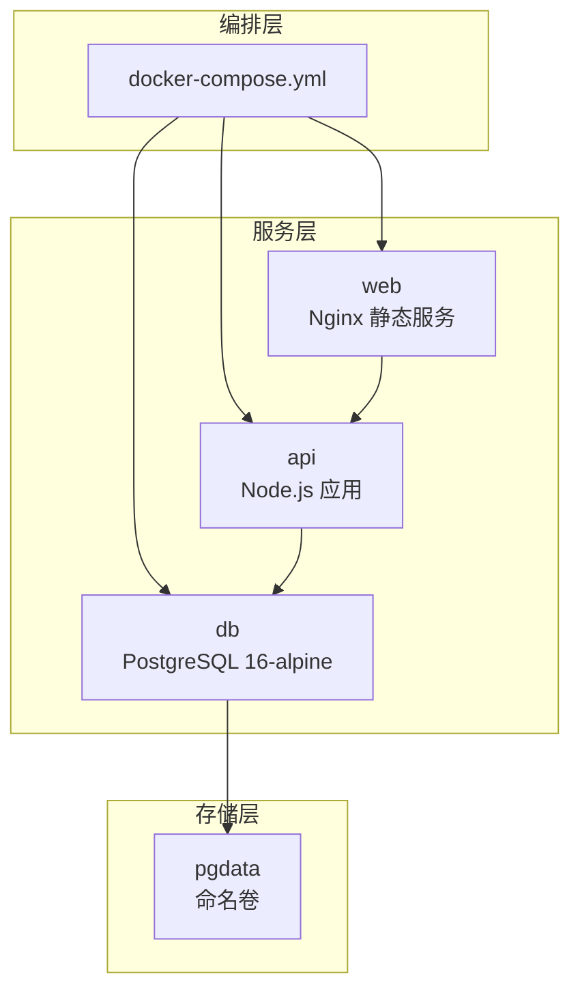
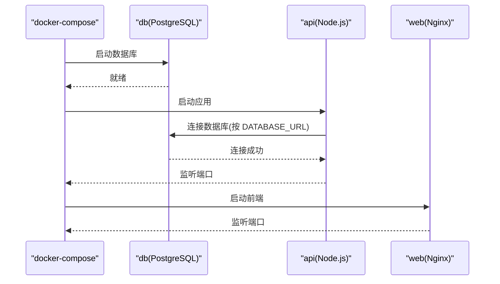
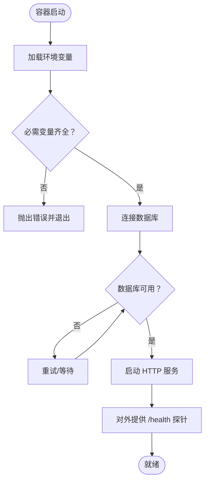
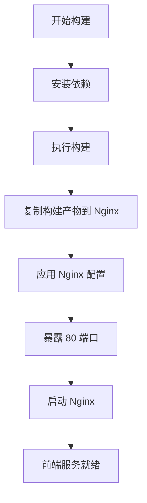
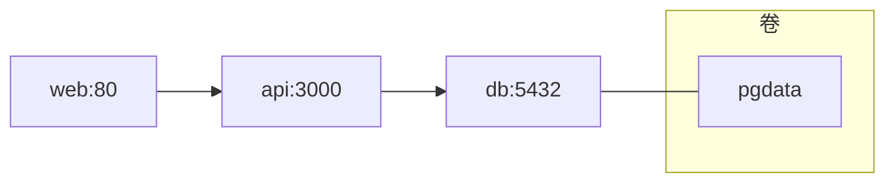

# Docker 容器化

<cite>
**本文引用的文件**
- [docker-compose.yml](file://docker-compose.yml)
- [api/Dockerfile](file://api/Dockerfile)
- [web/Dockerfile](file://web/Dockerfile)
- [api/package.json](file://api/package.json)
- [web/package.json](file://web/package.json)
- [api/src/config.ts](file://api/src/config.ts)
- [api/src/db.ts](file://api/src/db.ts)
- [api/src/index.ts](file://api/src/index.ts)
- [web/nginx.conf](file://web/nginx.conf)
- [quick-start.bat](file://quick-start.bat)
- [quick-lan-start.bat](file://quick-lan-start.bat)
- [quick-pull.bat](file://quick-pull.bat)
</cite>

## 目录
1. [简介](#简介)
2. [项目结构](#项目结构)
3. [核心组件](#核心组件)
4. [架构总览](#架构总览)
5. [详细组件分析](#详细组件分析)
6. [依赖分析](#依赖分析)
7. [性能考虑](#性能考虑)
8. [故障排查指南](#故障排查指南)
9. [结论](#结论)
10. [附录](#附录)

## 简介
本文件面向使用 Docker 对项目进行容器化的团队与个人，系统性说明 docker-compose 编排配置、各服务的 Dockerfile 构建策略、环境变量与卷挂载、端口映射与网络策略，并提供启动、停止、重启操作指南与调试技巧。同时给出镜像构建优化与安全加固建议，帮助在开发与生产环境中稳定运行。

## 项目结构
该项目采用多阶段构建与分层服务的容器化策略：
- 数据库服务：PostgreSQL，持久化数据通过命名卷管理
- API 服务：基于 Node.js 的后端服务，使用多阶段构建减少镜像体积
- 前端服务：基于 Nginx 的静态资源服务，由 Vite 构建产物提供

图表来源
- [docker-compose.yml:1-35](file://docker-compose.yml#L1-L35)

章节来源
- [docker-compose.yml:1-35](file://docker-compose.yml#L1-L35)

## 核心组件
- 数据库服务（db）
  - 使用官方 PostgreSQL 镜像，设置数据库名、用户名与密码
  - 通过命名卷持久化数据目录
  - 暴露标准端口供 API 服务连接
- API 服务（api）
  - 多阶段构建：依赖安装、构建、运行三个阶段
  - 运行时环境变量驱动端口、鉴权令牌、数据库连接与语音服务基础地址
  - 依赖数据库服务，启动顺序受编排控制
- 前端服务（web）
  - 多阶段构建：依赖安装、构建、Nginx 部署
  - 使用 Nginx 提供静态资源服务，监听 80 端口
  - 通过反向代理或直接访问，由 API 提供后端接口

章节来源
- [docker-compose.yml:1-35](file://docker-compose.yml#L1-L35)
- [api/Dockerfile:1-19](file://api/Dockerfile#L1-L19)
- [web/Dockerfile:1-16](file://web/Dockerfile#L1-L16)
- [api/src/config.ts:1-19](file://api/src/config.ts#L1-L19)
- [api/src/db.ts:1-35](file://api/src/db.ts#L1-L35)
- [api/src/index.ts:1-29](file://api/src/index.ts#L1-L29)
- [web/nginx.conf:1-11](file://web/nginx.conf#L1-L11)

## 架构总览
容器编排遵循“数据库先行、应用后行”的启动顺序，API 服务通过环境变量中的数据库连接字符串与数据库建立连接；前端服务通过 API 提供的接口进行交互。

图表来源
- [docker-compose.yml:1-35](file://docker-compose.yml#L1-L35)
- [api/src/config.ts:1-19](file://api/src/config.ts#L1-L19)
- [api/src/db.ts:1-35](file://api/src/db.ts#L1-L35)
- [api/src/index.ts:1-29](file://api/src/index.ts#L1-L29)

## 详细组件分析

### 数据库服务（db）
- 镜像与版本：PostgreSQL 16-alpine
- 环境变量
  - 数据库名、用户名、密码
- 卷
  - 使用命名卷 pgdata 挂载到容器内数据目录，确保数据持久化
- 端口映射
  - 将容器 5432 映射到主机 5432，便于本地开发与工具连接
- 启动顺序
  - 通过编排依赖，确保数据库先于 API 启动

章节来源
- [docker-compose.yml:2-11](file://docker-compose.yml#L2-L11)

### API 服务（api）
- 构建策略
  - 多阶段构建：依赖安装、构建、运行
  - 运行阶段设置生产环境变量，暴露服务端口
- 环境变量
  - 端口、Coze API 令牌、JWT 密钥、数据库连接字符串、语音服务基础地址
  - 其中部分变量来自宿主环境变量（例如令牌与密钥），需在启动前注入
- 依赖关系
  - 依赖数据库服务，连接字符串指向 db 服务
  - 通过编排声明依赖，保证启动顺序
- 健康检查
  - 提供 /health 接口用于健康探测

图表来源
- [api/src/config.ts:1-19](file://api/src/config.ts#L1-L19)
- [api/src/db.ts:1-35](file://api/src/db.ts#L1-L35)
- [api/src/index.ts:1-29](file://api/src/index.ts#L1-L29)

章节来源
- [api/Dockerfile:1-19](file://api/Dockerfile#L1-L19)
- [api/src/config.ts:1-19](file://api/src/config.ts#L1-L19)
- [api/src/db.ts:1-35](file://api/src/db.ts#L1-L35)
- [api/src/index.ts:1-29](file://api/src/index.ts#L1-L29)
- [docker-compose.yml:13-24](file://docker-compose.yml#L13-L24)

### 前端服务（web）
- 构建策略
  - 多阶段构建：依赖安装、构建、Nginx 部署
  - 使用 Nginx 提供静态资源服务，默认监听 80 端口
- 配置
  - 使用自定义 Nginx 配置，启用单页应用路由回退
- 端口映射
  - 将容器 80 映射到主机 5173，便于本地访问

图表来源
- [web/Dockerfile:1-16](file://web/Dockerfile#L1-L16)
- [web/nginx.conf:1-11](file://web/nginx.conf#L1-L11)

章节来源
- [web/Dockerfile:1-16](file://web/Dockerfile#L1-L16)
- [web/nginx.conf:1-11](file://web/nginx.conf#L1-L11)
- [docker-compose.yml:26-32](file://docker-compose.yml#L26-L32)

## 依赖分析
- 服务间依赖
  - API 依赖数据库（db）
  - 前端依赖 API（通过接口调用）
- 网络与端口
  - db: 5432
  - api: 3000
  - web: 5173 -> 80
- 卷
  - db 使用命名卷 pgdata 持久化

图表来源
- [docker-compose.yml:1-35](file://docker-compose.yml#L1-L35)

章节来源
- [docker-compose.yml:1-35](file://docker-compose.yml#L1-L35)

## 性能考虑
- 多阶段构建
  - 通过分离依赖安装、构建与运行阶段，显著减小最终镜像体积
- 运行时环境
  - 在运行阶段设置生产环境变量，避免开发依赖进入运行镜像
- 静态资源服务
  - 使用 Nginx 提供静态资源，具备较好的并发与缓存能力
- 端口与网络
  - 合理的端口映射与容器间通信，避免不必要的网络开销

章节来源
- [api/Dockerfile:1-19](file://api/Dockerfile#L1-L19)
- [web/Dockerfile:1-16](file://web/Dockerfile#L1-L16)

## 故障排查指南
- 启动顺序问题
  - 确认数据库服务先于 API 启动；若 API 报连接失败，检查数据库是否就绪
- 环境变量缺失
  - API 启动前会校验关键环境变量；若缺少，容器会因异常退出
- 数据库连接失败
  - 检查 DATABASE_URL 是否正确指向 db 服务与端口
- 健康检查
  - 可通过 /health 接口确认 API 服务状态
- 端口占用
  - 若宿主端口被占用，调整映射或释放端口
- 开发联调
  - 可参考本地快速启动脚本，了解开发模式下的端口与访问方式

章节来源
- [api/src/config.ts:1-19](file://api/src/config.ts#L1-L19)
- [api/src/index.ts:15-17](file://api/src/index.ts#L15-L17)
- [docker-compose.yml:1-35](file://docker-compose.yml#L1-L35)

## 结论
该容器化方案通过多阶段构建与编排配置实现了清晰的服务边界与稳定的运行环境。数据库持久化、环境变量注入与端口映射均遵循最佳实践。结合健康检查与合理的网络策略，可在开发与生产环境中高效运行。

## 附录

### docker-compose.yml 配置详解
- 服务定义
  - db：PostgreSQL 16-alpine，设置数据库名、用户与密码，使用命名卷持久化，暴露 5432
  - api：基于 ./api 构建，设置端口、令牌、密钥、数据库连接字符串，依赖 db，暴露 3000
  - web：基于 ./web 构建，依赖 api，暴露 5173 -> 80
- 卷定义
  - pgdata：用于数据库数据持久化

章节来源
- [docker-compose.yml:1-35](file://docker-compose.yml#L1-L35)

### 环境变量配置清单
- API 服务
  - PORT：服务监听端口
  - COZE_API_TOKEN：第三方服务令牌
  - JWT_SECRET：JWT 密钥
  - DATABASE_URL：数据库连接字符串
  - VOICE_BASE_URL：语音服务基础地址
- 建议
  - 将敏感信息通过外部环境注入，避免硬编码在镜像中
  - 在生产环境使用更严格的密钥与更强的令牌

章节来源
- [api/src/config.ts:1-19](file://api/src/config.ts#L1-L19)
- [docker-compose.yml:16-20](file://docker-compose.yml#L16-L20)

### 卷挂载与端口映射最佳实践
- 卷
  - 使用命名卷管理数据库数据，避免绑定宿主路径导致权限与迁移复杂化
- 端口
  - 将容器内部端口映射到宿主非默认端口，避免冲突
  - 前端服务将 80 映射到宿主端口，便于统一访问

章节来源
- [docker-compose.yml:8-11](file://docker-compose.yml#L8-L11)
- [docker-compose.yml:23-32](file://docker-compose.yml#L23-L32)

### 容器启动、停止与重启操作指南
- 启动
  - 使用编排工具启动所有服务，确保数据库先于应用启动
- 停止
  - 停止 web -> api -> db 的顺序，避免数据库连接中断
- 重启
  - 优先重启 web 与 api，最后重启 db

章节来源
- [docker-compose.yml:1-35](file://docker-compose.yml#L1-L35)

### 容器调试技巧
- 日志查看
  - 通过编排工具查看各服务日志，定位启动与运行问题
- 健康检查
  - 使用 /health 接口快速判断服务状态
- 环境变量验证
  - 在容器内打印关键环境变量，确认注入正确

章节来源
- [api/src/index.ts:15-17](file://api/src/index.ts#L15-L17)
- [api/src/config.ts:1-19](file://api/src/config.ts#L1-L19)

### 镜像构建优化与安全加固
- 构建优化
  - 多阶段构建减少最终镜像体积
  - 运行阶段仅复制必要文件，避免开发依赖进入运行镜像
- 安全加固
  - 不在镜像中存储敏感信息，通过环境变量注入
  - 使用只读根文件系统与最小权限原则（在生产环境中进一步强化）
  - 使用非 root 用户运行（在生产环境中进一步强化）

章节来源
- [api/Dockerfile:12-19](file://api/Dockerfile#L12-L19)
- [web/Dockerfile:12-16](file://web/Dockerfile#L12-L16)