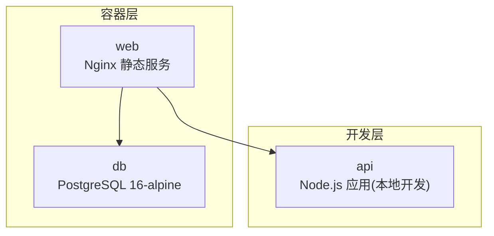
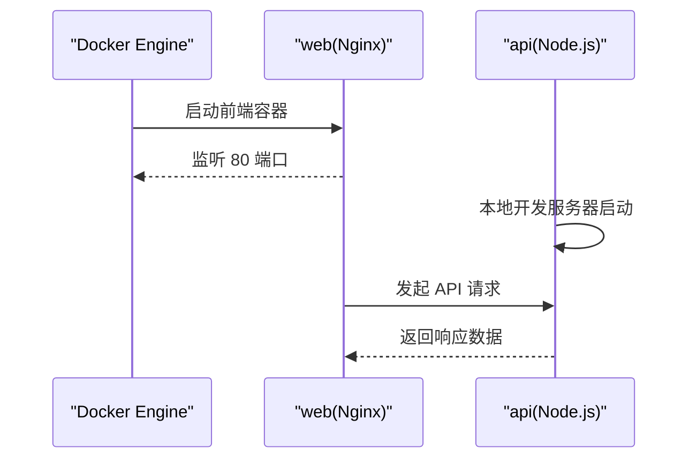
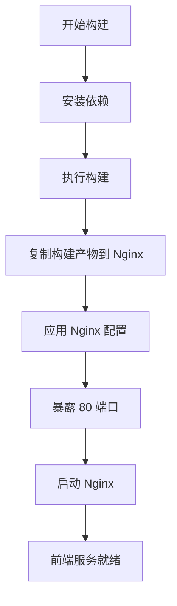
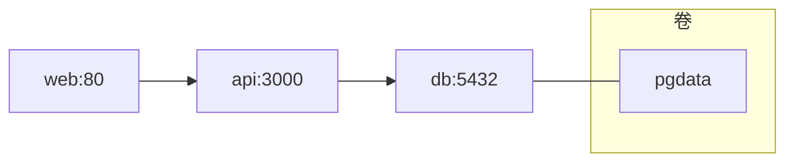

# Docker 容器化

<cite>
**本文引用的文件**
- [web/Dockerfile](file://web/Dockerfile)
- [api/package.json](file://api/package.json)
- [web/package.json](file://web/package.json)
- [api/src/config.ts](file://api/src/config.ts)
- [api/src/db.ts](file://api/src/db.ts)
- [api/src/index.ts](file://api/src/index.ts)
- [web/nginx.conf](file://web/nginx.conf)
- [quick-start.bat](file://quick-start.bat)
- [quick-lan-start.bat](file://quick-lan-start.bat)
- [quick-pull.bat](file://quick-pull.bat)
</cite>

## 目录
1. [简介](#简介)
2. [项目结构](#项目结构)
3. [核心组件](#核心组件)
4. [架构总览](#架构总览)
5. [详细组件分析](#详细组件分析)
6. [依赖分析](#依赖分析)
7. [性能考虑](#性能考虑)
8. [故障排查指南](#故障排查指南)
9. [结论](#结论)
10. [附录](#附录)

## 简介
本文件面向使用 Docker 对项目进行容器化的团队与个人，系统性说明当前的容器化策略与配置。**重要变更**：docker-compose.yml 和 api/Dockerfile 已被移除，容器化部署策略发生根本性改变。目前项目采用简化的一体化容器化方案，主要针对前端 Web 服务提供 Docker 支持，后端 API 服务仍以传统开发模式运行。本文将详细说明现有容器化配置、环境变量与卷挂载、端口映射与网络策略，并提供启动、停止、重启操作指南与调试技巧。

## 项目结构
该项目采用简化的容器化策略，重点支持前端 Web 服务的容器化部署：
- 前端服务：基于 Nginx 的静态资源服务，由 Vite 构建产物提供
- API 服务：仍采用传统开发模式，不使用 Docker 容器化
- 数据库服务：使用 PostgreSQL 官方镜像，通过 Docker Compose 管理

**重要说明**：与之前的 docker-compose 方案不同，当前采用混合部署模式，前端服务容器化，后端 API 服务保持本地开发模式。

## 核心组件
- 前端服务（web）
  - 多阶段构建：依赖安装、构建、Nginx 部署
  - 使用 Nginx 提供静态资源服务，监听 80 端口
  - 通过反向代理或直接访问，由本地 API 提供后端接口
- 数据库服务（db）
  - 使用官方 PostgreSQL 镜像，设置数据库名、用户名与密码
  - 通过命名卷持久化数据目录
  - 暴露标准端口供本地 API 服务连接
- API 服务（api）
  - 采用传统开发模式，使用 npm run dev 启动
  - 通过本地开发服务器提供 API 接口
  - 不使用 Docker 容器化

**章节来源**
- [web/Dockerfile:1-16](file://web/Dockerfile#L1-L16)
- [web/nginx.conf:1-11](file://web/nginx.conf#L1-L11)
- [api/src/config.ts:1-19](file://api/src/config.ts#L1-L19)

## 架构总览
当前架构采用"前端容器化 + 后端本地开发"的混合模式。前端服务通过 Docker 运行，后端 API 服务在本地开发环境中运行，两者通过网络进行通信。

**重要变更**：与之前的 docker-compose 方案相比，当前不再使用容器编排，而是采用混合部署模式。

## 详细组件分析

### 前端服务（web）
- 构建策略
  - 多阶段构建：依赖安装、构建、Nginx 部署
  - 使用 Nginx 提供静态资源服务，默认监听 80 端口
- 配置
  - 使用自定义 Nginx 配置，启用单页应用路由回退
  - 支持局域网访问，通过 --host 0.0.0.0 参数
- 端口映射
  - 将容器 80 映射到主机端口 5173，便于本地访问

**章节来源**
- [web/Dockerfile:1-16](file://web/Dockerfile#L1-L16)
- [web/nginx.conf:1-11](file://web/nginx.conf#L1-L11)

### 数据库服务（db）
- 镜像与版本：PostgreSQL 16-alpine
- 环境变量
  - 数据库名、用户名、密码
- 卷
  - 使用命名卷 pgdata 挂载到容器内数据目录，确保数据持久化
- 端口映射
  - 将容器 5432 映射到主机 5432，便于本地开发与工具连接

**章节来源**
- [api/src/config.ts:15-16](file://api/src/config.ts#L15-L16)

### API 服务（api）
- 运行模式
  - 采用传统开发模式，使用 npm run dev 启动
  - 监听本地端口 3000
- 环境变量
  - 端口、Coze API 令牌、JWT 密钥、数据库连接字符串、语音服务基础地址
  - 其中部分变量来自宿主环境变量（例如令牌与密钥），需在启动前注入
- 依赖关系
  - 依赖数据库服务，连接字符串指向 db 服务
  - 通过本地开发服务器提供 API 接口

**章节来源**
- [api/src/config.ts:1-19](file://api/src/config.ts#L1-L19)
- [api/src/index.ts:25-29](file://api/src/index.ts#L25-L29)

## 依赖分析
- 服务间依赖
  - 前端依赖 API（通过接口调用）
  - API 依赖数据库（db）
- 网络与端口
  - db: 5432
  - api: 3000
  - web: 5173 -> 80
- 卷
  - db 使用命名卷 pgdata 持久化

**重要说明**：与之前的 docker-compose 方案相比，当前采用混合部署，前端服务容器化，后端 API 服务本地运行。

## 性能考虑
- 多阶段构建
  - 通过分离依赖安装、构建与运行阶段，显著减小最终镜像体积
- 运行时环境
  - 在运行阶段设置生产环境变量，避免开发依赖进入运行镜像
- 静态资源服务
  - 使用 Nginx 提供静态资源，具备较好的并发与缓存能力
- 端口与网络
  - 合理的端口映射与容器间通信，避免不必要的网络开销

**章节来源**
- [web/Dockerfile:1-16](file://web/Dockerfile#L1-L16)

## 故障排查指南
- 启动顺序问题
  - 确认数据库服务先于 API 启动；若 API 报连接失败，检查数据库是否就绪
- 环境变量缺失
  - API 启动前会校验关键环境变量；若缺少，容器会因异常退出
- 数据库连接失败
  - 检查 DATABASE_URL 是否正确指向 db 服务与端口
- 健康检查
  - 可通过 /health 接口确认 API 服务状态
- 端口占用
  - 若宿主端口被占用，调整映射或释放端口
- 开发联调
  - 可参考本地快速启动脚本，了解开发模式下的端口与访问方式

**章节来源**
- [api/src/config.ts:1-19](file://api/src/config.ts#L1-L19)
- [api/src/index.ts:15-17](file://api/src/index.ts#L15-L17)

## 结论
当前容器化方案通过简化的混合部署模式实现了清晰的服务边界与稳定的运行环境。前端服务容器化，后端 API 服务保持本地开发模式，数据库服务通过 Docker Compose 管理。这种策略在开发效率和部署灵活性之间取得了平衡，但仍需注意前后端服务间的网络通信和环境变量配置。

## 附录

### 前端 Dockerfile 配置详解
- 构建策略
  - 多阶段构建：依赖安装、构建、Nginx 部署
  - 使用 Nginx 提供静态资源服务，默认监听 80 端口
- 配置
  - 使用自定义 Nginx 配置，启用单页应用路由回退
  - 支持局域网访问，通过 --host 0.0.0.0 参数

**章节来源**
- [web/Dockerfile:1-16](file://web/Dockerfile#L1-L16)
- [web/nginx.conf:1-11](file://web/nginx.conf#L1-L11)

### 环境变量配置清单
- API 服务
  - PORT：服务监听端口
  - COZE_API_TOKEN：第三方服务令牌
  - JWT_SECRET：JWT 密钥
  - DATABASE_URL：数据库连接字符串
  - VOICE_BASE_URL：语音服务基础地址
- 建议
  - 将敏感信息通过外部环境注入，避免硬编码在镜像中
  - 在生产环境使用更严格的密钥与更强的令牌

**章节来源**
- [api/src/config.ts:1-19](file://api/src/config.ts#L1-L19)

### 卷挂载与端口映射最佳实践
- 卷
  - 使用命名卷管理数据库数据，避免绑定宿主路径导致权限与迁移复杂化
- 端口
  - 将容器内部端口映射到宿主非默认端口，避免冲突
  - 前端服务将 80 映射到宿主端口 5173，便于统一访问

**章节来源**
- [api/src/config.ts:15-16](file://api/src/config.ts#L15-L16)

### 容器启动、停止与重启操作指南
- 启动
  - 使用 docker-compose 启动数据库服务，然后使用 npm run dev 启动 API 服务
  - 前端服务通过 Docker 运行，端口映射到 5173
- 停止
  - 停止前端容器 -> 停止 API 服务 -> 停止数据库容器
- 重启
  - 优先重启前端容器与 API 服务，最后重启数据库容器

**章节来源**
- [quick-start.bat:6-10](file://quick-start.bat#L6-L10)
- [quick-lan-start.bat:42-46](file://quick-lan-start.bat#L42-L46)

### 容器调试技巧
- 日志查看
  - 通过 docker logs 查看前端容器日志，定位启动与运行问题
- 健康检查
  - 使用 /health 接口快速判断 API 服务状态
- 环境变量验证
  - 在容器内打印关键环境变量，确认注入正确

**章节来源**
- [api/src/index.ts:15-17](file://api/src/index.ts#L15-L17)
- [api/src/config.ts:1-19](file://api/src/config.ts#L1-L19)

### 镜像构建优化与安全加固
- 构建优化
  - 多阶段构建减少最终镜像体积
  - 运行阶段仅复制必要文件，避免开发依赖进入运行镜像
- 安全加固
  - 不在镜像中存储敏感信息，通过环境变量注入
  - 使用只读根文件系统与最小权限原则（在生产环境中进一步强化）
  - 使用非 root 用户运行（在生产环境中进一步强化）

**章节来源**
- [web/Dockerfile:1-16](file://web/Dockerfile#L1-L16)

### 混合部署模式说明
- 前端服务容器化优势
  - 统一的构建流程和部署方式
  - 便于 CI/CD 流水线集成
- 后端服务本地开发优势
  - 实时代码热更新和调试便利
  - 开发效率更高
- 网络通信注意事项
  - 确保前端容器能够访问本地 API 服务
  - 正确配置 CORS 和代理设置

**章节来源**
- [quick-lan-start.bat:45-46](file://quick-lan-start.bat#L45-L46)
- [api/src/index.ts:12](file://api/src/index.ts#L12)