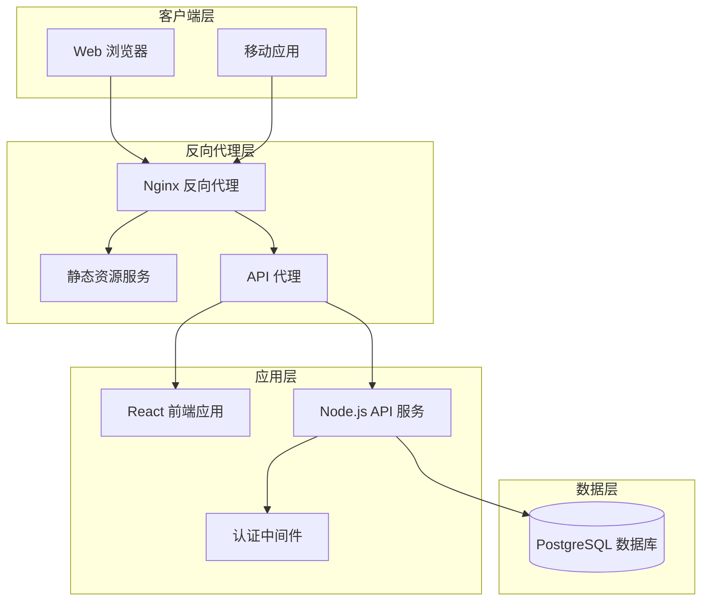
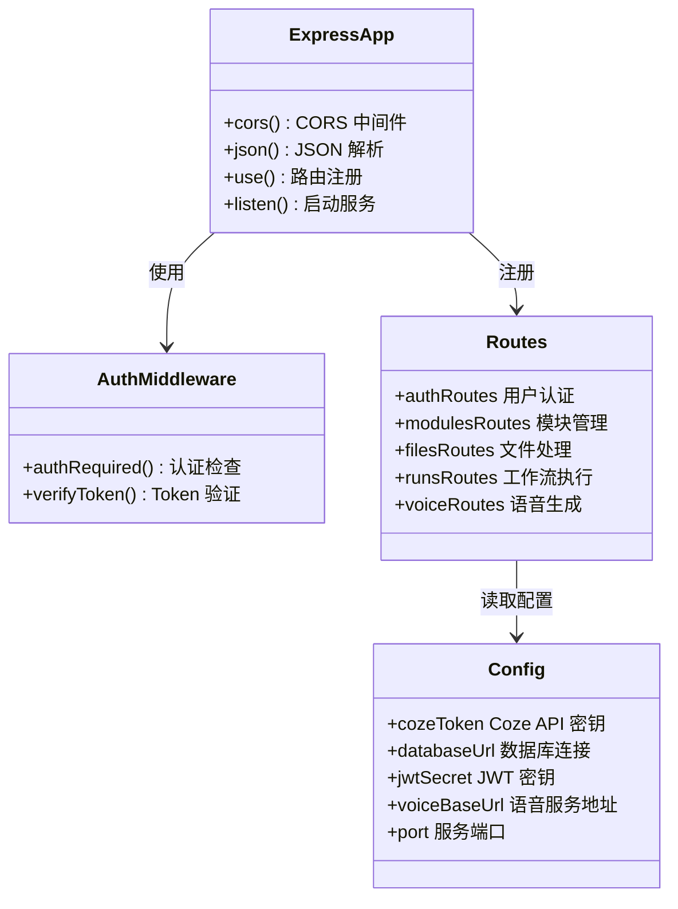
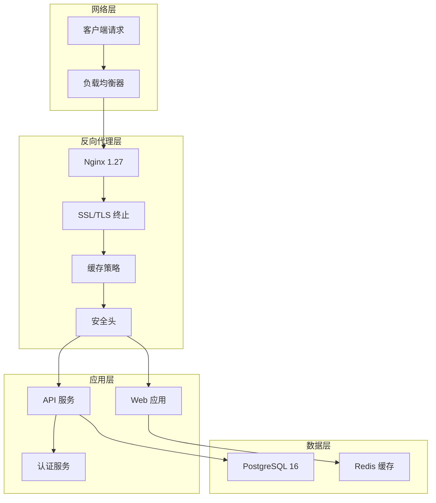
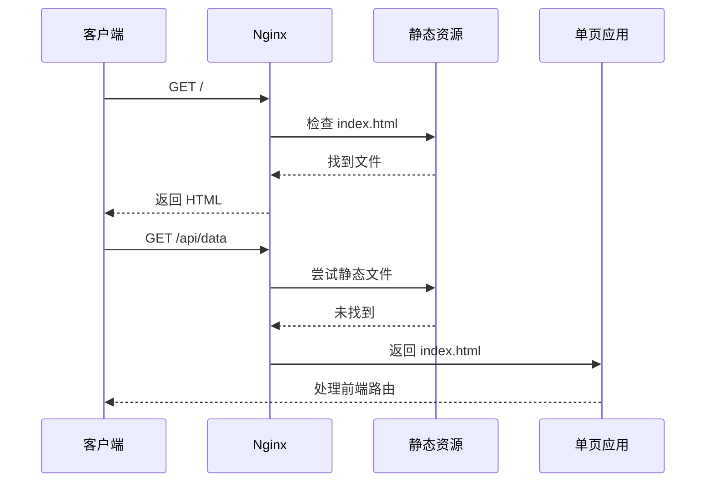
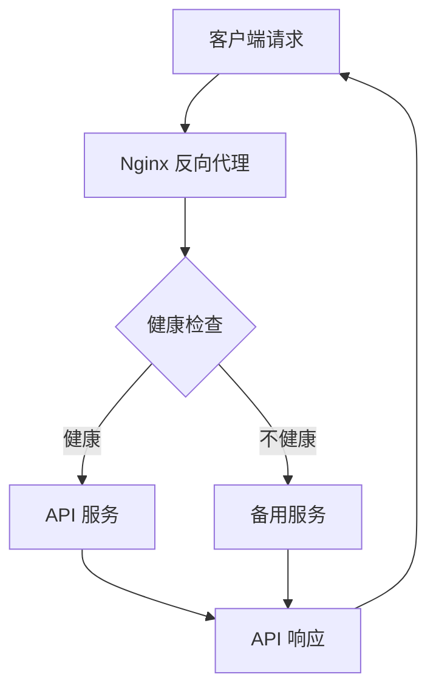
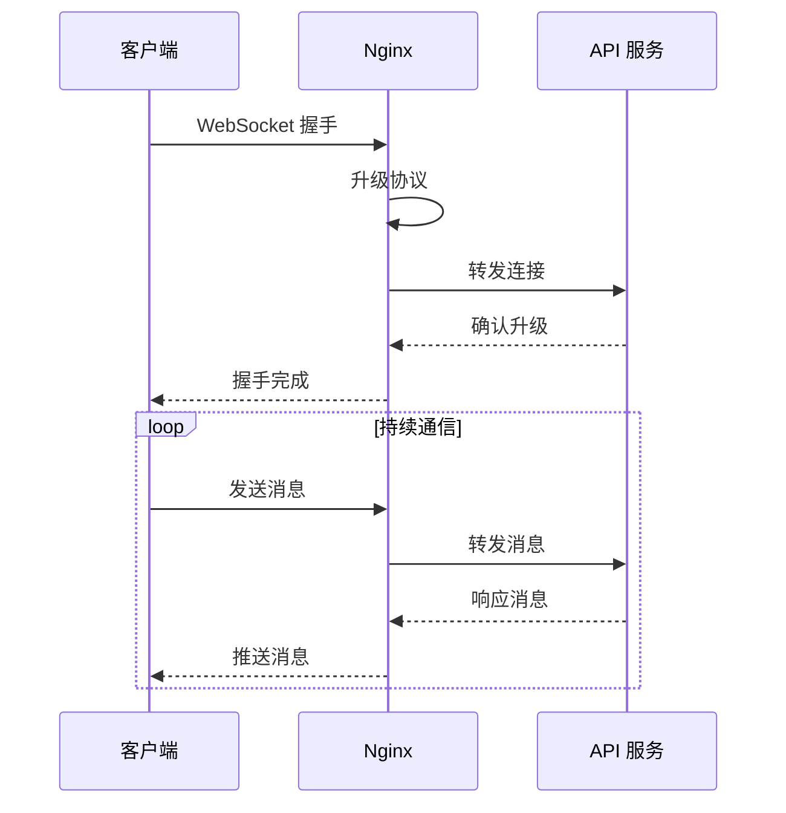
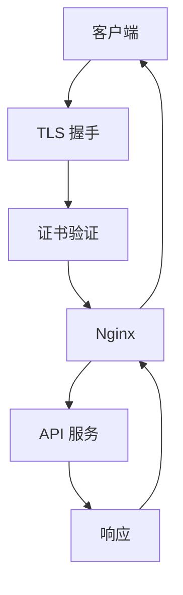
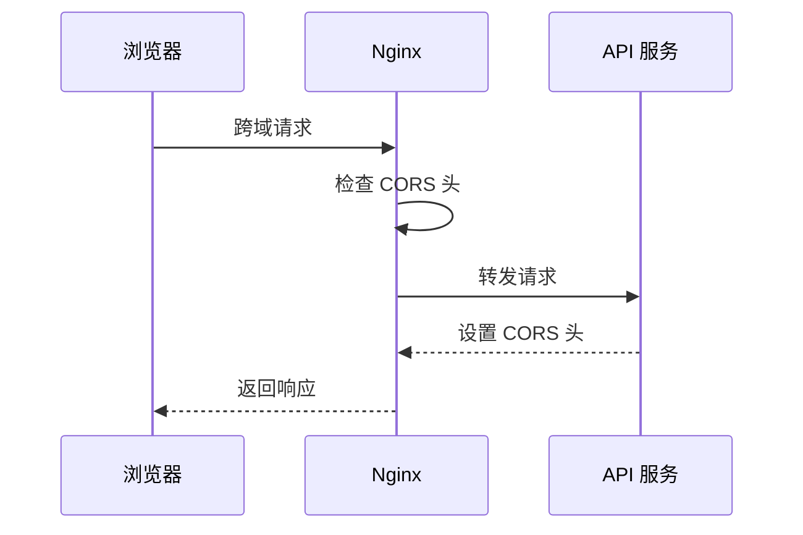
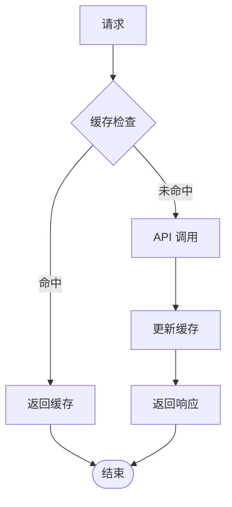
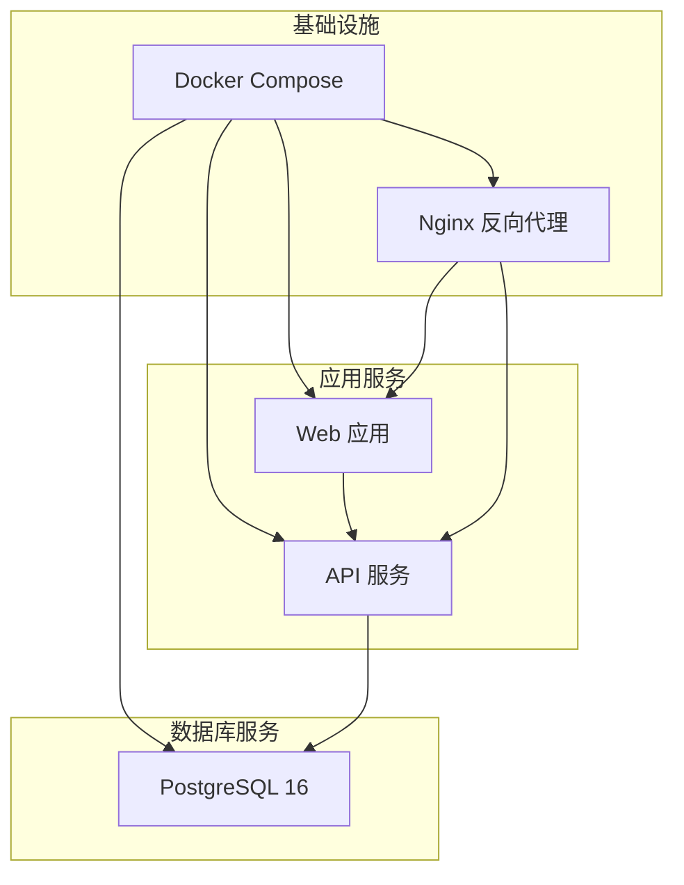

# Nginx 反向代理

<cite>
**本文档引用的文件**
- [nginx.conf](file://web/nginx.conf)
- [Dockerfile](file://web/Dockerfile)
- [docker-compose.yml](file://docker-compose.yml)
- [index.ts](file://api/src/index.ts)
- [config.ts](file://api/src/config.ts)
- [auth.ts](file://api/src/middleware/auth.ts)
- [voice.ts](file://api/src/routes/voice.ts)
- [package.json](file://web/package.json)
- [package.json](file://api/package.json)
</cite>

## 目录
1. [简介](#简介)
2. [项目结构](#项目结构)
3. [核心组件](#核心组件)
4. [架构概览](#架构概览)
5. [详细组件分析](#详细组件分析)
6. [依赖关系分析](#依赖关系分析)
7. [性能考虑](#性能考虑)
8. [故障排除指南](#故障排除指南)
9. [结论](#结论)

## 简介

本指南详细介绍了基于 Nginx 的反向代理配置，该配置服务于一个现代化的 Web 应用程序，包含前端 React 应用、Node.js API 服务和 PostgreSQL 数据库。系统采用 Docker 容器化部署，通过 Nginx 提供静态资源服务、API 请求转发和 WebSocket 支持。

该配置支持完整的 HTTPS 证书管理、HTTP/HTTPS 重定向、缓存策略、负载均衡和健康检查设置。同时提供了 CORS 配置、安全头设置和访问控制规则，以及性能优化配置和压缩设置。

## 项目结构

该项目采用多容器架构，包含以下主要组件：



**图表来源**
- [docker-compose.yml:1-35](file://docker-compose.yml#L1-L35)
- [web/Dockerfile:12-16](file://web/Dockerfile#L12-L16)

**章节来源**
- [docker-compose.yml:1-35](file://docker-compose.yml#L1-L35)
- [web/Dockerfile:12-16](file://web/Dockerfile#L12-L16)

## 核心组件

### Nginx 反向代理配置

当前的基础配置仅提供静态资源服务，需要扩展以支持完整的反向代理功能：


**图表来源**
- [nginx.conf:1-11](file://web/nginx.conf#L1-L11)

### API 服务架构

API 服务提供认证、模块管理和语音生成功能：



**图表来源**
- [api/src/index.ts:1-29](file://api/src/index.ts#L1-L29)
- [api/src/middleware/auth.ts:1-23](file://api/src/middleware/auth.ts#L1-L23)
- [api/src/config.ts:13-19](file://api/src/config.ts#L13-L19)

**章节来源**
- [api/src/index.ts:1-29](file://api/src/index.ts#L1-L29)
- [api/src/middleware/auth.ts:1-23](file://api/src/middleware/auth.ts#L1-L23)
- [api/src/config.ts:13-19](file://api/src/config.ts#L13-L19)

## 架构概览

完整的系统架构包括以下层次：



**图表来源**
- [docker-compose.yml:1-35](file://docker-compose.yml#L1-L35)
- [web/Dockerfile:12-16](file://web/Dockerfile#L12-L16)

## 详细组件分析

### 静态资源服务配置

当前配置仅支持基础的静态文件服务，需要增强以支持现代 Web 应用的需求：

#### 当前配置分析
- 监听端口：80
- 根目录：/usr/share/nginx/html  
- 默认索引：index.html
- 单页应用路由：使用 try_files 处理

#### 增强配置建议



**图表来源**
- [nginx.conf:8-10](file://web/nginx.conf#L8-L10)

### API 请求转发配置

需要配置 Nginx 将 API 请求转发到后端服务：



**图表来源**
- [api/src/index.ts:15-17](file://api/src/index.ts#L15-L17)

### WebSocket 支持配置

WebSocket 连接需要特殊的配置来保持长连接：



**图表来源**
- [api/src/routes/voice.ts:211-254](file://api/src/routes/voice.ts#L211-L254)

### SSL/TLS 证书配置

需要配置 HTTPS 终止和证书管理：



**图表来源**
- [web/Dockerfile:12-16](file://web/Dockerfile#L12-L16)

### CORS 配置

API 服务已启用 CORS 中间件，需要在 Nginx 层面进行补充配置：



**图表来源**
- [api/src/index.ts:12](file://api/src/index.ts#L12)

### 缓存策略配置

需要实现多层次的缓存策略：



**图表来源**
- [nginx.conf:5-6](file://web/nginx.conf#L5-L6)

## 依赖关系分析

### 容器依赖关系



**图表来源**
- [docker-compose.yml:1-35](file://docker-compose.yml#L1-L35)

### 环境变量依赖

API 服务依赖以下环境变量：

| 环境变量 | 类型 | 必需 | 描述 |
|---------|------|------|------|
| COZE_API_TOKEN | 字符串 | 是 | Coze API 访问令牌 |
| DATABASE_URL | 字符串 | 是 | PostgreSQL 数据库连接字符串 |
| JWT_SECRET | 字符串 | 是 | JWT 令牌签名密钥 |
| VOICE_BASE_URL | 字符串 | 是 | 语音服务基础 URL |
| PORT | 数字 | 否 | 服务监听端口，默认 3000 |

**章节来源**
- [api/src/config.ts:5-19](file://api/src/config.ts#L5-L19)

## 性能考虑

### 静态资源优化

- **Gzip 压缩**：启用静态文件压缩以减少传输大小
- **缓存策略**：设置合理的缓存头以提高加载速度
- **CDN 集成**：可选的 CDN 加速静态资源分发

### API 性能优化

- **连接池管理**：合理配置数据库连接池
- **请求限制**：实施速率限制防止滥用
- **超时配置**：设置适当的请求超时时间

### 内存和 CPU 优化

- **进程数量**：根据硬件配置调整 worker 进程数
- **缓冲区大小**：优化网络缓冲区设置
- **文件描述符**：调整系统文件描述符限制

## 故障排除指南

### 常见配置错误

#### 1. 端口冲突
**症状**：Nginx 启动失败，显示端口占用
**解决方案**：
- 检查端口占用情况：`netstat -tulpn | grep :80`
- 修改 Nginx 配置中的监听端口
- 确保容器端口映射正确

#### 2. 静态文件 404 错误
**症状**：页面加载空白或资源文件无法加载
**解决方案**：
- 验证静态文件路径配置
- 检查文件权限设置
- 确认构建产物已正确复制到容器

#### 3. API 请求转发失败
**症状**：前端 API 请求返回 502 错误
**解决方案**：
- 检查 API 服务状态：`docker-compose ps`
- 验证网络连接：`docker network ls`
- 查看 Nginx 错误日志：`docker-compose logs nginx`

#### 4. CORS 跨域问题
**症状**：浏览器控制台出现跨域错误
**解决方案**：
- 检查 API CORS 配置
- 验证 Nginx CORS 头设置
- 确认预检请求处理

### 日志分析

#### Nginx 日志位置
- 错误日志：`/var/log/nginx/error.log`
- 访问日志：`/var/log/nginx/access.log`

#### 常用诊断命令
```bash
# 查看实时日志
docker-compose logs -f nginx

# 检查容器健康状态
docker-compose ps

# 进入容器调试
docker-compose exec nginx bash
```

### 性能监控

#### 关键指标监控
- **请求响应时间**：平均和 95 分位响应时间
- **并发连接数**：活跃连接数统计
- **错误率**：HTTP 5xx 错误比例
- **带宽使用**：网络流量统计

#### 性能调优建议
- **缓存策略**：合理设置静态资源缓存
- **压缩配置**：启用 Gzip 压缩
- **连接复用**：启用 keep-alive
- **资源优化**：图片和静态文件压缩

**章节来源**
- [docker-compose.yml:1-35](file://docker-compose.yml#L1-L35)

## 结论

本 Nginx 反向代理配置为现代化 Web 应用提供了坚实的基础架构。当前配置支持基本的静态资源服务和单页应用路由处理，但需要进一步扩展以支持完整的生产环境需求。

推荐的改进方向包括：
1. **增强 API 代理配置**：添加完整的 API 路由转发
2. **SSL/TLS 配置**：实现 HTTPS 终止和证书管理
3. **负载均衡设置**：配置多个 API 实例的负载均衡
4. **健康检查集成**：实现自动故障转移
5. **缓存策略优化**：实施多层缓存机制
6. **安全加固**：添加 WAF 和 DDoS 防护

通过这些改进，系统将具备企业级的可靠性、性能和安全性，能够支持高并发的生产环境需求。