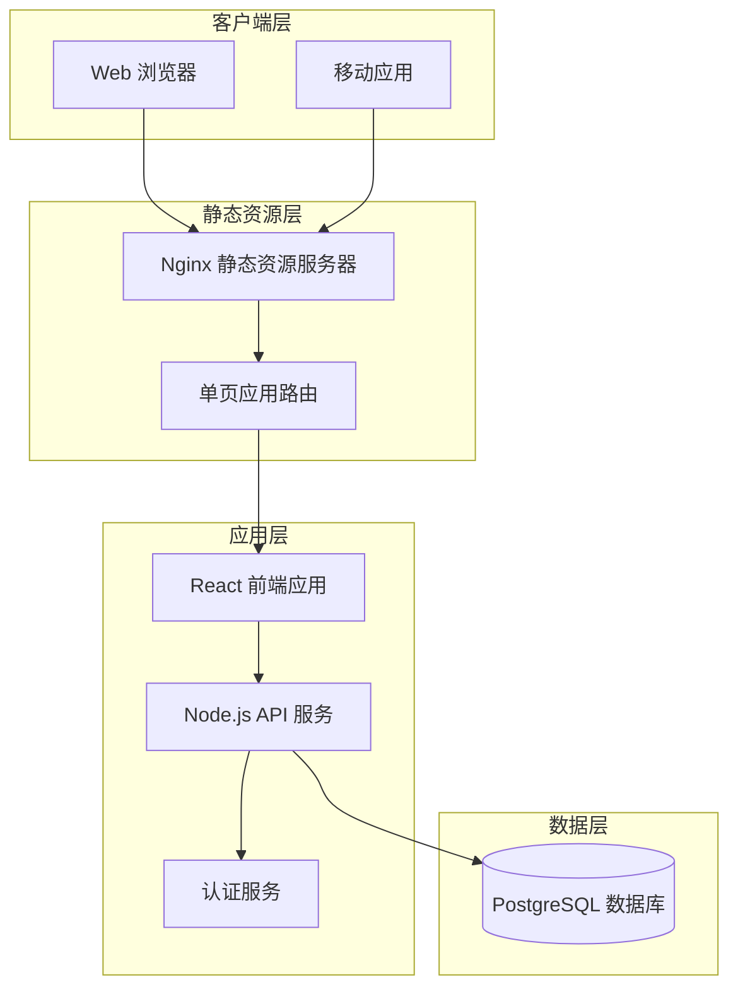
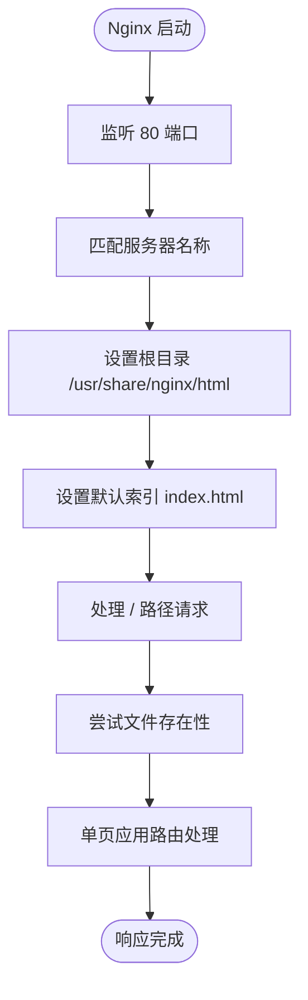
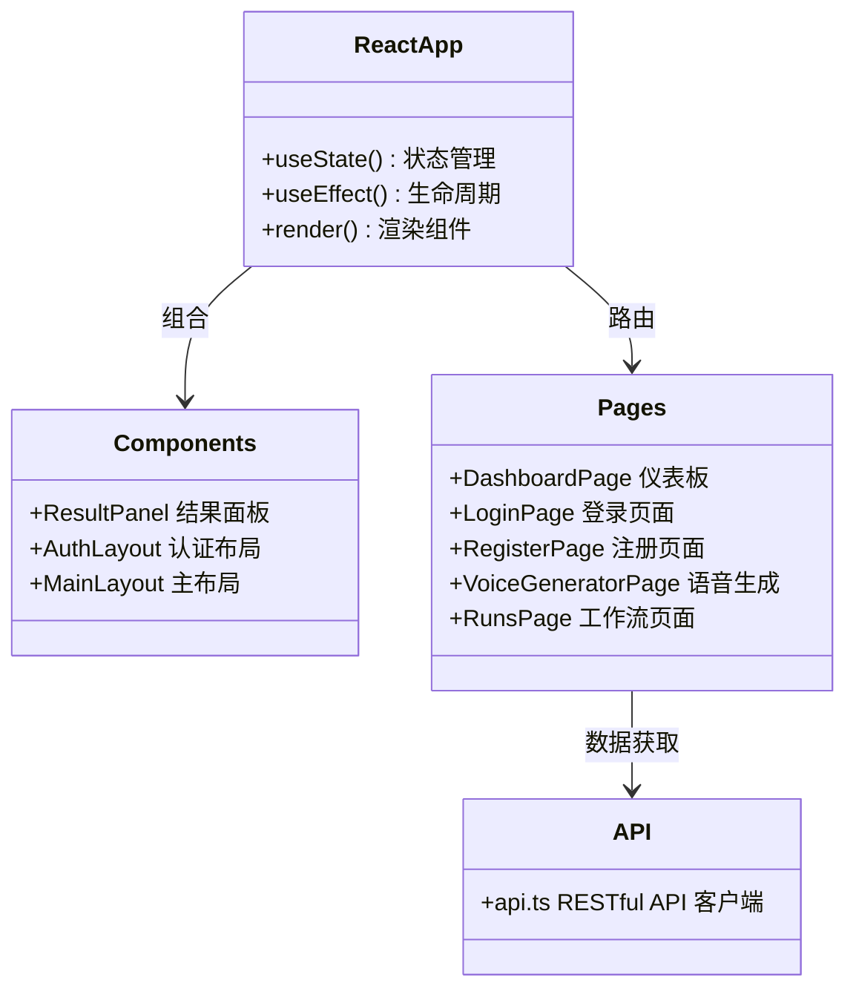
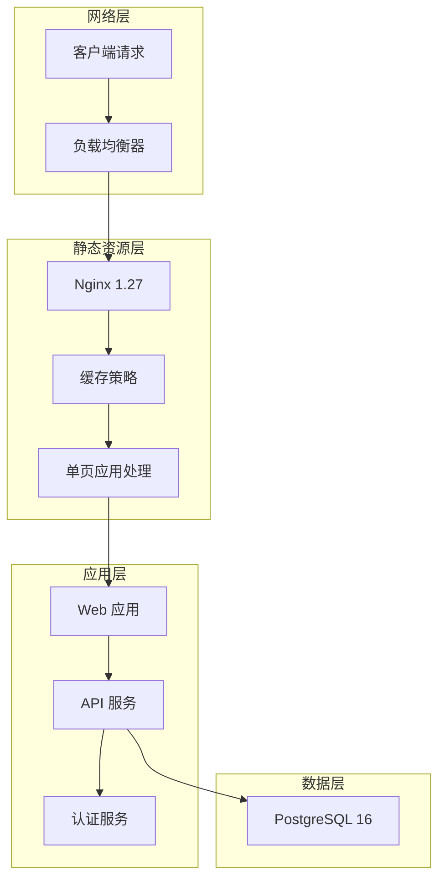
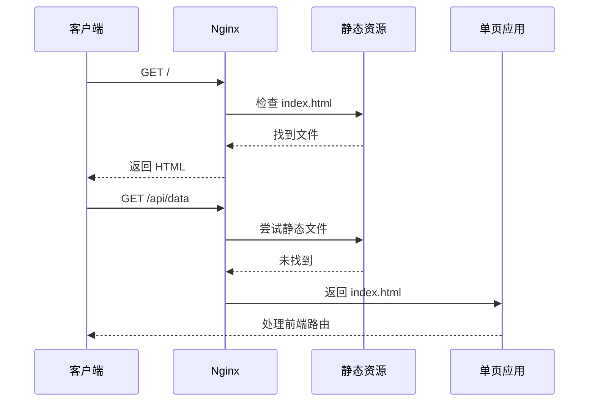
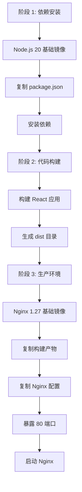

# Nginx 反向代理

<cite>
**本文档引用的文件**
- [nginx.conf](file://web/nginx.conf)
- [Dockerfile](file://web/Dockerfile)
- [index.ts](file://api/src/index.ts)
- [config.ts](file://api/src/config.ts)
- [package.json](file://web/package.json)
- [package.json](file://api/package.json)
</cite>

## 更新摘要
**变更内容**
- 更新架构概览以反映简化后的静态资源服务模式
- 移除反向代理配置相关的所有内容
- 新增静态资源服务配置的详细说明
- 更新容器化部署架构图
- 移除 API 路由转发和 WebSocket 相关配置

## 目录
1. [简介](#简介)
2. [项目结构](#项目结构)
3. [核心组件](#核心组件)
4. [架构概览](#架构概览)
5. [静态资源服务配置](#静态资源服务配置)
6. [容器化部署架构](#容器化部署架构)
7. [性能优化配置](#性能优化配置)
8. [故障排除指南](#故障排除指南)
9. [结论](#结论)

## 简介

本指南详细介绍了一个基于 Nginx 的静态资源服务配置，该配置服务于一个现代化的 Web 应用程序。应用程序采用前后端分离架构，前端使用 React 技术栈，后端使用 Node.js API 服务，数据库采用 PostgreSQL。系统通过 Docker 容器化部署，Nginx 专门用于提供静态资源服务和单页应用路由处理。

该配置专注于提供高性能的静态资源服务，支持单页应用的客户端路由（SPA），并具备基本的缓存策略和压缩功能。由于架构简化，不再包含反向代理、API 转发、WebSocket 支持等高级功能。

## 项目结构

该项目采用前后端分离的容器化架构，包含以下主要组件：



**图表来源**
- [web/Dockerfile:12-16](file://web/Dockerfile#L12-L16)

**章节来源**
- [web/Dockerfile:12-16](file://web/Dockerfile#L12-L16)

## 核心组件

### Nginx 静态资源服务配置

当前配置专注于提供基础的静态资源服务，支持单页应用路由处理：



**图表来源**
- [nginx.conf:1-11](file://web/nginx.conf#L1-L11)

### 前端应用架构

前端应用基于 React 技术栈，提供现代化的用户界面：



**图表来源**
- [web/src/App.tsx:1-50](file://web/src/App.tsx#L1-L50)
- [web/src/lib/api.ts:1-50](file://web/src/lib/api.ts#L1-L50)

**章节来源**
- [web/src/App.tsx:1-50](file://web/src/App.tsx#L1-L50)
- [web/src/lib/api.ts:1-50](file://web/src/lib/api.ts#L1-L50)

## 架构概览

简化后的系统架构专注于静态资源服务，API 服务独立运行：



**图表来源**
- [web/Dockerfile:12-16](file://web/Dockerfile#L12-L16)

## 静态资源服务配置

### 基础配置分析

当前的 Nginx 配置非常简洁，专注于静态资源服务：

#### 核心配置项
- **监听端口**：80
- **服务器名称**：_（匹配所有主机名）
- **根目录**：/usr/share/nginx/html
- **默认索引**：index.html
- **单页应用路由**：使用 try_files 处理

#### 配置流程图



**图表来源**
- [nginx.conf:8-10](file://web/nginx.conf#L8-L10)

### 静态资源优化策略

虽然当前配置较为简单，但仍可实施以下优化：

#### 缓存策略
- **静态文件缓存**：CSS、JS、图片文件长期缓存
- **HTML 文件缓存**：短期缓存，便于更新
- **动态内容缓存**：API 响应缓存策略

#### 压缩配置
- **Gzip 压缩**：启用静态文件压缩
- **Brotli 压缩**：现代浏览器支持的高效压缩
- **压缩阈值**：设置合适的压缩触发大小

#### 安全配置
- **CORS 头设置**：跨域资源共享配置
- **安全头**：X-Frame-Options、X-Content-Type-Options
- **HTTPS 重定向**：生产环境的 HTTP 到 HTTPS 跳转

**章节来源**
- [nginx.conf:1-11](file://web/nginx.conf#L1-L11)

## 容器化部署架构

### 多阶段构建流程

前端应用采用多阶段 Docker 构建，确保最终镜像的精简性：



**图表来源**
- [web/Dockerfile:1-16](file://web/Dockerfile#L1-L16)

### 部署架构

```mermaid
graph TB
subgraph "开发环境"
Dev[本地开发]
Vite[Vite 开发服务器]
End
subgraph "生产环境"
Docker[容器化部署]
NginxProd[Nginx 生产环境]
API[API 服务容器]
DB[(PostgreSQL 数据库)]
end
Dev --> Vite
Vite --> Docker
Docker --> NginxProd
Docker --> API
API --> DB
```

**图表来源**
- [web/Dockerfile:6-16](file://web/Dockerfile#L6-L16)

**章节来源**
- [web/Dockerfile:1-16](file://web/Dockerfile#L1-L16)

## 性能优化配置

### 静态资源性能优化

#### 缓存策略配置
- **长期缓存**：CSS、JS、字体文件设置 1 年缓存
- **短期缓存**：HTML 文件设置 5 分钟缓存
- **条件请求**：ETag 和 Last-Modified 头部支持

#### 压缩优化
- **Gzip 压缩**：对文本文件启用压缩
- **Brotli 压缩**：现代浏览器优先使用 Brotli
- **压缩级别**：平衡压缩比和 CPU 使用

#### 资源优化
- **图片优化**：WebP 格式支持
- **代码分割**：按需加载 JavaScript
- **懒加载**：非关键资源延迟加载

### API 服务性能

虽然 API 服务不通过 Nginx 反向代理，但仍需考虑其性能配置：

#### 连接池管理
- **数据库连接池**：合理配置最大连接数
- **请求队列**：处理突发流量的能力
- **超时设置**：数据库查询超时配置

#### 缓存策略
- **Redis 缓存**：热点数据缓存
- **内存缓存**：高频 API 响应缓存
- **CDN 缓存**：静态资源 CDN 加速

**章节来源**
- [api/src/config.ts:13-19](file://api/src/config.ts#L13-L19)

## 故障排除指南

### 常见配置问题

#### 1. 静态文件 404 错误
**症状**：页面加载空白或资源文件无法加载
**解决方案**：
- 验证静态文件路径配置是否正确
- 检查 dist 目录是否正确复制到容器
- 确认文件权限设置是否允许 Nginx 读取
- 验证构建产物是否包含在最终镜像中

#### 2. 单页应用路由问题
**症状**：刷新页面或直接访问路由导致 404
**解决方案**：
- 确认 try_files 配置是否正确
- 验证 index.html 是否存在于根目录
- 检查 Nginx 配置语法是否正确

#### 3. 构建失败问题
**症状**：Docker 构建过程中出现错误
**解决方案**：
- 检查 Node.js 版本兼容性
- 验证依赖安装是否成功
- 确认构建脚本是否正确执行

### 日志分析

#### Nginx 日志位置
- **错误日志**：`/var/log/nginx/error.log`
- **访问日志**：`/var/log/nginx/access.log`

#### 常用诊断命令
```bash
# 查看实时日志
docker logs -f container_name

# 检查容器状态
docker ps

# 进入容器调试
docker exec -it container_name bash

# 查看构建日志
docker build -t app .
```

### 性能监控

#### 关键指标监控
- **请求响应时间**：静态资源加载时间
- **并发连接数**：同时处理的请求数量
- **错误率**：404、500 错误比例
- **带宽使用**：静态资源传输量统计

#### 优化建议
- **缓存策略**：合理设置静态资源缓存
- **压缩配置**：启用 Gzip/Brotli 压缩
- **资源优化**：图片和静态文件压缩
- **CDN 集成**：可选的 CDN 加速静态资源分发

**章节来源**
- [web/Dockerfile:12-16](file://web/Dockerfile#L12-L16)

## 结论

本 Nginx 静态资源服务配置为现代化 Web 应用提供了简洁而高效的基础设施。当前配置专注于提供基础的静态资源服务和单页应用路由处理，具有以下特点：

### 当前优势
1. **架构简化**：专注于静态资源服务，配置清晰易懂
2. **性能优化**：多阶段构建确保镜像精简，启动快速
3. **开发友好**：支持热重载和开发服务器
4. **容器化成熟**：完整的 Docker 化部署流程

### 未来扩展方向
基于当前的简化架构，可能的扩展方向包括：
1. **CDN 集成**：引入 CDN 加速静态资源分发
2. **HTTPS 配置**：添加 SSL/TLS 终止支持
3. **缓存优化**：实施更精细的缓存策略
4. **监控集成**：添加性能监控和日志收集
5. **安全加固**：增强安全头和访问控制

### 最佳实践建议
- **持续集成**：自动化构建和部署流程
- **版本管理**：明确的版本控制和发布策略
- **备份策略**：静态资源和配置的备份方案
- **灾难恢复**：快速恢复和故障转移机制

通过这些改进，系统将具备更好的可维护性和扩展性，能够支持更大规模的应用需求。