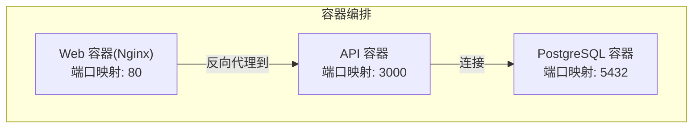
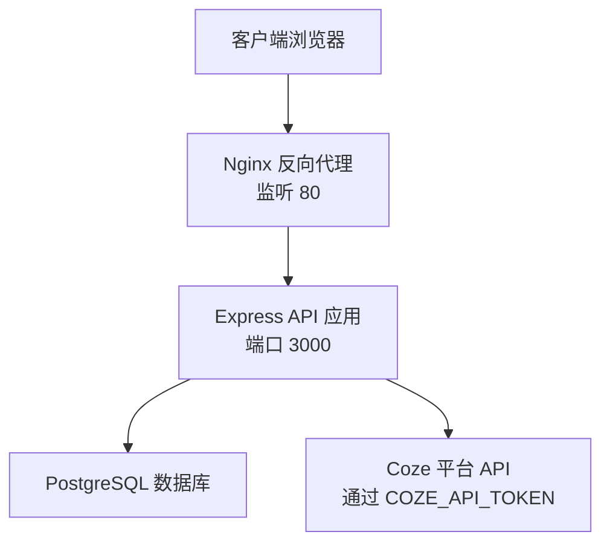
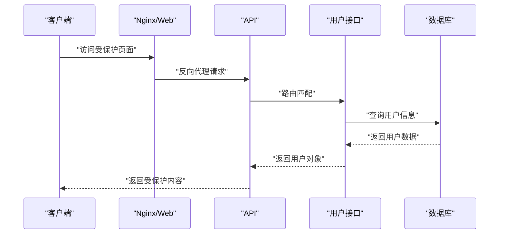
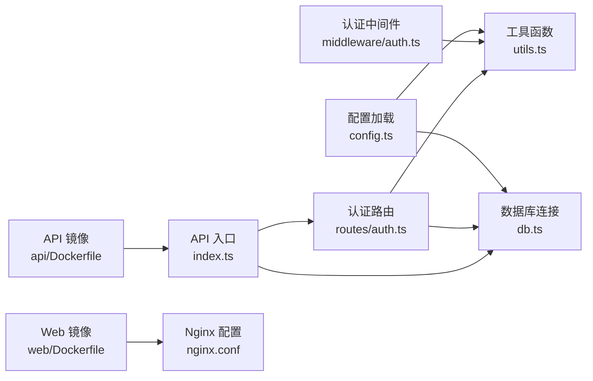

# 生产环境配置

<cite>
**本文引用的文件**
- [api/src/config.ts](file://api/src/config.ts)
- [api/src/db.ts](file://api/src/db.ts)
- [api/src/utils.ts](file://api/src/utils.ts)
- [api/src/middleware/auth.ts](file://api/src/middleware/auth.ts)
- [api/src/routes/auth.ts](file://api/src/routes/auth.ts)
- [api/src/index.ts](file://api/src/index.ts)
- [docker-compose.yml](file://docker-compose.yml)
- [api/Dockerfile](file://api/Dockerfile)
- [web/Dockerfile](file://web/Dockerfile)
- [web/nginx.conf](file://web/nginx.conf)
- [api/package.json](file://api/package.json)
- [web/package.json](file://web/package.json)
</cite>

## 目录
1. [简介](#简介)
2. [项目结构](#项目结构)
3. [核心组件](#核心组件)
4. [架构总览](#架构总览)
5. [详细组件分析](#详细组件分析)
6. [依赖关系分析](#依赖关系分析)
7. [性能与资源优化](#性能与资源优化)
8. [安全加固与合规](#安全加固与合规)
9. [日志与监控](#日志与监控)
10. [备份与数据保护](#备份与数据保护)
11. [部署检查清单与上线流程](#部署检查清单与上线流程)
12. [结论](#结论)

## 简介
本指南面向生产环境，围绕该应用的环境变量配置、数据库连接、API 密钥与 JWT 设置、域名与 HTTPS、性能调优、日志与磁盘管理、安全加固、监控告警以及标准化上线流程进行系统化说明。文档严格基于仓库中现有实现与配置文件进行分析与提炼，避免臆测。

## 项目结构
该项目采用前后端分离的容器化架构：前端使用 Nginx 提供静态资源服务；后端通过 Express 暴露 REST API，并使用 PostgreSQL 存储用户与运行记录等数据。Compose 将数据库、API 与 Web 服务编排为统一的运行单元。

图表来源
- [docker-compose.yml:1-35](file://docker-compose.yml#L1-L35)
- [web/Dockerfile:12-16](file://web/Dockerfile#L12-L16)
- [api/Dockerfile:18-19](file://api/Dockerfile#L18-L19)

章节来源
- [docker-compose.yml:1-35](file://docker-compose.yml#L1-L35)
- [web/Dockerfile:12-16](file://web/Dockerfile#L12-L16)
- [api/Dockerfile:18-19](file://api/Dockerfile#L18-L19)

## 核心组件
- 环境变量与密钥
  - 必需变量：COZE_API_TOKEN、DATABASE_URL、JWT_SECRET、VOICE_BASE_URL
  - 可选变量：PORT（默认 3000）
  - 配置加载方式：启动时读取 .env 并校验必需项
- 数据库连接
  - 使用连接池连接 PostgreSQL，启动时自动确保表结构
- 身份认证与授权
  - 基于 Bcrypt 的密码哈希与比较
  - 基于 JWT 的签发与校验，中间件拦截鉴权
- Web 服务
  - Nginx 提供静态资源与反向代理
  - 前端构建产物直接由 Nginx 托管

章节来源
- [api/src/config.ts:1-19](file://api/src/config.ts#L1-L19)
- [api/src/db.ts:1-35](file://api/src/db.ts#L1-L35)
- [api/src/utils.ts:1-21](file://api/src/utils.ts#L1-L21)
- [api/src/middleware/auth.ts:1-23](file://api/src/middleware/auth.ts#L1-L23)
- [web/nginx.conf:1-11](file://web/nginx.conf#L1-L11)

## 架构总览
下图展示生产环境中的典型流量路径：客户端请求经 Nginx 到达 API，API 访问数据库完成业务逻辑；同时 API 与外部 Coze 平台交互。

图表来源
- [web/nginx.conf:1-11](file://web/nginx.conf#L1-L11)
- [api/src/index.ts:19-23](file://api/src/index.ts#L19-L23)
- [api/src/config.ts:14-18](file://api/src/config.ts#L14-L18)
- [api/src/db.ts:6-8](file://api/src/db.ts#L6-L8)

## 详细组件分析

### 环境变量与密钥配置
- 必需环境变量
  - COZE_API_TOKEN：用于访问外部平台 API
  - DATABASE_URL：PostgreSQL 连接串
  - JWT_SECRET：JWT 签发与校验密钥
  - VOICE_BASE_URL：语音相关服务基础地址
  - PORT：API 监听端口，默认 3000
- 加载与校验
  - 启动时加载 .env 并对上述变量进行强制校验，缺失则抛出错误
- 建议
  - 在生产中通过编排系统注入变量，避免硬编码
  - JWT_SECRET 必须足够随机且保密，定期轮换

章节来源
- [api/src/config.ts:5-11](file://api/src/config.ts#L5-L11)
- [api/src/config.ts:13-19](file://api/src/config.ts#L13-L19)

### 数据库连接与初始化
- 连接池
  - 使用连接池按 DATABASE_URL 建立连接
- 初始化
  - 启动时自动创建用户与运行记录表（如不存在）
- 建议
  - 生产中为连接池设置合理的最大连接数与超时
  - 对敏感字段建立索引以提升查询性能

章节来源
- [api/src/db.ts:6-8](file://api/src/db.ts#L6-L8)
- [api/src/db.ts:10-34](file://api/src/db.ts#L10-L34)

### JWT 令牌与认证流程
- 签发与校验
  - 使用 JWT_SECRET 对用户信息进行签名，有效期 7 天
  - 中间件从 Authorization 请求头提取 Bearer Token 并验证
- 接口行为
  - 注册与登录成功后返回 JWT
  - 部分路由需要鉴权中间件保护
- 建议
  - 生产中缩短令牌有效期并引入刷新令牌机制
  - 对高危操作增加二次确认或更严格的权限校验

图表来源
- [api/src/routes/auth.ts:100-112](file://api/src/routes/auth.ts#L100-L112)
- [api/src/middleware/auth.ts:8-22](file://api/src/middleware/auth.ts#L8-L22)

章节来源
- [api/src/utils.ts:14-20](file://api/src/utils.ts#L14-L20)
- [api/src/middleware/auth.ts:1-23](file://api/src/middleware/auth.ts#L1-L23)
- [api/src/routes/auth.ts:36-63](file://api/src/routes/auth.ts#L36-L63)

### Web 服务与静态资源
- Nginx 配置
  - 监听 80 端口，根目录指向构建产物
  - 使用 try_files 将未命中路由回退到 index.html，适配 SPA
- 前端构建
  - 通过多阶段 Dockerfile 构建并交由 Nginx 托管
- 建议
  - 生产中启用 HTTPS 并强制跳转
  - 配置缓存与 Gzip 压缩提升性能

章节来源
- [web/nginx.conf:1-11](file://web/nginx.conf#L1-L11)
- [web/Dockerfile:12-16](file://web/Dockerfile#L12-L16)

### API 服务与健康检查
- 健康检查
  - 提供 /health 接口返回健康状态
- 路由组织
  - 统一挂载 /api/* 前缀，便于网关与反向代理管理
- 建议
  - 在生产中暴露独立健康检查端点，避免与业务端口混用

章节来源
- [api/src/index.ts:15-17](file://api/src/index.ts#L15-L17)
- [api/src/index.ts:19-23](file://api/src/index.ts#L19-L23)

## 依赖关系分析
- 组件耦合
  - API 依赖数据库连接池与环境变量
  - 认证模块依赖 JWT 与 Bcrypt 工具函数
  - Web 层依赖 Nginx 反向代理
- 外部依赖
  - PostgreSQL、Coze 平台 API、Nginx
- 编排关系
  - Compose 将数据库、API、Web 串联，形成完整运行栈

图表来源
- [api/src/config.ts:13-19](file://api/src/config.ts#L13-L19)
- [api/src/utils.ts:1-21](file://api/src/utils.ts#L1-L21)
- [api/src/db.ts:1-8](file://api/src/db.ts#L1-L8)
- [api/src/middleware/auth.ts:1-23](file://api/src/middleware/auth.ts#L1-L23)
- [api/src/routes/auth.ts:1-115](file://api/src/routes/auth.ts#L1-L115)
- [api/src/index.ts:1-29](file://api/src/index.ts#L1-L29)
- [web/Dockerfile:12-16](file://web/Dockerfile#L12-L16)
- [web/nginx.conf:1-11](file://web/nginx.conf#L1-L11)
- [api/Dockerfile:12-19](file://api/Dockerfile#L12-L19)

章节来源
- [api/src/config.ts:1-19](file://api/src/config.ts#L1-L19)
- [api/src/utils.ts:1-21](file://api/src/utils.ts#L1-L21)
- [api/src/db.ts:1-35](file://api/src/db.ts#L1-L35)
- [api/src/middleware/auth.ts:1-23](file://api/src/middleware/auth.ts#L1-L23)
- [api/src/routes/auth.ts:1-115](file://api/src/routes/auth.ts#L1-L115)
- [api/src/index.ts:1-29](file://api/src/index.ts#L1-L29)
- [web/Dockerfile:12-16](file://web/Dockerfile#L12-L16)
- [web/nginx.conf:1-11](file://web/nginx.conf#L1-L11)
- [api/Dockerfile:12-19](file://api/Dockerfile#L12-L19)

## 性能与资源优化
- 连接池与数据库
  - 建议在生产中根据实例规格设置连接池最大值与空闲回收策略
  - 对高频查询字段建立索引，减少全表扫描
- API 限流与防护
  - 在网关或反向代理层开启速率限制与请求大小限制
  - 对敏感接口（登录、重置密码）增加 IP 白名单或验证码
- 前端性能
  - 启用静态资源压缩与缓存策略
  - 使用 CDN 分发静态资源
- 内存与并发
  - Node.js 进程建议使用 PM2 或 systemd 管理，配合 CPU/内存监控
  - 根据实例核数设置工作进程数量，避免过度并发导致抖动

[本节为通用性能建议，不直接分析具体文件]

## 安全加固与合规
- 密钥与机密
  - JWT_SECRET 必须强随机且妥善保管，定期轮换
  - COZE_API_TOKEN 仅在必要范围内可见，避免泄露
- 传输安全
  - 强制 HTTPS，禁用明文 HTTP
  - 配置 HSTS、CSP、X-Frame-Options 等安全响应头
- 访问控制
  - 对内部服务使用网络隔离与只读访问
  - 限制数据库与 API 的访问源 IP
- 日志与审计
  - 记录登录、密码修改、管理员操作等关键事件
  - 限制日志中敏感信息输出

[本节为通用安全建议，不直接分析具体文件]

## 日志与监控
- 日志轮转
  - 使用 logrotate 或 journald 管理容器日志文件大小与保留周期
- 指标采集
  - 收集 API 响应时间、错误率、数据库连接数、CPU/内存占用
  - 结合 Prometheus/Grafana 实现可视化监控
- 告警策略
  - 设定阈值告警（如错误率超过 1%、响应时间 P95 超过 2 秒）
  - 关键事件（如登录失败、密码重置）触发即时告警

[本节为通用运维建议，不直接分析具体文件]

## 备份与数据保护
- 数据库备份
  - 定期执行逻辑备份（如使用 pg_dump）与物理备份
  - 将备份存储至异地或对象存储，设置生命周期策略
- 配置与密钥
  - 将 .env 与密钥保存在加密存储中，最小权限访问
- 灾备演练
  - 定期进行恢复演练，验证备份可用性与恢复时间目标

[本节为通用运维建议，不直接分析具体文件]

## 部署检查清单与上线流程
- 部署前准备
  - 准备 .env 文件，包含所有必需环境变量
  - 准备 SSL 证书与 Nginx 配置，启用 HTTPS 并强制跳转
  - 准备数据库初始化脚本与连接测试
- 编排与启动
  - 使用 Compose 启动服务，确保依赖顺序正确
  - 检查容器健康状态与日志
- 上线步骤
  - 停止旧版本服务，拉取最新镜像
  - 应用数据库迁移（如新增表或索引）
  - 重启 API 与 Web 服务，验证 /health 与核心功能
  - 回滚预案：保留上一个镜像版本，异常时快速回滚
- 验收与监控
  - 观察关键指标与日志，确认无异常波动
  - 进行端到端功能验收

[本节为通用流程建议，不直接分析具体文件]

## 结论
本指南基于仓库现有实现，给出了生产环境配置的关键要点与实施建议。建议在实际落地时结合企业安全基线与合规要求，补充 HTTPS、密钥管理、网络隔离与监控告警体系，确保系统稳定、安全、可运维。