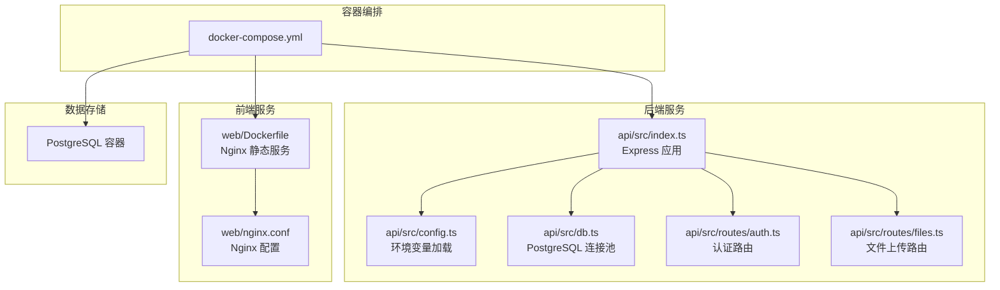
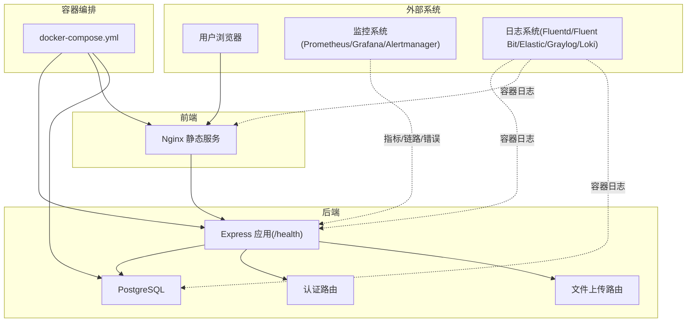
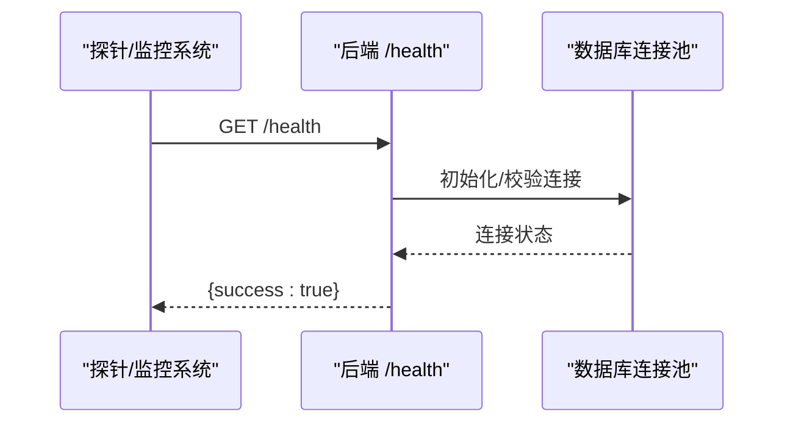
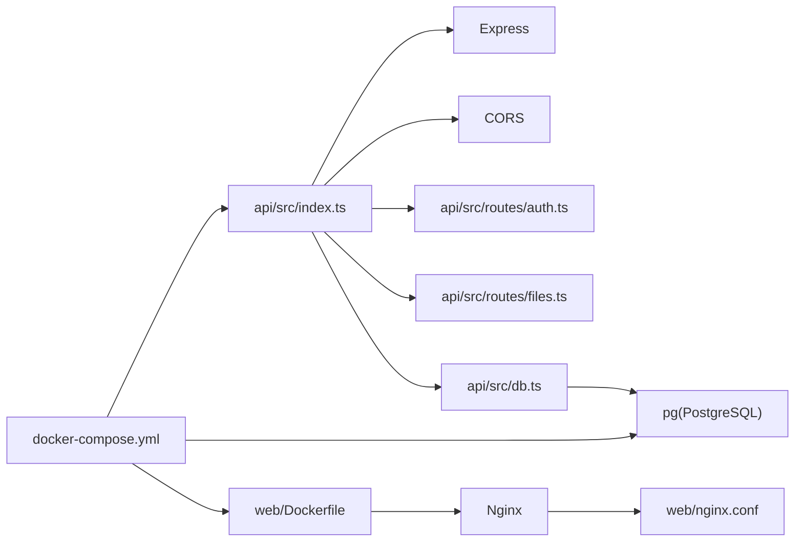

# 监控与日志

<cite>
**本文引用的文件**
- [docker-compose.yml](file://docker-compose.yml)
- [api/Dockerfile](file://api/Dockerfile)
- [web/Dockerfile](file://web/Dockerfile)
- [api/src/index.ts](file://api/src/index.ts)
- [api/src/config.ts](file://api/src/config.ts)
- [api/src/db.ts](file://api/src/db.ts)
- [api/src/utils.ts](file://api/src/utils.ts)
- [api/src/routes/auth.ts](file://api/src/routes/auth.ts)
- [api/src/routes/files.ts](file://api/src/routes/files.ts)
- [web/nginx.conf](file://web/nginx.conf)
</cite>

## 目录
1. [简介](#简介)
2. [项目结构](#项目结构)
3. [核心组件](#核心组件)
4. [架构总览](#架构总览)
5. [详细组件分析](#详细组件分析)
6. [依赖关系分析](#依赖关系分析)
7. [性能考量](#性能考量)
8. [故障排查指南](#故障排查指南)
9. [结论](#结论)
10. [附录](#附录)

## 简介
本实施指南面向容器化部署的监控与日志管理，围绕以下目标展开：容器日志收集与聚合、关键指标监控（性能与业务）、健康检查与可用性监控、故障告警、日志格式标准化与轮转、存储管理、APM 集成与链路追踪、CPU/内存/磁盘/网络资源监控、日志查询与可视化、监控仪表板与告警规则配置。  
当前仓库未包含任何现成的监控与日志实现，因此本指南提供可落地的实施方案与最佳实践，便于在现有服务中快速集成。

## 项目结构
项目采用多服务编排，包含数据库、后端 API 与前端 Web 三层。后端使用 Express 暴露健康检查端点；前端通过 Nginx 提供静态资源服务；数据库使用 PostgreSQL。容器镜像构建分别由各自目录下的 Dockerfile 完成。

图表来源
- [docker-compose.yml:1-35](file://docker-compose.yml#L1-L35)
- [api/src/index.ts:1-29](file://api/src/index.ts#L1-L29)
- [api/src/config.ts:1-19](file://api/src/config.ts#L1-L19)
- [api/src/db.ts:1-35](file://api/src/db.ts#L1-L35)
- [api/src/routes/auth.ts:1-115](file://api/src/routes/auth.ts#L1-L115)
- [api/src/routes/files.ts:1-43](file://api/src/routes/files.ts#L1-L43)
- [web/Dockerfile:1-16](file://web/Dockerfile#L1-L16)
- [web/nginx.conf:1-11](file://web/nginx.conf#L1-L11)

章节来源
- [docker-compose.yml:1-35](file://docker-compose.yml#L1-L35)
- [api/Dockerfile:1-19](file://api/Dockerfile#L1-L19)
- [web/Dockerfile:1-16](file://web/Dockerfile#L1-L16)
- [web/nginx.conf:1-11](file://web/nginx.conf#L1-L11)

## 核心组件
- 健康检查端点：后端提供 /health 快速健康探测，便于容器编排与外部监控系统集成。
- 数据库连接：通过连接池访问 PostgreSQL，支持自动建表与初始化。
- 认证与授权：基于 JWT 的用户认证流程，提供注册、登录、重置密码与个人信息查询。
- 文件上传：对接第三方文件上传接口，内置日志输出用于问题定位。
- 前端静态服务：Nginx 提供单页应用静态资源与路由回退。

章节来源
- [api/src/index.ts:15-17](file://api/src/index.ts#L15-L17)
- [api/src/db.ts:6-8](file://api/src/db.ts#L6-L8)
- [api/src/db.ts:10-34](file://api/src/db.ts#L10-L34)
- [api/src/routes/auth.ts:8-34](file://api/src/routes/auth.ts#L8-L34)
- [api/src/routes/auth.ts:36-63](file://api/src/routes/auth.ts#L36-L63)
- [api/src/routes/auth.ts:65-98](file://api/src/routes/auth.ts#L65-L98)
- [api/src/routes/auth.ts:100-112](file://api/src/routes/auth.ts#L100-L112)
- [api/src/routes/files.ts:10-40](file://api/src/routes/files.ts#L10-L40)
- [web/nginx.conf:8-10](file://web/nginx.conf#L8-L10)

## 架构总览
下图展示容器化部署中的服务交互与监控接入位置。建议在编排层引入日志收集器（如 Fluent Bit/Fluentd）与指标导出器（如 Prometheus Node Exporter、自定义探针），并在 API 层增加链路追踪与错误监控中间件。

图表来源
- [docker-compose.yml:1-35](file://docker-compose.yml#L1-L35)
- [api/src/index.ts:15-17](file://api/src/index.ts#L15-L17)
- [api/src/routes/auth.ts:1-115](file://api/src/routes/auth.ts#L1-L115)
- [api/src/routes/files.ts:1-43](file://api/src/routes/files.ts#L1-L43)
- [web/nginx.conf:1-11](file://web/nginx.conf#L1-L11)

## 详细组件分析

### 健康检查与可用性监控
- 后端健康端点：/health 返回简单健康状态，适合容器存活/就绪探针与外部监控系统调用。
- 前端可用性：Nginx 提供静态资源与 SPA 回退，确保路由兜底。
- 数据库连通性：通过连接池初始化时的建表逻辑间接验证数据库可用性。

图表来源
- [api/src/index.ts:15-17](file://api/src/index.ts#L15-L17)
- [api/src/db.ts:6-8](file://api/src/db.ts#L6-L8)
- [api/src/db.ts:10-34](file://api/src/db.ts#L10-L34)

章节来源
- [api/src/index.ts:15-17](file://api/src/index.ts#L15-L17)
- [api/src/db.ts:10-34](file://api/src/db.ts#L10-L34)

### 日志收集与聚合配置
- 容器日志采集：在编排层启用日志驱动（如 json-file 或 gelf），并使用日志收集器统一收集到集中式日志平台。
- 日志格式标准化：建议统一 JSON 格式，包含时间戳、级别、服务名、容器 ID、请求 ID、消息体等字段。
- 日志轮转策略：结合容器日志驱动的轮转参数与外部日志系统的滚动策略，控制单文件大小与保留天数。
- 存储管理：为日志系统配置持久卷与生命周期策略，避免磁盘占满。

章节来源
- [docker-compose.yml:1-35](file://docker-compose.yml#L1-L35)
- [api/Dockerfile:1-19](file://api/Dockerfile#L1-L19)
- [web/Dockerfile:1-16](file://web/Dockerfile#L1-L16)

### 关键指标监控
- 性能指标：使用 Prometheus Node Exporter 收集主机级 CPU/内存/磁盘/网络；在后端暴露自定义指标端点（如 /metrics）。
- 业务指标：统计认证成功率、文件上传失败率、数据库查询耗时、HTTP 请求延迟与错误码分布。
- 健康与可用性：容器存活/就绪状态、/health 响应时间与成功率、数据库连接池空闲/活跃数。

章节来源
- [api/src/index.ts:15-17](file://api/src/index.ts#L15-L17)
- [api/src/db.ts:6-8](file://api/src/db.ts#L6-L8)

### APM 工具集成、链路追踪与错误监控
- 链路追踪：在后端引入 APM SDK（如 OpenTelemetry），对路由、数据库、外部 API 调用进行自动采样与上下文传播。
- 错误监控：统一捕获未处理异常，上报错误事件与堆栈信息，并关联请求 ID 以便回溯。
- 仪表板：在 Grafana 中创建多面板仪表板，展示 RT、错误率、P95/P99 延迟、吞吐量与资源占用。

章节来源
- [api/src/routes/auth.ts:1-115](file://api/src/routes/auth.ts#L1-L115)
- [api/src/routes/files.ts:1-43](file://api/src/routes/files.ts#L1-L43)

### 日志查询、分析与可视化
- 查询与分析：在日志平台中按服务名、容器 ID、请求 ID、错误关键字进行过滤与聚合。
- 可视化：结合 Grafana 创建日志热力图、错误趋势、Top-N 错误消息与响应码分布。

章节来源
- [api/src/routes/files.ts:11-31](file://api/src/routes/files.ts#L11-L31)

### 告警规则设置
- 基础告警：/health 失败、容器重启、数据库连接失败、HTTP 5xx 比例上升、队列积压。
- 业务告警：认证失败率突增、文件上传失败率异常、数据库慢查询占比超阈值。
- 通知渠道：通过 Alertmanager 推送到企业微信、钉钉、邮件或电话。

章节来源
- [api/src/index.ts:15-17](file://api/src/index.ts#L15-L17)
- [api/src/routes/files.ts:28-36](file://api/src/routes/files.ts#L28-L36)

## 依赖关系分析
- 后端依赖：Express、CORS、JSON Web Token、PostgreSQL 连接池、Multer、Node Fetch。
- 编排依赖：docker-compose 定义服务间依赖顺序与端口映射。
- 前端依赖：Vite/React/Ant Design，Nginx 提供静态资源服务。

图表来源
- [api/src/index.ts:1-29](file://api/src/index.ts#L1-L29)
- [api/src/routes/auth.ts:1-115](file://api/src/routes/auth.ts#L1-L115)
- [api/src/routes/files.ts:1-43](file://api/src/routes/files.ts#L1-L43)
- [api/src/db.ts:1-35](file://api/src/db.ts#L1-L35)
- [web/Dockerfile:1-16](file://web/Dockerfile#L1-L16)
- [web/nginx.conf:1-11](file://web/nginx.conf#L1-L11)
- [docker-compose.yml:1-35](file://docker-compose.yml#L1-L35)

章节来源
- [api/src/index.ts:1-29](file://api/src/index.ts#L1-L29)
- [api/src/db.ts:1-35](file://api/src/db.ts#L1-L35)
- [web/Dockerfile:1-16](file://web/Dockerfile#L1-L16)
- [web/nginx.conf:1-11](file://web/nginx.conf#L1-L11)
- [docker-compose.yml:1-35](file://docker-compose.yml#L1-L35)

## 性能考量
- 连接池与并发：合理配置数据库连接池大小，避免高并发下的连接争用。
- 路由与中间件：精简中间件链，避免在热路径上执行阻塞操作。
- 文件上传：限制文件大小与并发，结合流式处理降低内存峰值。
- 缓存与降级：对热点数据与外部依赖接口增加缓存与熔断策略。

章节来源
- [api/src/db.ts:6-8](file://api/src/db.ts#L6-L8)
- [api/src/routes/files.ts:10-14](file://api/src/routes/files.ts#L10-L14)

## 故障排查指南
- 健康检查失败
  - 确认 /health 能正常返回。
  - 检查数据库连接字符串与网络连通性。
- 登录/注册异常
  - 核对 JWT 密钥与数据库表结构是否正确初始化。
  - 查看认证路由返回的错误码与提示。
- 文件上传失败
  - 检查第三方上传接口状态与鉴权头。
  - 对照日志中的错误码与响应体。
- 前端页面无法加载
  - 确认 Nginx 配置与静态资源路径。
  - 检查 SPA 路由回退是否生效。

章节来源
- [api/src/index.ts:15-17](file://api/src/index.ts#L15-L17)
- [api/src/config.ts:5-11](file://api/src/config.ts#L5-L11)
- [api/src/db.ts:10-34](file://api/src/db.ts#L10-L34)
- [api/src/routes/auth.ts:15-24](file://api/src/routes/auth.ts#L15-L24)
- [api/src/routes/auth.ts:51-59](file://api/src/routes/auth.ts#L51-L59)
- [api/src/routes/files.ts:19-36](file://api/src/routes/files.ts#L19-L36)
- [web/nginx.conf:8-10](file://web/nginx.conf#L8-L10)

## 结论
本指南提供了从容器日志到指标监控、从健康检查到告警的完整实施路径。建议优先完成日志与指标的基础采集，再逐步引入 APM 与链路追踪，最终完善仪表板与告警规则，形成闭环的可观测体系。

## 附录
- 环境变量清单（示例）
  - COZE_API_TOKEN：第三方文件上传接口鉴权
  - DATABASE_URL：PostgreSQL 连接串
  - JWT_SECRET：JWT 签发密钥
  - VOICE_BASE_URL：语音相关服务地址
  - PORT：后端监听端口
- 建议的监控项
  - 指标：HTTP 请求速率、错误率、响应时间、数据库连接数、容器资源使用
  - 日志：请求日志、错误日志、审计日志、文件上传失败明细
  - 告警：健康检查失败、错误率阈值、资源使用率阈值、数据库异常

章节来源
- [api/src/config.ts:5-19](file://api/src/config.ts#L5-L19)
- [api/src/utils.ts:14-20](file://api/src/utils.ts#L14-L20)