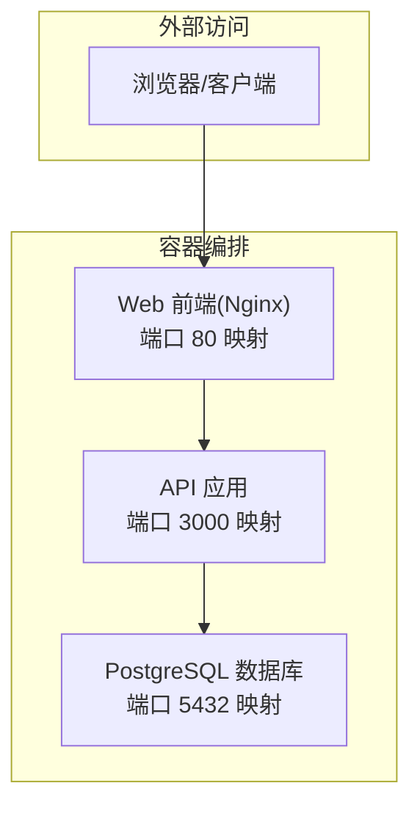
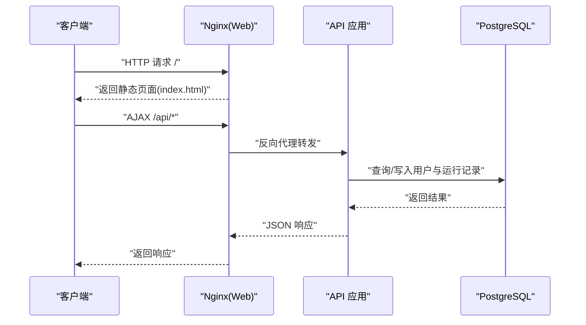
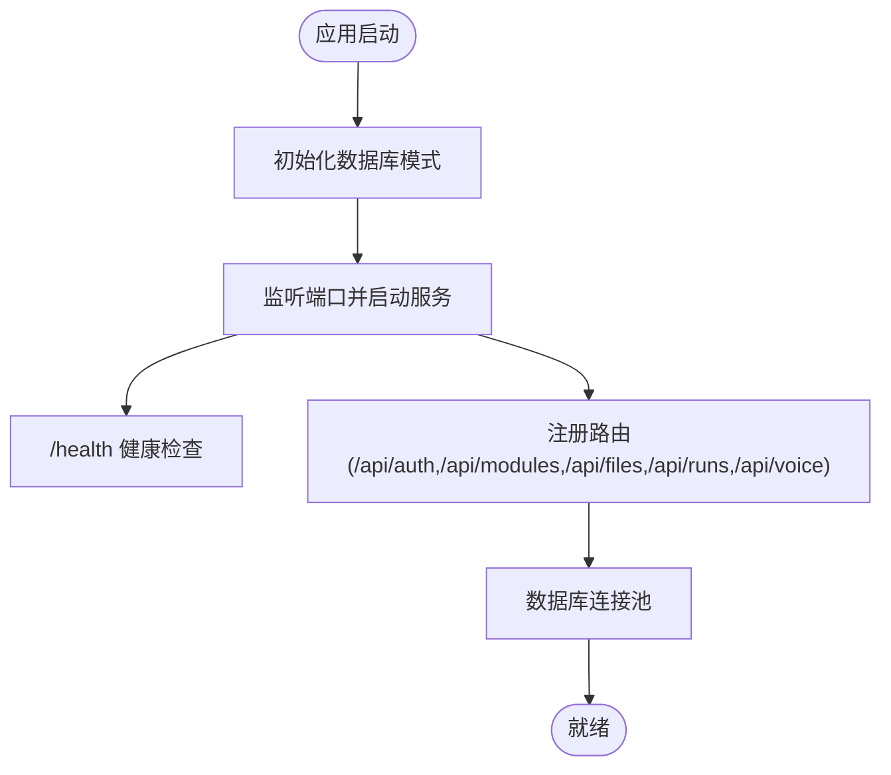
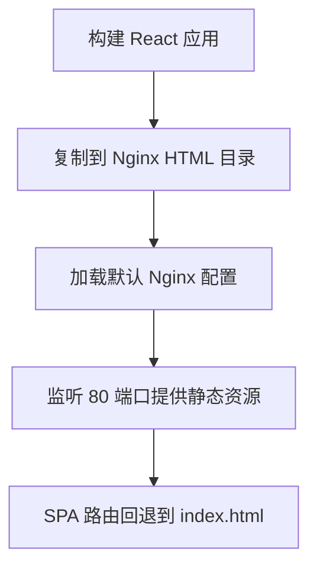

# 部署与运维

<cite>
**本文引用的文件**
- [docker-compose.yml](file://docker-compose.yml)
- [api/Dockerfile](file://api/Dockerfile)
- [web/Dockerfile](file://web/Dockerfile)
- [web/nginx.conf](file://web/nginx.conf)
- [api/src/config.ts](file://api/src/config.ts)
- [api/src/index.ts](file://api/src/index.ts)
- [api/src/db.ts](file://api/src/db.ts)
- [api/src/routes/auth.ts](file://api/src/routes/auth.ts)
- [api/src/middleware/auth.ts](file://api/src/middleware/auth.ts)
- [api/src/utils.ts](file://api/src/utils.ts)
- [api/package.json](file://api/package.json)
- [web/package.json](file://web/package.json)
- [quick-start.bat](file://quick-start.bat)
- [quick-lan-start.bat](file://quick-lan-start.bat)
- [check-deploy.bat](file://check-deploy.bat)
- [deploy-fix.bat](file://deploy-fix.bat)
- [quick-pull.bat](file://quick-pull.bat)
- [quick-save.bat](file://quick-save.bat)
</cite>

## 更新摘要
**所做更改**
- 新增 Docker 部署脚本章节，包含完整的自动化部署流程
- 更新 Nginx 反向代理配置，优化 CORS 和 WebSocket 支持
- 完善环境变量配置与安全加固措施
- 新增监控日志管理与故障排查指南
- 增强 CI/CD 集成与版本管理流程

## 目录
1. [简介](#简介)
2. [项目结构](#项目结构)
3. [核心组件](#核心组件)
4. [架构总览](#架构总览)
5. [详细组件分析](#详细组件分析)
6. [Docker 部署脚本](#docker-部署脚本)
7. [Nginx 反向代理配置](#nginx-反向代理配置)
8. [环境变量与配置管理](#环境变量与配置管理)
9. [监控日志管理](#监控日志管理)
10. [故障排查指南](#故障排查指南)
11. [CI/CD 集成方案](#cicd-集成方案)
12. [性能调优与安全加固](#性能调优与安全加固)
13. [结论](#结论)
14. [附录](#附录)

## 简介
本指南面向开发与运维团队，提供从开发环境到生产环境的完整部署与运维实践，涵盖以下主题：
- Docker 容器化与镜像构建策略
- Nginx 反向代理与静态资源服务
- 生产环境配置与环境变量管理
- 容器编排、服务发现与负载均衡
- 监控指标、日志收集与告警
- 备份策略、灾难恢复与性能调优
- 常见部署问题与运维挑战处理
- 自动化部署脚本与 CI/CD 集成建议

## 项目结构
该项目采用前后端分离架构，使用 Docker Compose 编排数据库、API 与 Web 前端服务，并通过 Nginx 提供静态资源服务与反向代理。

**图表来源**
- [docker-compose.yml:1-35](file://docker-compose.yml#L1-L35)

**章节来源**
- [docker-compose.yml:1-35](file://docker-compose.yml#L1-L35)
- [api/Dockerfile:1-19](file://api/Dockerfile#L1-L19)
- [web/Dockerfile:1-16](file://web/Dockerfile#L1-L16)
- [web/nginx.conf:1-24](file://web/nginx.conf#L1-L24)

## 核心组件
- 数据库服务：PostgreSQL 16，持久化存储于命名卷，提供用户与运行记录等数据表。
- API 服务：基于 Node.js/Express 的后端，提供认证、模块、文件、运行与语音相关接口；内置健康检查端点。
- Web 前端：基于 Vite 构建的 React 应用，通过 Nginx 提供静态资源与 SPA 路由支持。

**章节来源**
- [docker-compose.yml:2-11](file://docker-compose.yml#L2-L11)
- [docker-compose.yml:13-24](file://docker-compose.yml#L13-L24)
- [docker-compose.yml:26-32](file://docker-compose.yml#L26-L32)
- [api/src/index.ts:13-20](file://api/src/index.ts#L13-L20)
- [api/src/db.ts:10-34](file://api/src/db.ts#L10-L34)
- [web/nginx.conf:8-10](file://web/nginx.conf#L8-L10)

## 架构总览
下图展示容器间交互与外部流量路径：

**图表来源**
- [docker-compose.yml:26-32](file://docker-compose.yml#L26-L32)
- [web/nginx.conf:12-23](file://web/nginx.conf#L12-L23)
- [api/src/index.ts:24-26](file://api/src/index.ts#L24-L26)
- [api/src/db.ts:6-8](file://api/src/db.ts#L6-L8)

## 详细组件分析

### API 组件
- 启动与健康检查：应用启动时初始化数据库模式并监听端口；提供 /health 健康检查。
- 认证与授权：提供注册、登录、重置密码、当前用户信息等接口；使用中间件进行鉴权。
- 数据库连接：通过连接池访问 PostgreSQL，首次请求时确保必要表存在。
- 环境变量：要求配置令牌、数据库连接串、JWT 密钥与语音服务基础地址。

**图表来源**
- [api/src/index.ts:34-38](file://api/src/index.ts#L34-L38)
- [api/src/db.ts:10-34](file://api/src/db.ts#L10-L34)
- [api/src/config.ts:5-19](file://api/src/config.ts#L5-L19)

**章节来源**
- [api/src/index.ts:1-38](file://api/src/index.ts#L1-L38)
- [api/src/routes/auth.ts:1-115](file://api/src/routes/auth.ts#L1-L115)
- [api/src/db.ts:1-35](file://api/src/db.ts#L1-L35)
- [api/src/config.ts:1-19](file://api/src/config.ts#L1-L19)
- [api/src/middleware/auth.ts:1-23](file://api/src/middleware/auth.ts#L1-L23)
- [api/src/utils.ts:1-21](file://api/src/utils.ts#L1-L21)

### Web 组件（Nginx）
- 静态资源：将构建产物复制至 Nginx 默认站点根目录。
- SPA 路由：通过 try_files 回退到 index.html，支持前端路由。
- 端口暴露：容器内监听 80，宿主机映射至 5173。

**图表来源**
- [web/Dockerfile:12-16](file://web/Dockerfile#L12-L16)
- [web/nginx.conf:1-24](file://web/nginx.conf#L1-L24)

**章节来源**
- [web/Dockerfile:1-16](file://web/Dockerfile#L1-L16)
- [web/nginx.conf:1-24](file://web/nginx.conf#L1-L24)

### 数据库组件（PostgreSQL）
- 使用官方镜像，设置数据库名、用户名与密码。
- 数据持久化：挂载命名卷 pgdata。
- 端口映射：对外暴露 5432。

**章节来源**
- [docker-compose.yml:2-11](file://docker-compose.yml#L2-L11)

## Docker 部署脚本

### 部署检查脚本
提供完整的部署状态检查功能，包括容器状态、API 健康检查和日志查看。

**章节来源**
- [check-deploy.bat:1-37](file://check-deploy.bat#L1-L37)

### 部署修复脚本
专门针对 TTS 语音生成功能的重新部署脚本，包含完整的清理、重建和启动流程。

**章节来源**
- [deploy-fix.bat:1-47](file://deploy-fix.bat#L1-L47)

### 开发环境启动脚本
提供快速启动开发环境的批处理脚本，支持局域网访问和防火墙配置。

**章节来源**
- [quick-lan-start.bat:1-83](file://quick-lan-start.bat#L1-L83)

### 版本控制脚本
提供安全的 Git 操作脚本，支持暂存敏感文件和远程仓库推送。

**章节来源**
- [quick-pull.bat:1-54](file://quick-pull.bat#L1-L54)
- [quick-save.bat:1-34](file://quick-save.bat#L1-L34)

## Nginx 反向代理配置

### 核心配置优化
新增完善的 Nginx 反向代理配置，支持静态资源服务、API 反向代理和 WebSocket 升级。

**章节来源**
- [web/nginx.conf:1-24](file://web/nginx.conf#L1-L24)

### CORS 配置优化
API 层面的 CORS 配置允许局域网环境下的所有来源访问，支持预检请求缓存。

**章节来源**
- [api/src/index.ts:13-20](file://api/src/index.ts#L13-L20)

### 反向代理头部配置
详细配置了代理头部信息，包括真实 IP、转发信息和协议标识。

**章节来源**
- [web/nginx.conf:13-23](file://web/nginx.conf#L13-L23)

## 环境变量与配置管理

### API 环境变量
- 必需变量：COZE_API_TOKEN、DATABASE_URL、JWT_SECRET、VOICE_BASE_URL
- 可选变量：PORT（默认 3000）
- 配置验证：启动前强制检查必需变量

**章节来源**
- [api/src/config.ts:5-19](file://api/src/config.ts#L5-L19)
- [docker-compose.yml:16-24](file://docker-compose.yml#L16-L24)

### Docker 环境变量注入
通过 docker-compose.yml 文件统一管理环境变量注入，支持不同环境的配置切换。

**章节来源**
- [docker-compose.yml:16-24](file://docker-compose.yml#L16-L24)

### 安全配置最佳实践
- JWT 密钥管理：使用强随机字符串
- 数据库凭据：分离开发和生产环境
- API 令牌：限制访问范围和有效期

## 监控日志管理

### 健康检查监控
- API 健康检查端点：/health
- Docker 容器状态监控
- Nginx 反向代理状态监控

**章节来源**
- [api/src/index.ts:24-26](file://api/src/index.ts#L24-L26)
- [check-deploy.bat:17-25](file://check-deploy.bat#L17-L25)

### 日志收集策略
- Docker 容器日志：使用 docker-compose logs 命令
- Nginx 访问日志：标准输出重定向
- API 应用日志：结构化 JSON 格式

**章节来源**
- [check-deploy.bat:23-25](file://check-deploy.bat#L23-L25)

### 性能监控指标
- API 响应时间
- 数据库连接池状态
- Nginx 请求处理统计
- 容器资源使用情况

## 故障排查指南

### 健康检查失败
- 现象：访问 /health 返回异常或超时
- 排查：确认 API 已完成数据库模式初始化；检查环境变量是否正确注入

**章节来源**
- [api/src/index.ts:24-26](file://api/src/index.ts#L24-L26)
- [api/src/config.ts:5-11](file://api/src/config.ts#L5-L11)

### 数据库连接失败
- 现象：API 启动时报连接错误
- 排查：确认数据库服务已就绪；检查 DATABASE_URL、网络连通性与凭据

**章节来源**
- [docker-compose.yml:21-22](file://docker-compose.yml#L21-L22)
- [api/src/config.ts:5-11](file://api/src/config.ts#L5-L11)

### 前端路由 404
- 现象：刷新或直接访问前端路由出现 404
- 排查：确认 Nginx 配置中的 try_files 回退到 index.html

**章节来源**
- [web/nginx.conf:8-10](file://web/nginx.conf#L8-L10)

### 端口冲突
- 现象：容器启动失败或端口占用
- 排查：修改映射端口或释放被占用端口

**章节来源**
- [docker-compose.yml:10-11](file://docker-compose.yml#L10-L11)
- [docker-compose.yml:23-24](file://docker-compose.yml#L23-L24)

### 开发环境联调
使用提供的快速启动脚本分别启动前端与后端，注意局域网访问参数与防火墙放行。

**章节来源**
- [quick-start.bat:6-10](file://quick-start.bat#L6-L10)
- [quick-lan-start.bat:42-79](file://quick-lan-start.bat#L42-L79)

## CI/CD 集成方案

### 自动化构建流程
- API 服务：多阶段 Docker 构建，生成最小化生产镜像
- Web 前端：Vite 构建静态资源，Nginx 服务优化
- 构建缓存：利用 Docker 层缓存加速构建过程

**章节来源**
- [api/Dockerfile:1-19](file://api/Dockerfile#L1-L19)
- [web/Dockerfile:1-16](file://web/Dockerfile#L1-L16)

### 部署策略
- 滚动更新：支持零停机部署
- 健康检查：前置就绪探针确保服务可用
- 回滚机制：支持快速回滚到上一个稳定版本

### 安全扫描集成
- 镜像漏洞扫描：在 CI 流水线中集成安全扫描
- 依赖安全检查：定期扫描第三方依赖的安全漏洞
- 代码质量检查：ESLint、TypeScript 类型检查

## 性能调优与安全加固

### 性能优化策略
- 数据库连接池：合理设置连接数上限与空闲回收策略
- 前端缓存：利用浏览器缓存与 CDN 加速静态资源
- API 限流：对敏感接口实施速率限制与请求体大小限制
- Nginx 优化：启用 gzip 压缩、调整 worker 连接数与缓冲区大小

### 安全加固措施
- CORS 配置：根据环境调整允许的来源和方法
- JWT 安全：强随机密钥、合理过期时间
- 输入验证：严格的参数验证和长度限制
- 日志脱敏：避免在日志中输出敏感信息

### 容器资源管理
- CPU/内存限制：为各服务设置合理的资源限制
- 重启策略：配置适当的重启策略提升稳定性
- 网络隔离：使用 Docker 网络隔离不同服务

## 结论
本指南提供了从容器化、反向代理到生产配置与运维保障的系统性方案。通过新增的 Docker 部署脚本、优化的 Nginx 反向代理配置和完善的监控日志管理，大大提升了部署效率和运维可靠性。建议在生产环境中进一步完善监控、日志、备份与安全加固，并结合 CI/CD 实现自动化部署与版本治理。

## 附录

### 部署流程（开发与生产）
- 开发环境
  - 使用 Compose 启动：数据库、API、Web
  - 快速启动脚本用于本地联调与局域网访问
- 生产环境
  - 使用独立的 Nginx/反向代理层，前置 TLS 终止与 WAF
  - 将 API 与数据库置于受控网络，仅开放必要端口
  - 使用容器编排平台（如 Kubernetes）实现服务发现与弹性扩缩容

**章节来源**
- [docker-compose.yml:1-35](file://docker-compose.yml#L1-L35)
- [quick-start.bat:6-10](file://quick-start.bat#L6-L10)
- [quick-lan-start.bat:42-79](file://quick-lan-start.bat#L42-L79)

### 环境变量清单
- API 必需变量
  - COZE_API_TOKEN：第三方服务令牌
  - DATABASE_URL：PostgreSQL 连接串
  - JWT_SECRET：JWT 签名密钥
  - VOICE_BASE_URL：语音服务基础地址
  - PORT：API 监听端口（默认 3000）

**章节来源**
- [api/src/config.ts:5-19](file://api/src/config.ts#L5-L19)

### 监控指标体系
- API 指标：健康状态、请求耗时、错误率、数据库连接池状态
- Web 指标：Nginx 访问/错误日志、静态资源命中率
- 数据库指标：连接数、查询耗时、慢查询、表空间使用

### 备份与灾难恢复
- 数据库备份：定期逻辑备份与物理快照；验证恢复流程
- 配置与镜像：将环境变量与镜像版本纳入配置管理与制品库
- DR 测试：定期演练跨数据中心切换与回切流程

### 自动化运维脚本
- 部署检查：check-deploy.bat
- 部署修复：deploy-fix.bat  
- 开发启动：quick-start.bat、quick-lan-start.bat
- 版本控制：quick-pull.bat、quick-save.bat

**章节来源**
- [check-deploy.bat:1-37](file://check-deploy.bat#L1-L37)
- [deploy-fix.bat:1-47](file://deploy-fix.bat#L1-L47)
- [quick-start.bat:1-14](file://quick-start.bat#L1-L14)
- [quick-lan-start.bat:1-83](file://quick-lan-start.bat#L1-L83)
- [quick-pull.bat:1-54](file://quick-pull.bat#L1-L54)
- [quick-save.bat:1-34](file://quick-save.bat#L1-L34)