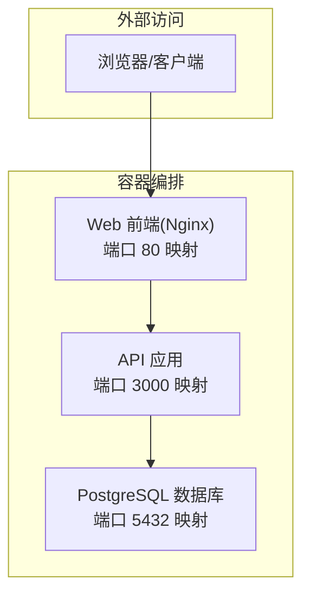
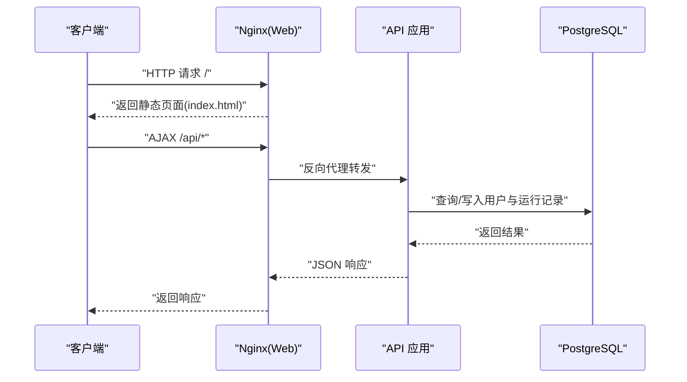
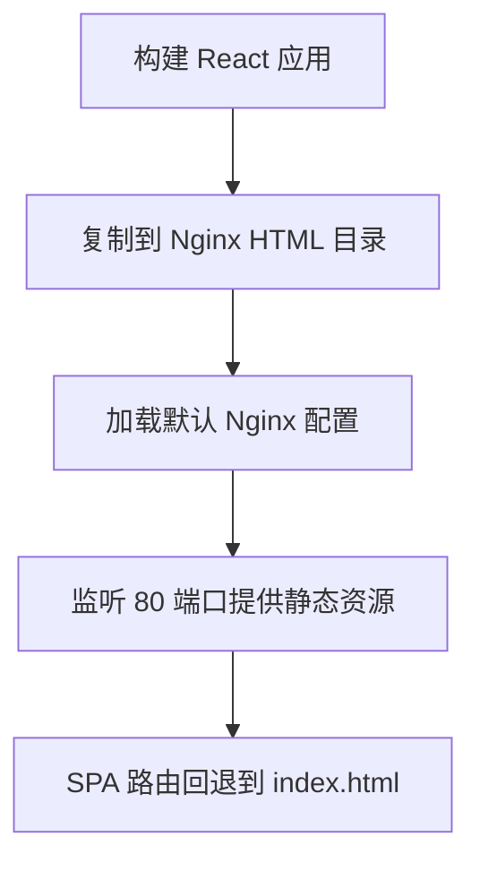
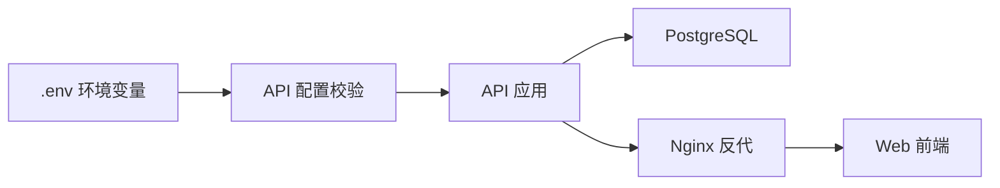

# 部署与运维

<cite>
**本文引用的文件**
- [docker-compose.yml](file://docker-compose.yml)
- [api/Dockerfile](file://api/Dockerfile)
- [web/Dockerfile](file://web/Dockerfile)
- [web/nginx.conf](file://web/nginx.conf)
- [api/src/config.ts](file://api/src/config.ts)
- [api/src/index.ts](file://api/src/index.ts)
- [api/src/db.ts](file://api/src/db.ts)
- [api/src/routes/auth.ts](file://api/src/routes/auth.ts)
- [api/package.json](file://api/package.json)
- [web/package.json](file://web/package.json)
- [quick-start.bat](file://quick-start.bat)
- [quick-lan-start.bat](file://quick-lan-start.bat)
</cite>

## 目录
1. [简介](#简介)
2. [项目结构](#项目结构)
3. [核心组件](#核心组件)
4. [架构总览](#架构总览)
5. [详细组件分析](#详细组件分析)
6. [依赖关系分析](#依赖关系分析)
7. [性能考虑](#性能考虑)
8. [故障排查指南](#故障排查指南)
9. [结论](#结论)
10. [附录](#附录)

## 简介
本指南面向开发与运维团队，提供从开发环境到生产环境的完整部署与运维实践，涵盖以下主题：
- Docker 容器化与镜像构建策略
- Nginx 反向代理与静态资源服务
- 生产环境配置与环境变量管理
- 容器编排、服务发现与负载均衡
- 监控指标、日志收集与告警
- 备份策略、灾难恢复与性能调优
- 常见部署问题与运维挑战处理
- 自动化部署脚本与 CI/CD 集成建议

## 项目结构
该项目采用前后端分离架构，使用 Docker Compose 编排数据库、API 与 Web 前端服务，并通过 Nginx 提供静态资源服务与反向代理。

图表来源
- [docker-compose.yml:1-35](file://docker-compose.yml#L1-L35)

章节来源
- [docker-compose.yml:1-35](file://docker-compose.yml#L1-L35)
- [api/Dockerfile:1-19](file://api/Dockerfile#L1-L19)
- [web/Dockerfile:1-16](file://web/Dockerfile#L1-L16)
- [web/nginx.conf:1-11](file://web/nginx.conf#L1-L11)

## 核心组件
- 数据库服务：PostgreSQL 16，持久化存储于命名卷，提供用户与运行记录等数据表。
- API 服务：基于 Node.js/Express 的后端，提供认证、模块、文件、运行与语音相关接口；内置健康检查端点。
- Web 前端：基于 Vite 构建的 React 应用，通过 Nginx 提供静态资源与 SPA 路由支持。

章节来源
- [docker-compose.yml:2-11](file://docker-compose.yml#L2-L11)
- [docker-compose.yml:13-24](file://docker-compose.yml#L13-L24)
- [docker-compose.yml:26-32](file://docker-compose.yml#L26-L32)
- [api/src/index.ts:15-17](file://api/src/index.ts#L15-L17)
- [api/src/db.ts:10-34](file://api/src/db.ts#L10-L34)
- [web/nginx.conf:8-10](file://web/nginx.conf#L8-L10)

## 架构总览
下图展示容器间交互与外部流量路径：

图表来源
- [docker-compose.yml:26-32](file://docker-compose.yml#L26-L32)
- [web/nginx.conf:8-10](file://web/nginx.conf#L8-L10)
- [api/src/index.ts:19-23](file://api/src/index.ts#L19-L23)
- [api/src/db.ts:6-8](file://api/src/db.ts#L6-L8)

## 详细组件分析

### API 组件
- 启动与健康检查：应用启动时初始化数据库模式并监听端口；提供 /health 健康检查。
- 认证与授权：提供注册、登录、重置密码、当前用户信息等接口；使用中间件进行鉴权。
- 数据库连接：通过连接池访问 PostgreSQL，首次请求时确保必要表存在。
- 环境变量：要求配置令牌、数据库连接串、JWT 密钥与语音服务基础地址。

图表来源
- [api/src/index.ts:25-29](file://api/src/index.ts#L25-L29)
- [api/src/db.ts:10-34](file://api/src/db.ts#L10-L34)
- [api/src/config.ts:5-11](file://api/src/config.ts#L5-L11)

章节来源
- [api/src/index.ts:1-29](file://api/src/index.ts#L1-L29)
- [api/src/routes/auth.ts:1-115](file://api/src/routes/auth.ts#L1-L115)
- [api/src/db.ts:1-35](file://api/src/db.ts#L1-L35)
- [api/src/config.ts:1-19](file://api/src/config.ts#L1-L19)

### Web 组件（Nginx）
- 静态资源：将构建产物复制至 Nginx 默认站点根目录。
- SPA 路由：通过 try_files 回退到 index.html，支持前端路由。
- 端口暴露：容器内监听 80，宿主机映射至 5173。

图表来源
- [web/Dockerfile:12-16](file://web/Dockerfile#L12-L16)
- [web/nginx.conf:1-11](file://web/nginx.conf#L1-L11)

章节来源
- [web/Dockerfile:1-16](file://web/Dockerfile#L1-L16)
- [web/nginx.conf:1-11](file://web/nginx.conf#L1-L11)

### 数据库组件（PostgreSQL）
- 使用官方镜像，设置数据库名、用户名与密码。
- 数据持久化：挂载命名卷 pgdata。
- 端口映射：对外暴露 5432。

章节来源
- [docker-compose.yml:2-11](file://docker-compose.yml#L2-L11)

### 环境变量与配置
- 必需变量：COZE_API_TOKEN、DATABASE_URL、JWT_SECRET、VOICE_BASE_URL。
- API 服务：读取 .env 并在启动前校验必需变量是否存在。
- Compose：通过环境变量注入 API 所需配置。

章节来源
- [api/src/config.ts:5-11](file://api/src/config.ts#L5-L11)
- [api/src/config.ts:13-19](file://api/src/config.ts#L13-L19)
- [docker-compose.yml:16-20](file://docker-compose.yml#L16-L20)

## 依赖关系分析
- API 依赖数据库连接池与环境变量；启动顺序由 Compose 的 depends_on 控制。
- Web 依赖 API 提供后端接口；Nginx 作为反向代理转发 /api/* 到 API。
- 开发工具链：API 使用 TypeScript/Express，Web 使用 Vite/React。

图表来源
- [api/src/config.ts:3-11](file://api/src/config.ts#L3-L11)
- [docker-compose.yml:16-24](file://docker-compose.yml#L16-L24)
- [web/nginx.conf:8-10](file://web/nginx.conf#L8-L10)

章节来源
- [api/package.json:6-9](file://api/package.json#L6-L9)
- [web/package.json:6-9](file://web/package.json#L6-L9)
- [docker-compose.yml:21-30](file://docker-compose.yml#L21-L30)

## 性能考虑
- 数据库连接池：合理设置连接数上限与空闲回收策略，避免并发高峰下的连接耗尽。
- 前端缓存：利用浏览器缓存与 CDN 加速静态资源；控制缓存头以平衡更新与性能。
- API 限流与超时：对敏感接口（如登录/注册）实施速率限制与请求体大小限制。
- Nginx 优化：启用 gzip 压缩、调整 worker 连接数与缓冲区大小。
- 容器资源限制：在生产中为各服务设置 CPU/内存限制与重启策略，提升稳定性。

## 故障排查指南
- 健康检查失败
  - 现象：访问 /health 返回异常或超时。
  - 排查：确认 API 已完成数据库模式初始化；检查环境变量是否正确注入。
- 数据库连接失败
  - 现象：API 启动时报连接错误。
  - 排查：确认数据库服务已就绪；检查 DATABASE_URL、网络连通性与凭据。
- 前端路由 404
  - 现象：刷新或直接访问前端路由出现 404。
  - 排查：确认 Nginx 配置中的 try_files 回退到 index.html。
- 端口冲突
  - 现象：容器启动失败或端口占用。
  - 排查：修改映射端口或释放被占用端口。
- 开发环境联调
  - 使用提供的快速启动脚本分别启动前端与后端，注意局域网访问参数与防火墙放行。

章节来源
- [api/src/index.ts:15-17](file://api/src/index.ts#L15-L17)
- [api/src/config.ts:5-11](file://api/src/config.ts#L5-L11)
- [web/nginx.conf:8-10](file://web/nginx.conf#L8-L10)
- [quick-lan-start.bat:42-46](file://quick-lan-start.bat#L42-L46)
- [quick-lan-start.bat:29-31](file://quick-lan-start.bat#L29-L31)

## 结论
本指南提供了从容器化、反向代理到生产配置与运维保障的系统性方案。建议在生产环境中进一步完善监控、日志、备份与安全加固，并结合 CI/CD 实现自动化部署与版本治理。

## 附录

### 部署流程（开发与生产）
- 开发环境
  - 使用 Compose 启动：数据库、API、Web。
  - 快速启动脚本用于本地联调与局域网访问。
- 生产环境
  - 使用独立的 Nginx/反向代理层，前置 TLS 终止与 WAF。
  - 将 API 与数据库置于受控网络，仅开放必要端口。
  - 使用容器编排平台（如 Kubernetes）实现服务发现与弹性扩缩容。

章节来源
- [docker-compose.yml:1-35](file://docker-compose.yml#L1-L35)
- [quick-start.bat:6-10](file://quick-start.bat#L6-L10)
- [quick-lan-start.bat:42-79](file://quick-lan-start.bat#L42-L79)

### 环境变量清单
- API 必需变量
  - COZE_API_TOKEN：第三方服务令牌
  - DATABASE_URL：PostgreSQL 连接串
  - JWT_SECRET：JWT 签名密钥
  - VOICE_BASE_URL：语音服务基础地址
  - PORT：API 监听端口（默认 3000）

章节来源
- [api/src/config.ts:5-19](file://api/src/config.ts#L5-L19)

### 安全加固建议
- 强制 HTTPS：在反向代理层启用 TLS 并禁用弱协议。
- 最小权限：数据库凭据与令牌仅在受控环境中注入。
- 输入校验：对所有接口输入进行严格校验与长度限制。
- 日志脱敏：避免在日志中输出敏感信息。
- 定期审计：对 API 与数据库访问日志进行审计与告警。

### 监控与日志
- 指标采集
  - API：/health 健康状态、请求耗时、错误率、数据库连接池状态。
  - Web：Nginx 访问/错误日志、静态资源命中率。
  - 数据库：连接数、查询耗时、慢查询、表空间使用。
- 日志收集
  - 使用集中式日志系统（如 ELK/EFK）收集容器 stdout/stderr。
  - 对关键业务事件（登录、重置密码、运行任务）做结构化日志。
- 告警策略
  - 健康检查失败、错误率突增、数据库连接池耗尽、磁盘空间不足等。

### 备份与灾难恢复
- 数据库备份
  - 定期逻辑备份与物理快照；验证恢复流程。
- 配置与镜像
  - 将环境变量与镜像版本纳入配置管理与制品库。
- DR 测试
  - 定期演练跨数据中心切换与回切流程。

### 性能调优
- API
  - 合理设置数据库连接池大小；对热点接口增加缓存。
- Web
  - 启用静态资源压缩与缓存；CDN 分发。
- Nginx
  - 调整 worker 连接数、缓冲区大小与 keepalive 超时。
- 容器
  - 设置 CPU/内存限制与优先级；启用水平/垂直扩展。

### 自动化部署与 CI/CD 集成
- 构建阶段
  - API：多阶段构建生成最小镜像；打包产物用于部署。
  - Web：构建静态资源并上传制品库。
- 部署阶段
  - 使用编排平台部署；滚动更新与回滚策略。
  - 前置健康检查与就绪探针，确保平滑发布。
- 安全扫描
  - 在流水线中集成镜像漏洞扫描与依赖安全检查。