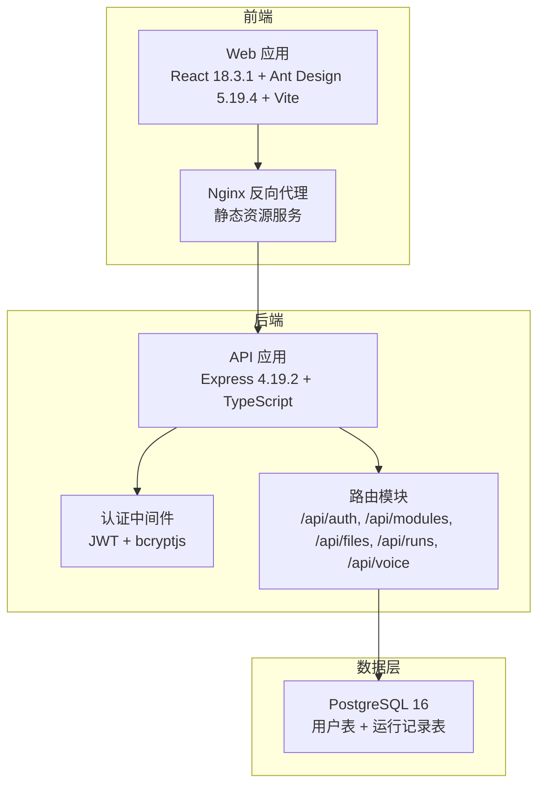
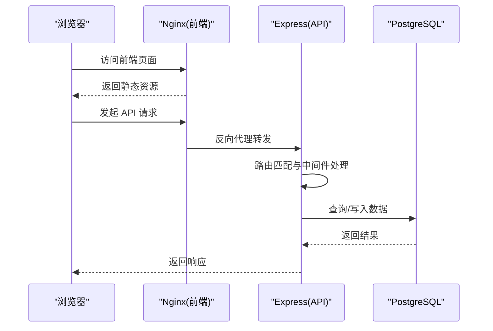
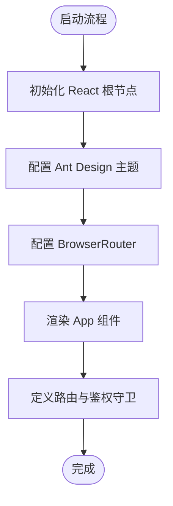
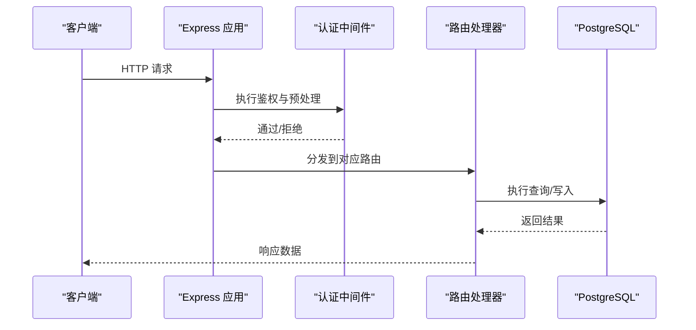
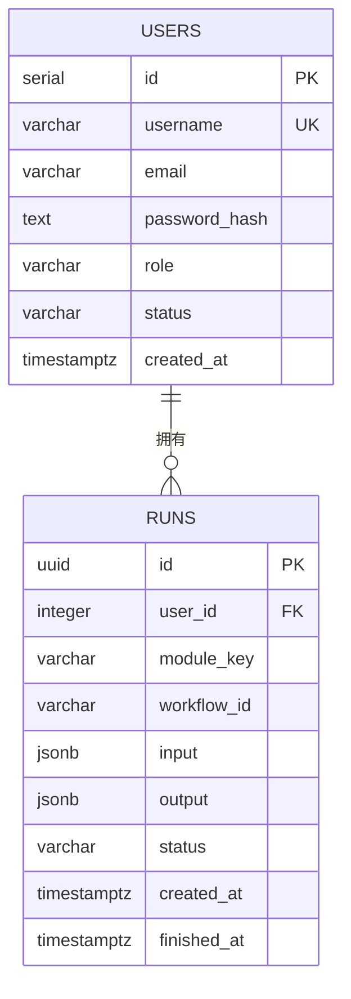
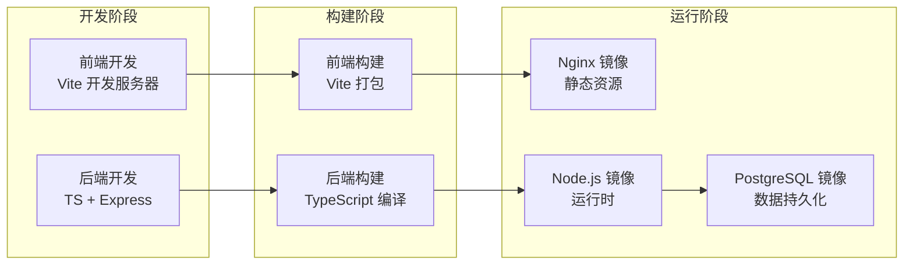
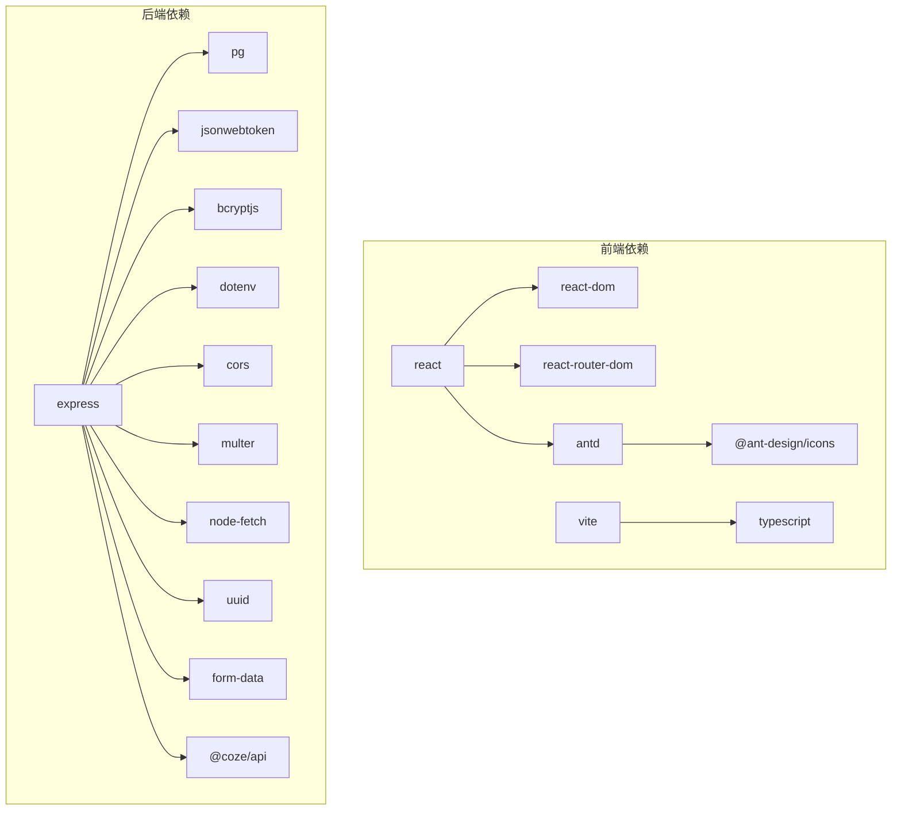

# 技术栈概览

<cite>
**本文档引用的文件**
- [api/package.json](file://api/package.json)
- [web/package.json](file://web/package.json)
- [docker-compose.yml](file://docker-compose.yml)
- [api/Dockerfile](file://api/Dockerfile)
- [web/Dockerfile](file://web/Dockerfile)
- [api/tsconfig.json](file://api/tsconfig.json)
- [web/tsconfig.json](file://web/tsconfig.json)
- [web/vite.config.ts](file://web/vite.config.ts)
- [api/src/index.ts](file://api/src/index.ts)
- [api/src/db.ts](file://api/src/db.ts)
- [api/src/config.ts](file://api/src/config.ts)
- [api/src/coze.ts](file://api/src/coze.ts)
- [web/src/main.tsx](file://web/src/main.tsx)
- [web/src/App.tsx](file://web/src/App.tsx)
</cite>

## 目录
1. [引言](#引言)
2. [项目结构](#项目结构)
3. [核心组件](#核心组件)
4. [架构总览](#架构总览)
5. [详细组件分析](#详细组件分析)
6. [依赖关系分析](#依赖关系分析)
7. [性能考虑](#性能考虑)
8. [故障排除指南](#故障排除指南)
9. [结论](#结论)

## 引言
本文件面向 Coze Workflow 项目，提供技术栈概览与整体架构认知。围绕前端（React 18.3.1、Ant Design 5.19.4、Vite）、后端（Node.js、Express 4.19.2、TypeScript）、数据库（PostgreSQL）与部署（Docker、Nginx）进行系统化说明，解释各技术选型的原因、优势以及它们如何协同支撑项目功能需求。文中所有技术决策均以仓库中的实际配置与代码为依据，并通过图示与来源标注帮助读者快速定位到具体实现。

## 项目结构
该项目采用前后端分离的多服务架构，通过 Docker Compose 编排运行，包含以下主要组件：
- 前端 Web 应用：基于 Vite 构建，打包后由 Nginx 提供静态资源服务
- 后端 API 应用：基于 Express 框架，使用 TypeScript 开发，负责业务逻辑与数据访问
- 数据库：PostgreSQL，通过连接池管理数据库连接
- 部署：容器化编排，前端镜像基于 Nginx 发布静态页面，后端镜像基于 Node.js 运行

图表来源
- [docker-compose.yml:1-35](file://docker-compose.yml#L1-L35)
- [web/Dockerfile:12-16](file://web/Dockerfile#L12-L16)
- [api/Dockerfile:1-19](file://api/Dockerfile#L1-L19)
- [api/src/index.ts:1-29](file://api/src/index.ts#L1-L29)
- [api/src/db.ts:1-35](file://api/src/db.ts#L1-L35)

章节来源
- [docker-compose.yml:1-35](file://docker-compose.yml#L1-L35)
- [web/Dockerfile:1-16](file://web/Dockerfile#L1-L16)
- [api/Dockerfile:1-19](file://api/Dockerfile#L1-L19)

## 核心组件
本节从技术栈维度梳理关键组件及其作用：

- 前端技术栈
  - React 18.3.1：用于构建用户界面，支持并发特性与严格模式
  - Ant Design 5.19.4：提供丰富的 UI 组件与设计规范，提升开发效率与一致性
  - Vite 5.4.2：快速的构建工具与开发服务器，优化开发体验
  - TypeScript 5.5.4：提供类型安全与更好的 IDE 支持
  - React Router DOM 6.25.1：处理前端路由导航
  - @ant-design/icons 6.1.0：图标库

- 后端技术栈
  - Node.js（容器基础镜像为 node:20）：运行时环境
  - Express 4.19.2：Web 框架，提供路由与中间件能力
  - TypeScript 5.5.4：类型安全与工程化支持
  - PostgreSQL 驱动 pg 8.12.0：数据库连接与查询
  - JSON Web Token 9.0.2：认证令牌管理
  - bcryptjs 2.4.3：密码哈希与校验
  - dotenv 16.4.5：加载环境变量
  - Coze API SDK 1.3.1：对接 Coze 平台能力

- 数据库技术
  - PostgreSQL 16：企业级关系型数据库，提供事务、约束与高性能查询
  - 连接池：通过 pg 的 Pool 管理连接复用，降低开销

- 部署技术
  - Docker Compose：统一编排数据库、API、Web 服务
  - Nginx 1.27：作为前端静态资源服务器，反向代理 API 请求
  - 多阶段构建：前端基于 Nginx 镜像发布，后端基于 Node.js 镜像运行

章节来源
- [web/package.json:1-26](file://web/package.json#L1-L26)
- [api/package.json:1-36](file://api/package.json#L1-L36)
- [api/src/db.ts:1-35](file://api/src/db.ts#L1-L35)
- [docker-compose.yml:1-35](file://docker-compose.yml#L1-L35)
- [web/Dockerfile:1-16](file://web/Dockerfile#L1-L16)
- [api/Dockerfile:1-19](file://api/Dockerfile#L1-L19)

## 架构总览
下图展示了从前端到后端再到数据库的完整请求链路，以及容器化部署的服务关系。

图表来源
- [docker-compose.yml:13-32](file://docker-compose.yml#L13-L32)
- [web/Dockerfile:12-16](file://web/Dockerfile#L12-L16)
- [api/src/index.ts:1-29](file://api/src/index.ts#L1-L29)
- [api/src/db.ts:1-35](file://api/src/db.ts#L1-L35)

## 详细组件分析

### 前端应用（React + Ant Design + Vite）
- 入口与主题配置
  - 应用入口在 main.tsx 中初始化 React、路由与主题配置，设置主色调等全局样式
  - App.tsx 定义路由规则与鉴权守卫，确保未登录用户跳转至登录页
- 技术要点
  - 使用 React Router DOM 实现单页应用路由
  - Ant Design 提供统一的 UI 组件体系，提升交互一致性
  - Vite 提供快速热更新与构建能力，开发体验良好
- 关键路径
  - 入口渲染：[web/src/main.tsx:1-17](file://web/src/main.tsx#L1-L17)
  - 路由与鉴权：[web/src/App.tsx:1-70](file://web/src/App.tsx#L1-L70)
  - 构建配置：[web/vite.config.ts:1-10](file://web/vite.config.ts#L1-L10)
  - 类型配置：[web/tsconfig.json:1-21](file://web/tsconfig.json#L1-L21)

图表来源
- [web/src/main.tsx:1-17](file://web/src/main.tsx#L1-L17)
- [web/src/App.tsx:1-70](file://web/src/App.tsx#L1-L70)

章节来源
- [web/src/main.tsx:1-17](file://web/src/main.tsx#L1-L17)
- [web/src/App.tsx:1-70](file://web/src/App.tsx#L1-L70)
- [web/vite.config.ts:1-10](file://web/vite.config.ts#L1-L10)
- [web/tsconfig.json:1-21](file://web/tsconfig.json#L1-L21)

### 后端 API（Express + TypeScript + PostgreSQL）
- 应用入口与路由
  - index.ts 创建 Express 应用，启用 CORS 与 JSON 解析，注册健康检查与各模块路由
  - 路由模块覆盖认证、模块、文件、运行记录与语音相关接口
- 数据库与配置
  - db.ts 使用 pg 的 Pool 建立连接池，并在启动时确保用户与运行记录表存在
  - config.ts 从环境变量加载必要配置，包括 Coze API Token、数据库连接串、JWT 密钥与语音服务地址
- 第三方集成
  - coze.ts 初始化 Coze API 客户端，用于调用外部平台能力
- 关键路径
  - 应用入口：[api/src/index.ts:1-29](file://api/src/index.ts#L1-L29)
  - 数据库连接与建表：[api/src/db.ts:1-35](file://api/src/db.ts#L1-L35)
  - 环境配置：[api/src/config.ts:1-19](file://api/src/config.ts#L1-L19)
  - Coze 客户端：[api/src/coze.ts:1-8](file://api/src/coze.ts#L1-L8)
  - 类型配置：[api/tsconfig.json:1-14](file://api/tsconfig.json#L1-L14)

图表来源
- [api/src/index.ts:1-29](file://api/src/index.ts#L1-L29)
- [api/src/db.ts:1-35](file://api/src/db.ts#L1-L35)
- [api/src/config.ts:1-19](file://api/src/config.ts#L1-L19)

章节来源
- [api/src/index.ts:1-29](file://api/src/index.ts#L1-L29)
- [api/src/db.ts:1-35](file://api/src/db.ts#L1-L35)
- [api/src/config.ts:1-19](file://api/src/config.ts#L1-L19)
- [api/src/coze.ts:1-8](file://api/src/coze.ts#L1-L8)
- [api/tsconfig.json:1-14](file://api/tsconfig.json#L1-L14)

### 数据库（PostgreSQL）
- 表结构
  - 用户表：存储用户名、邮箱、密码哈希、角色与状态等字段
  - 运行记录表：存储工作流运行 ID、关联用户、模块键、输入输出、状态与时间戳等
- 连接与生命周期
  - 通过连接池管理连接，减少频繁建立/销毁连接的开销
  - 在应用启动时自动创建所需表结构，保证最小可用性
- 关键路径
  - 连接池与建表：[api/src/db.ts:1-35](file://api/src/db.ts#L1-L35)

图表来源
- [api/src/db.ts:10-34](file://api/src/db.ts#L10-L34)

章节来源
- [api/src/db.ts:1-35](file://api/src/db.ts#L1-L35)

### 部署（Docker + Nginx）
- 编排与服务
  - docker-compose.yml 定义 db、api、web 三个服务，分别映射端口并声明依赖关系
  - 数据库使用官方 postgres:16-alpine 镜像，持久化数据卷
  - API 服务基于 node:20，生产环境运行 dist/index.js
  - Web 服务基于 node:20 构建产物，最终由 nginx:1.27 提供静态资源
- 多阶段构建
  - 前端：先安装依赖与构建，再复制到 nginx 镜像中
  - 后端：先安装依赖与编译 TS，再复制到运行镜像中
- 关键路径
  - 编排文件：[docker-compose.yml:1-35](file://docker-compose.yml#L1-L35)
  - 前端 Dockerfile：[web/Dockerfile:1-16](file://web/Dockerfile#L1-L16)
  - 后端 Dockerfile：[api/Dockerfile:1-19](file://api/Dockerfile#L1-L19)

图表来源
- [docker-compose.yml:1-35](file://docker-compose.yml#L1-L35)
- [web/Dockerfile:1-16](file://web/Dockerfile#L1-L16)
- [api/Dockerfile:1-19](file://api/Dockerfile#L1-L19)

章节来源
- [docker-compose.yml:1-35](file://docker-compose.yml#L1-L35)
- [web/Dockerfile:1-16](file://web/Dockerfile#L1-L16)
- [api/Dockerfile:1-19](file://api/Dockerfile#L1-L19)

## 依赖关系分析
- 前端依赖
  - React 生态：react、react-dom、react-router-dom
  - UI 框架：antd 与 @ant-design/icons
  - 构建工具：vite、@vitejs/plugin-react、typescript
- 后端依赖
  - Web 框架：express
  - 数据库：pg（PostgreSQL 驱动）
  - 安全与认证：bcryptjs、jsonwebtoken
  - 工具与环境：dotenv、cors、multer、node-fetch、uuid、form-data
  - 对接平台：@coze/api
- 类型支持
  - 前端与后端均使用 TypeScript，配合严格的编译选项提升代码质量

图表来源
- [web/package.json:11-24](file://web/package.json#L11-L24)
- [api/package.json:11-34](file://api/package.json#L11-L34)

章节来源
- [web/package.json:1-26](file://web/package.json#L1-L26)
- [api/package.json:1-36](file://api/package.json#L1-L36)

## 性能考虑
- 前端
  - Vite 的快速冷启动与热更新显著提升开发效率；生产构建开启 Tree Shaking 与按需打包，减小体积
  - Ant Design 的按需引入与主题定制可减少不必要资源加载
- 后端
  - 使用连接池（pg.Pool）降低数据库连接成本，提高并发处理能力
  - Express 的中间件机制与路由分发清晰，便于扩展与性能优化点定位
- 数据库
  - PostgreSQL 提供成熟的索引与事务支持，结合合理的字段类型与约束，保障读写性能与数据一致性
- 部署
  - Nginx 作为静态资源服务器具备高并发与低延迟特性；多阶段构建减少镜像体积，缩短拉取与启动时间

## 故障排除指南
- 环境变量缺失
  - 后端启动前会校验关键环境变量（如 Coze API Token、数据库连接串、JWT Secret、语音服务地址），若缺失将抛出错误
  - 排查步骤：确认 .env 文件或容器环境变量已正确注入
  - 关键路径：[api/src/config.ts:5-11](file://api/src/config.ts#L5-L11)
- 数据库连接失败
  - 检查数据库服务是否正常运行、网络连通性与连接串格式
  - 确认容器间网络与端口映射配置
  - 关键路径：[docker-compose.yml:2-11](file://docker-compose.yml#L2-L11)
- 健康检查
  - 后端提供 /health 接口用于服务可用性检测
  - 关键路径：[api/src/index.ts:15-17](file://api/src/index.ts#L15-L17)
- 前端鉴权失效
  - 当后端返回未授权时，前端会清除本地令牌并重定向至登录页
  - 关键路径：[web/src/App.tsx:26-39](file://web/src/App.tsx#L26-L39)

章节来源
- [api/src/config.ts:5-11](file://api/src/config.ts#L5-L11)
- [docker-compose.yml:2-11](file://docker-compose.yml#L2-L11)
- [api/src/index.ts:15-17](file://api/src/index.ts#L15-L17)
- [web/src/App.tsx:26-39](file://web/src/App.tsx#L26-L39)

## 结论
本项目采用“现代前端 + Node.js 后端 + PostgreSQL + 容器化部署”的技术组合，既满足了快速迭代的开发需求，也兼顾了生产环境的稳定性与可维护性。React + Ant Design 提升了前端开发效率与用户体验，Express + TypeScript 提供了清晰的后端架构与类型安全保障，PostgreSQL 保证了数据层的可靠性，Docker 与 Nginx 则实现了高效的交付与运行。该技术栈适合需要快速构建、持续演进的工作流类应用。