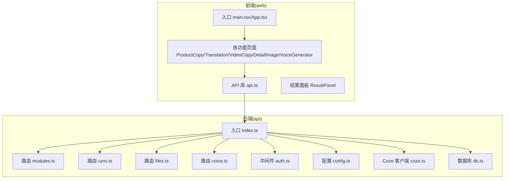
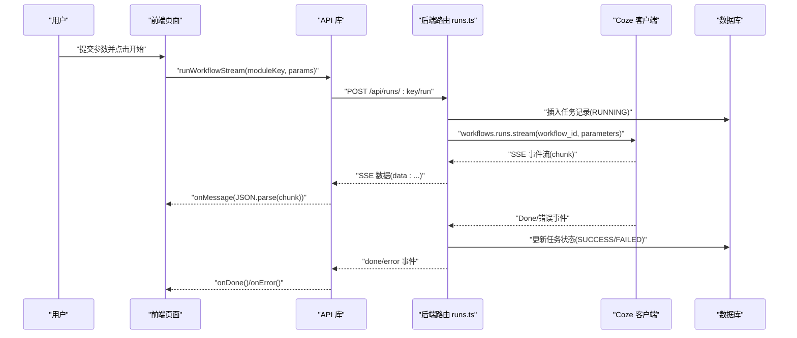
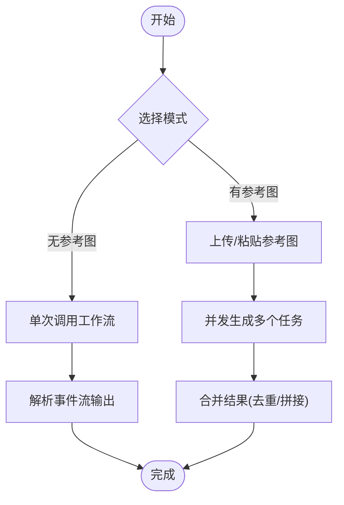
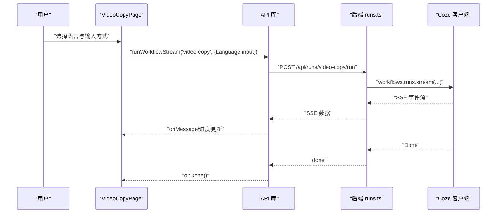
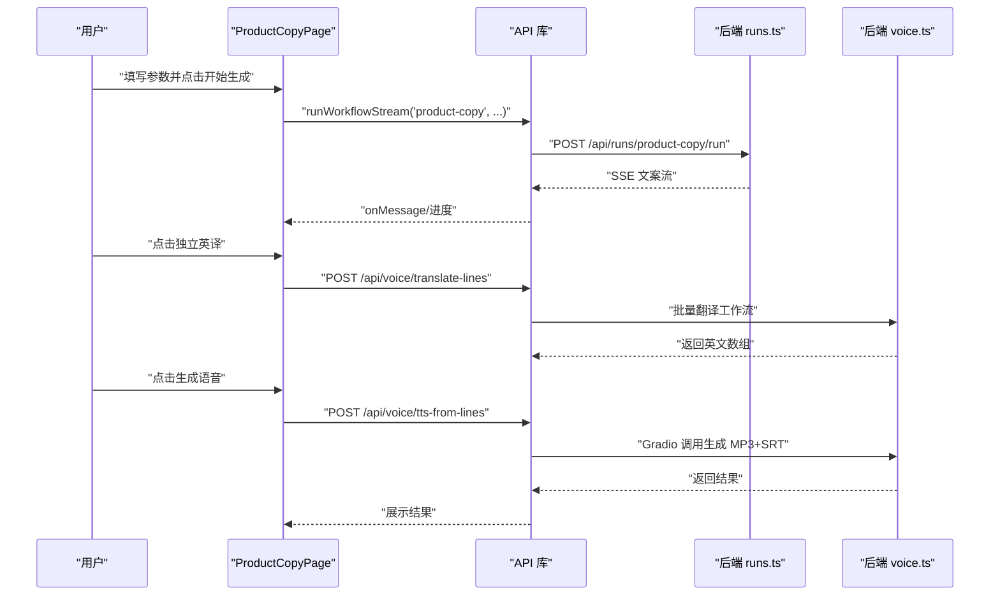
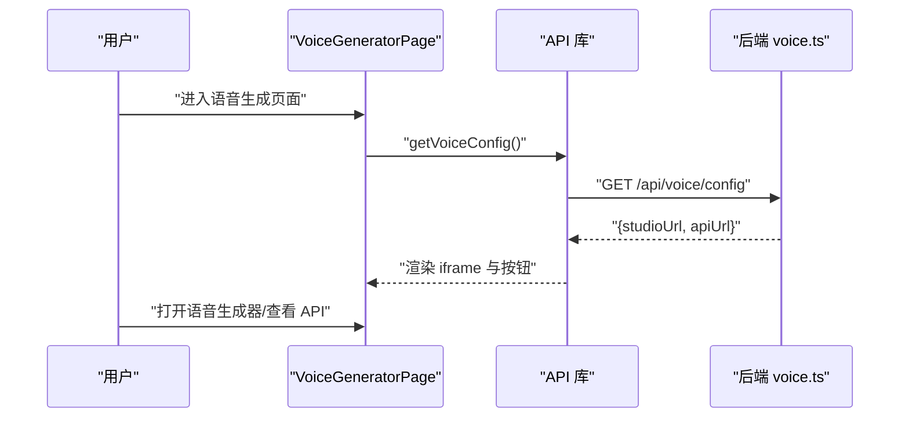
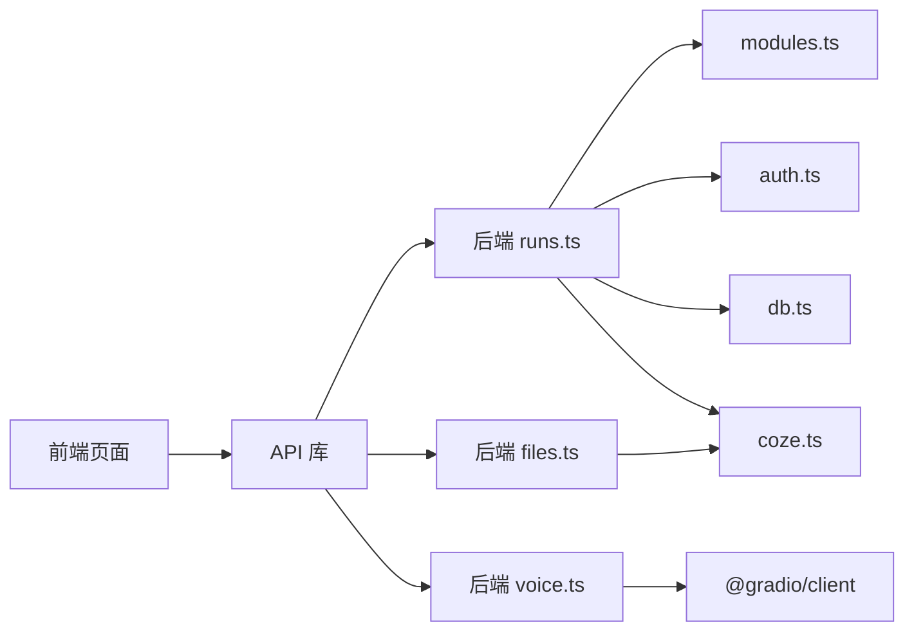

# 核心功能特性

<cite>
**本文引用的文件**
- [api/src/index.ts](file://api/src/index.ts)
- [api/src/config.ts](file://api/src/config.ts)
- [api/src/coze.ts](file://api/src/coze.ts)
- [api/src/modules.ts](file://api/src/modules.ts)
- [api/src/db.ts](file://api/src/db.ts)
- [api/src/middleware/auth.ts](file://api/src/middleware/auth.ts)
- [api/src/routes/modules.ts](file://api/src/routes/modules.ts)
- [api/src/routes/runs.ts](file://api/src/routes/runs.ts)
- [api/src/routes/files.ts](file://api/src/routes/files.ts)
- [api/src/routes/voice.ts](file://api/src/routes/voice.ts)
- [web/src/lib/api.ts](file://web/src/lib/api.ts)
- [web/src/pages/ProductCopyPage.tsx](file://web/src/pages/ProductCopyPage.tsx)
- [web/src/pages/TranslationPage.tsx](file://web/src/pages/TranslationPage.tsx)
- [web/src/pages/VideoCopyPage.tsx](file://web/src/pages/VideoCopyPage.tsx)
- [web/src/pages/DetailImagePage.tsx](file://web/src/pages/DetailImagePage.tsx)
- [web/src/pages/VoiceGeneratorPage.tsx](file://web/src/pages/VoiceGeneratorPage.tsx)
- [web/src/components/ResultPanel.tsx](file://web/src/components/ResultPanel.tsx)
</cite>

## 目录
1. [简介](#简介)
2. [项目结构](#项目结构)
3. [核心组件](#核心组件)
4. [架构总览](#架构总览)
5. [详细组件分析](#详细组件分析)
6. [依赖分析](#依赖分析)
7. [性能考虑](#性能考虑)
8. [故障排查指南](#故障排查指南)
9. [结论](#结论)
10. [附录](#附录)

## 简介
本项目是一个基于 Coze 工作流引擎的多模态内容生产平台，围绕“图像生成、视频处理、文案创作、翻译服务、语音生成”五大核心能力构建。前端通过浏览器直连后端 API，后端以 Express 提供 REST 接口与 SSE 流式响应，结合 Coze 工作流与第三方语音服务，形成从输入到多形态输出的一体化体验。系统强调模块化、可扩展与易用性，支持本地上传与远程链接两种输入方式，提供进度可视化与结果面板，帮助用户高效完成内容生产。

## 项目结构
- 前端（web）：基于 React + Ant Design，页面按功能划分，统一通过 API 库发起请求。
- 后端（api）：Express 服务，路由按功能拆分，中间件负责鉴权，数据库持久化任务状态，对接 Coze 与语音服务。

图表来源
- [api/src/index.ts:1-29](file://api/src/index.ts#L1-L29)
- [web/src/lib/api.ts:1-160](file://web/src/lib/api.ts#L1-L160)

章节来源
- [api/src/index.ts:1-29](file://api/src/index.ts#L1-L29)
- [api/src/config.ts:1-19](file://api/src/config.ts#L1-L19)

## 核心组件
- 模块注册中心：集中管理各功能模块的标识、名称与对应的工作流 ID。
- 运行调度器：接收前端参数，调用 Coze 工作流，以 SSE 流式返回中间结果与最终输出。
- 文件上传代理：将本地文件上传至 Coze，返回 file_id 供工作流使用。
- 语音服务集成：提供语音配置查询、批量翻译、TTS 生成（MP3+SRT）与调试记录。
- 前端 API 库：封装 fetch、SSE 读取、文件上传、鉴权头注入与错误处理。
- 结果面板：统一展示文本流、JSON 调试、进度条与复制按钮。

章节来源
- [api/src/modules.ts:1-29](file://api/src/modules.ts#L1-L29)
- [api/src/routes/runs.ts:55-159](file://api/src/routes/runs.ts#L55-L159)
- [api/src/routes/files.ts:10-43](file://api/src/routes/files.ts#L10-L43)
- [api/src/routes/voice.ts:69-86](file://api/src/routes/voice.ts#L69-L86)
- [web/src/lib/api.ts:58-160](file://web/src/lib/api.ts#L58-L160)
- [web/src/components/ResultPanel.tsx:14-46](file://web/src/components/ResultPanel.tsx#L14-L46)

## 架构总览
系统采用前后端分离设计，前端页面通过 API 库向后端发起请求，后端路由根据模块键调用 Coze 工作流，实时回传事件流。文件上传经由后端代理到 Coze，语音服务通过 Gradio 客户端连接局域网语音站点，实现统一的多模态内容生成体验。

图表来源
- [web/src/lib/api.ts:58-115](file://web/src/lib/api.ts#L58-L115)
- [api/src/routes/runs.ts:55-159](file://api/src/routes/runs.ts#L55-L159)
- [api/src/coze.ts:4-7](file://api/src/coze.ts#L4-L7)

## 详细组件分析

### 图像生成（详情图生成）
- 功能概述：支持“有参考图”和“无参考图”两种模式，输入主图与可选参考图，生成多张详情图链接或文案组合。
- 使用场景：电商主图优化、产品详情页素材生成、广告创意拼接。
- 技术实现：
  - 有参考图：并发上传参考图，逐个调用工作流，聚合输出链接与文本。
  - 无参考图：单次调用工作流，解析事件流中的输出链接并展示。
  - 文件上传：本地文件先上传至 Coze 获取 file_id，再作为参数传入工作流。
- 用户体验：Tab 切换模式，表单校验与进度条，结果面板支持复制与查看 JSON。

图表来源
- [web/src/pages/DetailImagePage.tsx:105-251](file://web/src/pages/DetailImagePage.tsx#L105-L251)
- [api/src/routes/files.ts:10-43](file://api/src/routes/files.ts#L10-L43)
- [api/src/routes/runs.ts:84-123](file://api/src/routes/runs.ts#L84-L123)

章节来源
- [web/src/pages/DetailImagePage.tsx:14-346](file://web/src/pages/DetailImagePage.tsx#L14-L346)
- [api/src/modules.ts:2-11](file://api/src/modules.ts#L2-L11)
- [api/src/routes/files.ts:10-43](file://api/src/routes/files.ts#L10-L43)
- [api/src/routes/runs.ts:84-123](file://api/src/routes/runs.ts#L84-L123)

### 视频处理（视频提取文案）
- 功能概述：支持视频 URL 或本地上传两种输入，自动识别多语言字幕并提取文案。
- 使用场景：短视频脚本提炼、视频内容二次创作、多语言字幕生成。
- 技术实现：根据输入模式构造参数，调用工作流，解析事件流中的输出文本。
- 用户体验：语言下拉选择、URL/上传二选一、进度条与结果面板。

图表来源
- [web/src/pages/VideoCopyPage.tsx:52-125](file://web/src/pages/VideoCopyPage.tsx#L52-L125)
- [web/src/lib/api.ts:58-115](file://web/src/lib/api.ts#L58-L115)
- [api/src/routes/runs.ts:84-123](file://api/src/routes/runs.ts#L84-L123)

章节来源
- [web/src/pages/VideoCopyPage.tsx:29-202](file://web/src/pages/VideoCopyPage.tsx#L29-L202)
- [api/src/modules.ts:12-16](file://api/src/modules.ts#L12-L16)
- [api/src/routes/runs.ts:84-123](file://api/src/routes/runs.ts#L84-L123)

### 文案创作（产品文案生成）
- 功能概述：输入产品名称、卖点与模板，生成多风格文案；支持独立英译与批量 TTS（MP3+SRT）。
- 使用场景：电商主图文案、广告语生成、跨语言内容本地化。
- 技术实现：三步流程（生成→独立英译→生成语音），中间结果可复制与复用。
- 用户体验：模板下拉、卖点富文本、三面板结果、一键复制 JSON/文本。

图表来源
- [web/src/pages/ProductCopyPage.tsx:31-149](file://web/src/pages/ProductCopyPage.tsx#L31-L149)
- [web/src/lib/api.ts:128-160](file://web/src/lib/api.ts#L128-L160)
- [api/src/routes/runs.ts:84-123](file://api/src/routes/runs.ts#L84-L123)
- [api/src/routes/voice.ts:276-341](file://api/src/routes/voice.ts#L276-L341)
- [api/src/routes/voice.ts:344-402](file://api/src/routes/voice.ts#L344-L402)

章节来源
- [web/src/pages/ProductCopyPage.tsx:13-249](file://web/src/pages/ProductCopyPage.tsx#L13-L249)
- [api/src/modules.ts:17-21](file://api/src/modules.ts#L17-L21)
- [api/src/routes/runs.ts:84-123](file://api/src/routes/runs.ts#L84-L123)
- [api/src/routes/voice.ts:276-341](file://api/src/routes/voice.ts#L276-L341)
- [api/src/routes/voice.ts:344-402](file://api/src/routes/voice.ts#L344-L402)

### 翻译服务（多语言翻译）
- 功能概述：输入中文文案与目标语言，一键生成多语种翻译。
- 使用场景：跨境营销文案、多语言脚本、本地化内容校对。
- 技术实现：选择语言后调用工作流，解析事件流中的输出字段。
- 用户体验：语言下拉、文案富文本、进度条与结果面板。

章节来源
- [web/src/pages/TranslationPage.tsx:18-140](file://web/src/pages/TranslationPage.tsx#L18-L140)
- [api/src/modules.ts:22-26](file://api/src/modules.ts#L22-L26)
- [api/src/routes/runs.ts:84-123](file://api/src/routes/runs.ts#L84-L123)

### 语音生成（局域网语音站点）
- 功能概述：接入局域网语音生成站点，统一调度客户端算力，支持批量 TTS 与 SRT 导出。
- 使用场景：配音制作、视频配音、多语言语音资产沉淀。
- 技术实现：后端读取 VOICE_BASE_URL，提供配置查询；前端内嵌 iframe 集成站点；语音路由通过 Gradio 客户端调用站点接口。
- 用户体验：页面展示站点与 API 文档链接，一键打开；支持调试记录查看。

图表来源
- [web/src/pages/VoiceGeneratorPage.tsx:10-25](file://web/src/pages/VoiceGeneratorPage.tsx#L10-L25)
- [web/src/lib/api.ts:117-126](file://web/src/lib/api.ts#L117-L126)
- [api/src/routes/voice.ts:69-86](file://api/src/routes/voice.ts#L69-L86)

章节来源
- [web/src/pages/VoiceGeneratorPage.tsx:5-95](file://web/src/pages/VoiceGeneratorPage.tsx#L5-L95)
- [api/src/routes/voice.ts:69-86](file://api/src/routes/voice.ts#L69-L86)
- [web/src/lib/api.ts:117-126](file://web/src/lib/api.ts#L117-L126)

## 依赖分析
- 前端依赖后端 API 库，API 库负责鉴权头注入、SSE 读取与错误处理。
- 后端路由依赖模块注册中心、鉴权中间件、数据库与 Coze 客户端。
- 语音路由依赖 Gradio 客户端与局域网语音站点，同时维护调试记录。
- 文件上传路由代理到 Coze 文件上传接口，确保令牌安全。

图表来源
- [web/src/lib/api.ts:13-36](file://web/src/lib/api.ts#L13-L36)
- [api/src/routes/runs.ts:4-8](file://api/src/routes/runs.ts#L4-L8)
- [api/src/routes/files.ts:3-5](file://api/src/routes/files.ts#L3-L5)
- [api/src/routes/voice.ts:4-5](file://api/src/routes/voice.ts#L4-L5)
- [api/src/modules.ts:1-29](file://api/src/modules.ts#L1-L29)
- [api/src/middleware/auth.ts:1-200](file://api/src/middleware/auth.ts#L1-L200)
- [api/src/db.ts:1-200](file://api/src/db.ts#L1-L200)
- [api/src/coze.ts:4-7](file://api/src/coze.ts#L4-L7)

章节来源
- [web/src/lib/api.ts:13-36](file://web/src/lib/api.ts#L13-L36)
- [api/src/routes/runs.ts:4-8](file://api/src/routes/runs.ts#L4-L8)
- [api/src/routes/files.ts:3-5](file://api/src/routes/files.ts#L3-L5)
- [api/src/routes/voice.ts:4-5](file://api/src/routes/voice.ts#L4-L5)
- [api/src/modules.ts:1-29](file://api/src/modules.ts#L1-L29)

## 性能考虑
- 流式传输：后端以 SSE 返回事件流，前端增量渲染，降低首屏延迟与内存占用。
- 并发控制：详情图“有参考图”模式并发调用工作流，合理设置并发度避免资源争用。
- 缓存与复用：结果面板支持复制文本与 JSON，减少重复请求。
- 文件上传：本地文件先上传至 Coze，避免大文件在网关层阻塞。
- 语音生成：批量 TTS 与 SRT 导出，适合大规模内容生产。

## 故障排查指南
- 401 未授权：检查本地存储的 Token 是否存在与过期，确认鉴权中间件逻辑。
- 404 模块不存在：确认模块键与工作流 ID 是否正确，检查模块注册中心。
- 上传失败：检查后端文件路由与 Coze 文件上传接口返回，确认令牌与文件格式。
- 语音站点不可达：检查 VOICE_BASE_URL 配置，确认局域网可达性与主题参数。
- 任务状态异常：查看数据库 runs 表状态字段，区分 SUCCESS/WARNING/FAILED 的差异处理。

章节来源
- [web/src/lib/api.ts:25-36](file://web/src/lib/api.ts#L25-L36)
- [api/src/routes/modules.ts:10-17](file://api/src/routes/modules.ts#L10-L17)
- [api/src/routes/files.ts:12-14](file://api/src/routes/files.ts#L12-L14)
- [api/src/config.ts:5-11](file://api/src/config.ts#L5-L11)
- [api/src/routes/runs.ts:124-156](file://api/src/routes/runs.ts#L124-L156)

## 结论
本项目通过模块化的功能页面与统一的后端 API，实现了从图像、视频到文案、翻译与语音的全链路多模态内容生产。其核心竞争力在于：
- 一体化工作流编排：统一调度 Coze 工作流，SSE 实时反馈。
- 本地化与可扩展：文件上传代理、语音站点内嵌、调试记录完善。
- 易用性与可复用性：结果面板、复制能力、三步式文案工作流，降低使用门槛。

## 附录
- 环境变量要求：COZE_API_TOKEN、DATABASE_URL、JWT_SECRET、VOICE_BASE_URL 必须配置。
- 健康检查：根路径 /health 返回健康状态。
- 模块清单：统一暴露模块键与工作流 ID，便于前端导航与扩展。

章节来源
- [api/src/config.ts:5-11](file://api/src/config.ts#L5-L11)
- [api/src/index.ts:15-17](file://api/src/index.ts#L15-L17)
- [api/src/routes/modules.ts:6-17](file://api/src/routes/modules.ts#L6-L17)