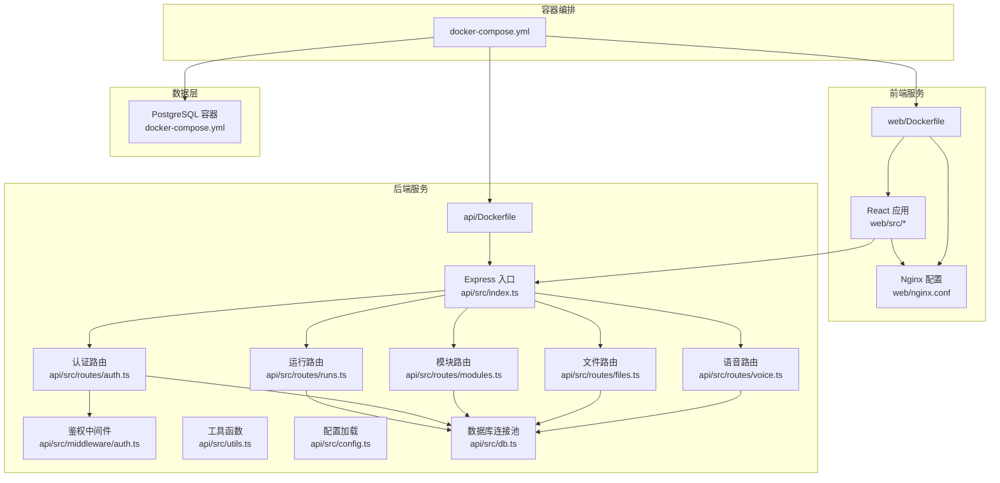
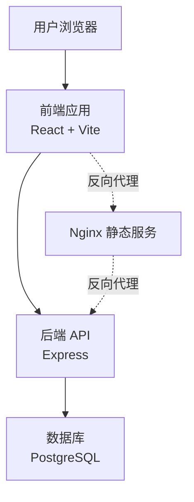
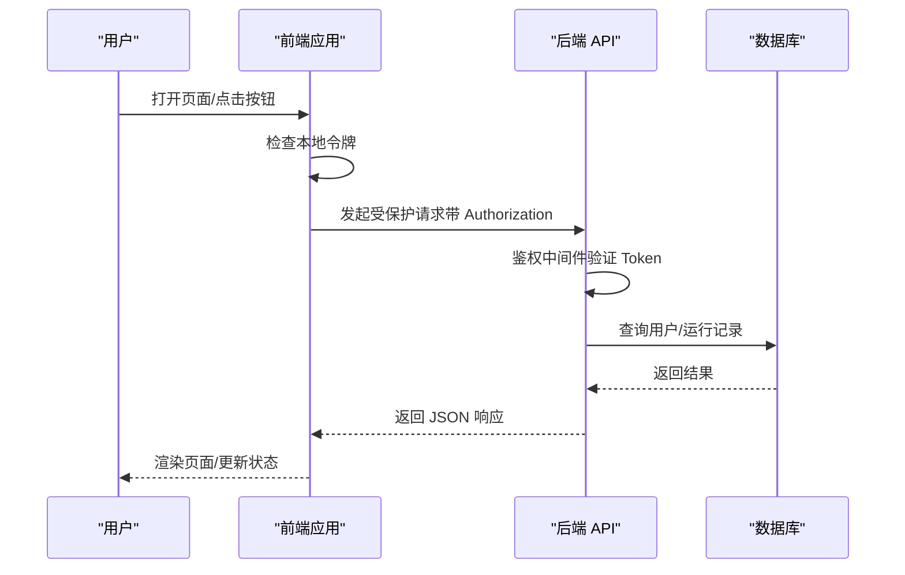
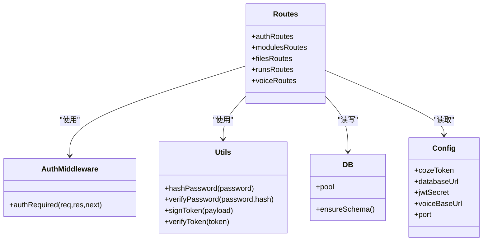
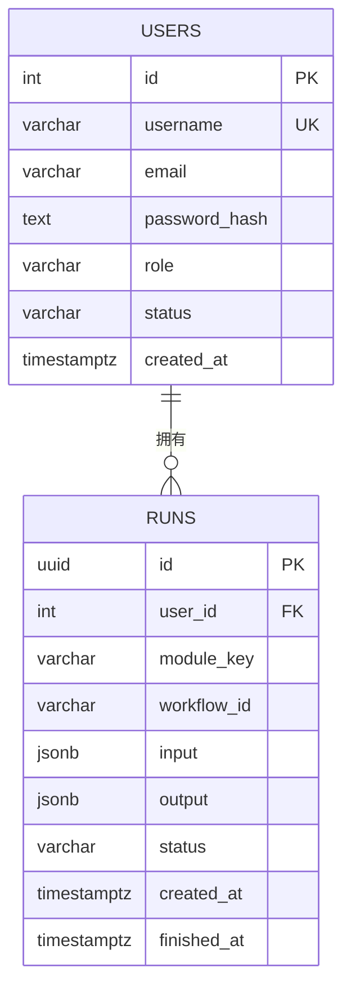
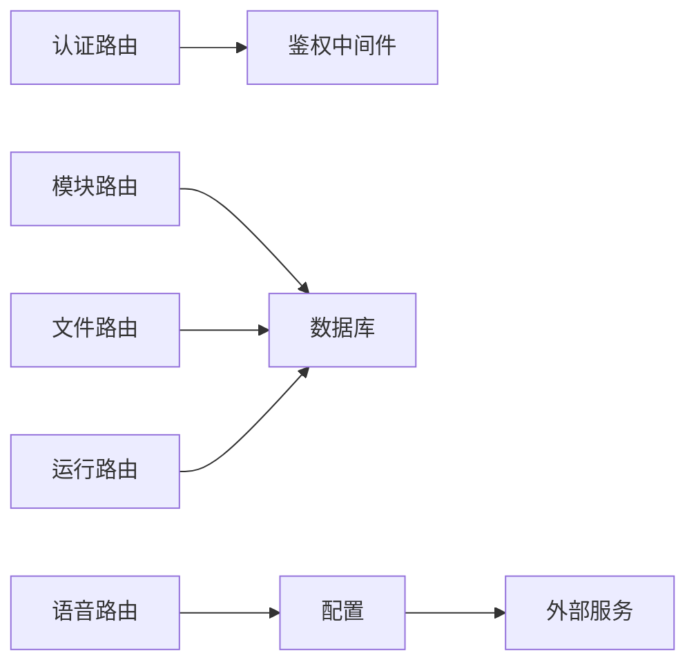
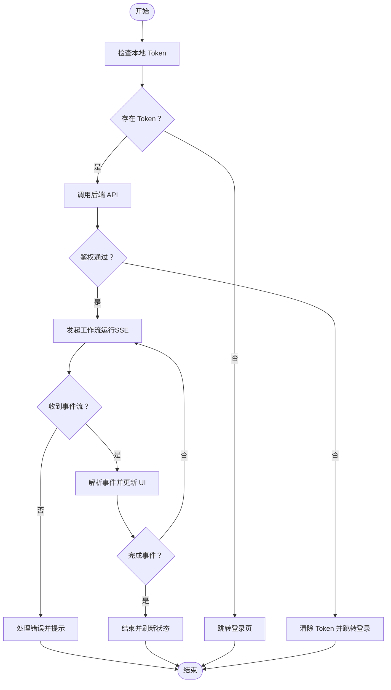
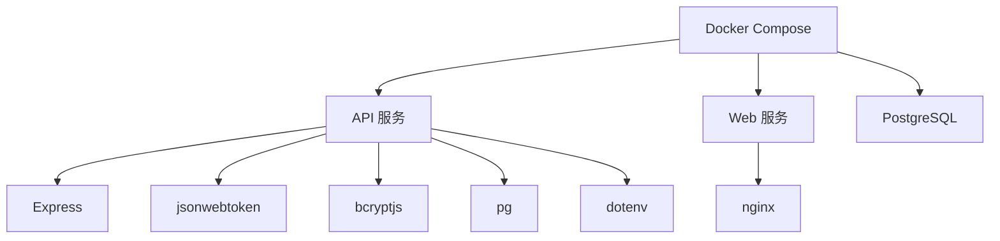

# 系统架构

<cite>
**本文引用的文件**
- [docker-compose.yml](file://docker-compose.yml)
- [api/Dockerfile](file://api/Dockerfile)
- [web/Dockerfile](file://web/Dockerfile)
- [api/src/index.ts](file://api/src/index.ts)
- [api/src/config.ts](file://api/src/config.ts)
- [api/src/db.ts](file://api/src/db.ts)
- [api/src/middleware/auth.ts](file://api/src/middleware/auth.ts)
- [api/src/utils.ts](file://api/src/utils.ts)
- [api/src/routes/auth.ts](file://api/src/routes/auth.ts)
- [api/src/routes/modules.ts](file://api/src/routes/modules.ts)
- [api/src/routes/files.ts](file://api/src/routes/files.ts)
- [api/src/routes/runs.ts](file://api/src/routes/runs.ts)
- [api/src/routes/voice.ts](file://api/src/routes/voice.ts)
- [web/src/main.tsx](file://web/src/main.tsx)
- [web/src/App.tsx](file://web/src/App.tsx)
- [web/src/lib/api.ts](file://web/src/lib/api.ts)
- [web/nginx.conf](file://web/nginx.conf)
</cite>

## 目录
1. [引言](#引言)
2. [项目结构](#项目结构)
3. [核心组件](#核心组件)
4. [架构总览](#架构总览)
5. [详细组件分析](#详细组件分析)
6. [依赖分析](#依赖分析)
7. [性能考虑](#性能考虑)
8. [故障排查指南](#故障排查指南)
9. [结论](#结论)
10. [附录](#附录)

## 引言
本文件面向架构师与高级开发者，系统化阐述 Coze Workflow 的分层架构与容器化部署方案。项目采用前后端分离：前端基于 React + Vite，后端基于 Express，数据库使用 PostgreSQL，通过 Docker Compose 进行容器编排。系统以模块化路由组织功能，结合中间件实现鉴权与数据校验，并通过流式 SSE 接口支持工作流执行过程的实时反馈。

## 项目结构
项目采用多服务分层：
- 表现层（前端 Web）：React 应用，打包后由 Nginx 提供静态资源服务。
- 业务层（API 服务）：Express 应用，提供 REST 接口与路由分发。
- 数据层（数据库）：PostgreSQL，持久化用户与运行记录等数据。
- 编排层（容器编排）：Docker Compose 统一管理服务生命周期与依赖顺序。

图表来源
- [docker-compose.yml:1-35](file://docker-compose.yml#L1-L35)
- [web/Dockerfile:1-16](file://web/Dockerfile#L1-L16)
- [api/Dockerfile:1-19](file://api/Dockerfile#L1-L19)
- [api/src/index.ts:1-29](file://api/src/index.ts#L1-L29)
- [api/src/routes/auth.ts:1-115](file://api/src/routes/auth.ts#L1-L115)
- [api/src/routes/modules.ts:1-20](file://api/src/routes/modules.ts#L1-L20)
- [api/src/routes/files.ts](file://api/src/routes/files.ts)
- [api/src/routes/runs.ts](file://api/src/routes/runs.ts)
- [api/src/routes/voice.ts](file://api/src/routes/voice.ts)
- [api/src/middleware/auth.ts:1-23](file://api/src/middleware/auth.ts#L1-L23)
- [api/src/utils.ts:1-21](file://api/src/utils.ts#L1-L21)
- [api/src/config.ts:1-19](file://api/src/config.ts#L1-L19)
- [api/src/db.ts:1-35](file://api/src/db.ts#L1-L35)
- [web/nginx.conf](file://web/nginx.conf)

章节来源
- [docker-compose.yml:1-35](file://docker-compose.yml#L1-L35)
- [web/Dockerfile:1-16](file://web/Dockerfile#L1-L16)
- [api/Dockerfile:1-19](file://api/Dockerfile#L1-L19)

## 核心组件
- 前端应用（Web）
  - 路由与布局：基于 React Router 的页面路由与布局组件。
  - API 封装：统一的 fetch 工具，自动注入 Authorization 头，处理 401 并触发登出。
  - 静态资源：构建产物由 Nginx 提供，支持健康检查与反向代理。
- 后端 API（API）
  - Express 入口：注册 CORS、JSON 解析、健康检查与路由前缀。
  - 路由模块：认证、模块信息、文件上传、运行控制、语音相关接口。
  - 中间件：基于 JWT 的鉴权中间件，统一拦截未登录请求。
  - 数据访问：PostgreSQL 连接池与初始化脚本，确保用户表与运行记录表存在。
  - 配置管理：从环境变量加载必要参数，缺失时启动即报错。
- 数据库（PostgreSQL）
  - 用户表：存储用户名、邮箱、密码哈希、角色与状态。
  - 运行记录表：存储工作流运行 ID、所属用户、模块键、输入输出、状态与时间戳。
- 容器编排（Docker Compose）
  - 服务定义：db、api、web，设置环境变量、端口映射与依赖顺序。
  - 存储卷：持久化 PostgreSQL 数据目录。

章节来源
- [web/src/App.tsx:1-70](file://web/src/App.tsx#L1-L70)
- [web/src/main.tsx:1-17](file://web/src/main.tsx#L1-L17)
- [web/src/lib/api.ts:1-160](file://web/src/lib/api.ts#L1-L160)
- [api/src/index.ts:1-29](file://api/src/index.ts#L1-L29)
- [api/src/routes/auth.ts:1-115](file://api/src/routes/auth.ts#L1-L115)
- [api/src/routes/modules.ts:1-20](file://api/src/routes/modules.ts#L1-L20)
- [api/src/routes/files.ts](file://api/src/routes/files.ts)
- [api/src/routes/runs.ts](file://api/src/routes/runs.ts)
- [api/src/routes/voice.ts](file://api/src/routes/voice.ts)
- [api/src/middleware/auth.ts:1-23](file://api/src/middleware/auth.ts#L1-L23)
- [api/src/db.ts:1-35](file://api/src/db.ts#L1-L35)
- [api/src/config.ts:1-19](file://api/src/config.ts#L1-L19)
- [docker-compose.yml:1-35](file://docker-compose.yml#L1-L35)

## 架构总览
系统采用三层架构与微服务风格的服务边界：
- 表现层（Web）：负责用户界面与交互，调用后端 API 获取数据与触发工作流。
- 业务层（API）：集中处理业务逻辑，提供 REST 接口，内部按功能模块拆分路由。
- 数据层（PostgreSQL）：持久化用户与运行记录，支持高并发读写与事务一致性。

图表来源
- [web/src/App.tsx:1-70](file://web/src/App.tsx#L1-L70)
- [web/src/lib/api.ts:1-160](file://web/src/lib/api.ts#L1-L160)
- [api/src/index.ts:1-29](file://api/src/index.ts#L1-L29)
- [api/src/db.ts:1-35](file://api/src/db.ts#L1-L35)
- [web/nginx.conf](file://web/nginx.conf)

## 详细组件分析

### 前端组件分析（React + Vite + Nginx）
- 应用入口与主题：根节点挂载路由与主题配置，启用严格模式。
- 路由体系：登录/注册与主布局下的多个功能页；受保护路由在进入前校验令牌。
- API 通信：统一 fetch 封装，自动携带 Bearer Token；401 触发登出与跳转。
- 静态资源：构建产物交由 Nginx 提供，支持健康检查与反代。

图表来源
- [web/src/App.tsx:17-39](file://web/src/App.tsx#L17-L39)
- [web/src/lib/api.ts:13-36](file://web/src/lib/api.ts#L13-L36)
- [api/src/middleware/auth.ts:8-22](file://api/src/middleware/auth.ts#L8-L22)
- [api/src/routes/auth.ts:100-112](file://api/src/routes/auth.ts#L100-L112)
- [api/src/db.ts:1-35](file://api/src/db.ts#L1-L35)

章节来源
- [web/src/main.tsx:1-17](file://web/src/main.tsx#L1-L17)
- [web/src/App.tsx:1-70](file://web/src/App.tsx#L1-L70)
- [web/src/lib/api.ts:1-160](file://web/src/lib/api.ts#L1-L160)

### 后端组件分析（Express + 路由 + 中间件）
- 入口与中间件：CORS、JSON 解析、健康检查、路由前缀。
- 认证路由：注册、登录、重置密码、查询当前用户。
- 模块路由：列举可用模块与按键查询模块详情。
- 文件路由：文件上传接口（用于图片等资源）。
- 运行路由：工作流运行接口，支持流式事件推送。
- 语音路由：语音配置、文本分段翻译、TTS 接口。
- 鉴权中间件：从 Authorization 头解析 Bearer Token，失败返回 401。
- 工具函数：密码哈希与比对、JWT 签发与校验。
- 数据库：连接池与初始化脚本，创建用户与运行记录表。

图表来源
- [api/src/middleware/auth.ts:1-23](file://api/src/middleware/auth.ts#L1-L23)
- [api/src/utils.ts:1-21](file://api/src/utils.ts#L1-L21)
- [api/src/db.ts:1-35](file://api/src/db.ts#L1-L35)
- [api/src/routes/auth.ts:1-115](file://api/src/routes/auth.ts#L1-L115)
- [api/src/routes/modules.ts:1-20](file://api/src/routes/modules.ts#L1-L20)
- [api/src/routes/files.ts](file://api/src/routes/files.ts)
- [api/src/routes/runs.ts](file://api/src/routes/runs.ts)
- [api/src/routes/voice.ts](file://api/src/routes/voice.ts)
- [api/src/config.ts:1-19](file://api/src/config.ts#L1-L19)

章节来源
- [api/src/index.ts:1-29](file://api/src/index.ts#L1-L29)
- [api/src/middleware/auth.ts:1-23](file://api/src/middleware/auth.ts#L1-L23)
- [api/src/utils.ts:1-21](file://api/src/utils.ts#L1-L21)
- [api/src/db.ts:1-35](file://api/src/db.ts#L1-L35)
- [api/src/config.ts:1-19](file://api/src/config.ts#L1-L19)

### 数据模型与关系

图表来源
- [api/src/db.ts:11-32](file://api/src/db.ts#L11-L32)

章节来源
- [api/src/db.ts:1-35](file://api/src/db.ts#L1-L35)

### 微服务与模块化交互
- 路由解耦：每个功能域（认证、模块、文件、运行、语音）独立路由，便于演进与测试。
- 中间件复用：鉴权中间件在需要保护的路由上统一使用。
- 数据访问：所有路由共享数据库连接池与初始化脚本，保证一致性。
- 外部集成：通过配置项加载外部服务地址与密钥，便于替换与扩展。

图表来源
- [api/src/routes/auth.ts:1-115](file://api/src/routes/auth.ts#L1-L115)
- [api/src/routes/modules.ts:1-20](file://api/src/routes/modules.ts#L1-L20)
- [api/src/routes/files.ts](file://api/src/routes/files.ts)
- [api/src/routes/runs.ts](file://api/src/routes/runs.ts)
- [api/src/routes/voice.ts](file://api/src/routes/voice.ts)
- [api/src/middleware/auth.ts:1-23](file://api/src/middleware/auth.ts#L1-L23)
- [api/src/db.ts:1-35](file://api/src/db.ts#L1-L35)
- [api/src/config.ts:1-19](file://api/src/config.ts#L1-L19)

章节来源
- [api/src/routes/auth.ts:1-115](file://api/src/routes/auth.ts#L1-L115)
- [api/src/routes/modules.ts:1-20](file://api/src/routes/modules.ts#L1-L20)
- [api/src/routes/files.ts](file://api/src/routes/files.ts)
- [api/src/routes/runs.ts](file://api/src/routes/runs.ts)
- [api/src/routes/voice.ts](file://api/src/routes/voice.ts)
- [api/src/middleware/auth.ts:1-23](file://api/src/middleware/auth.ts#L1-L23)
- [api/src/db.ts:1-35](file://api/src/db.ts#L1-L35)
- [api/src/config.ts:1-19](file://api/src/config.ts#L1-L19)

### 流程图：用户请求与工作流运行

图表来源
- [web/src/App.tsx:17-39](file://web/src/App.tsx#L17-L39)
- [web/src/lib/api.ts:58-115](file://web/src/lib/api.ts#L58-L115)
- [api/src/middleware/auth.ts:8-22](file://api/src/middleware/auth.ts#L8-L22)

章节来源
- [web/src/App.tsx:1-70](file://web/src/App.tsx#L1-L70)
- [web/src/lib/api.ts:1-160](file://web/src/lib/api.ts#L1-L160)
- [api/src/middleware/auth.ts:1-23](file://api/src/middleware/auth.ts#L1-L23)

## 依赖分析
- 组件内聚与耦合
  - 路由层与业务逻辑解耦，通过中间件与工具函数实现横切关注点。
  - 数据访问集中在 db.ts，避免重复连接与 SQL 分散。
- 外部依赖
  - Express、JWT、Bcrypt、PostgreSQL 驱动、Nginx。
- 环境变量与配置
  - 必需项：COZE_API_TOKEN、DATABASE_URL、JWT_SECRET、VOICE_BASE_URL。
- 容器编排依赖
  - db 优先启动，api 依赖 db，web 依赖 api；端口映射与卷挂载明确。

图表来源
- [api/src/index.ts:1-29](file://api/src/index.ts#L1-L29)
- [api/src/utils.ts:1-21](file://api/src/utils.ts#L1-L21)
- [api/src/config.ts:1-19](file://api/src/config.ts#L1-L19)
- [api/src/db.ts:1-35](file://api/src/db.ts#L1-L35)
- [docker-compose.yml:1-35](file://docker-compose.yml#L1-L35)
- [web/Dockerfile:1-16](file://web/Dockerfile#L1-L16)
- [api/Dockerfile:1-19](file://api/Dockerfile#L1-L19)

章节来源
- [api/src/index.ts:1-29](file://api/src/index.ts#L1-L29)
- [api/src/utils.ts:1-21](file://api/src/utils.ts#L1-L21)
- [api/src/config.ts:1-19](file://api/src/config.ts#L1-L19)
- [api/src/db.ts:1-35](file://api/src/db.ts#L1-L35)
- [docker-compose.yml:1-35](file://docker-compose.yml#L1-L35)

## 性能考虑
- 前端
  - 使用 Vite 构建，生产环境静态资源由 Nginx 提供，减少首屏等待。
  - 通过统一 fetch 封装减少重复代码，提升可维护性。
- 后端
  - Express 默认 JSON 限制适中，满足常见场景；如需更大负载可调整。
  - 数据库连接池复用连接，降低连接开销。
- 数据库
  - 初始化脚本仅在启动时执行一次，避免重复创建表。
  - 用户与运行记录表具备基础索引字段，建议根据查询模式增加复合索引。
- 容器与网络
  - 明确端口映射与依赖顺序，避免冷启动抖动。
  - Nginx 作为反向代理，可扩展到多实例与负载均衡。

## 故障排查指南
- 启动失败（缺少环境变量）
  - 现象：API 启动时报错，提示缺失环境变量。
  - 处理：检查环境变量是否正确设置于 docker-compose 或宿主机。
  - 参考路径：[api/src/config.ts:5-11](file://api/src/config.ts#L5-L11)
- 登录鉴权失败
  - 现象：401 未登录或登录失效。
  - 处理：确认前端已保存 Token，后端 JWT 密钥一致，且 Token 未过期。
  - 参考路径：[api/src/middleware/auth.ts:8-22](file://api/src/middleware/auth.ts#L8-L22)，[web/src/lib/api.ts:25-28](file://web/src/lib/api.ts#L25-L28)
- 数据库连接异常
  - 现象：API 启动后无法连接数据库或初始化失败。
  - 处理：检查 DATABASE_URL、网络连通性与数据库凭据。
  - 参考路径：[api/src/db.ts:6-8](file://api/src/db.ts#L6-L8)，[docker-compose.yml:20-22](file://docker-compose.yml#L20-L22)
- 工作流运行无事件流
  - 现象：SSE 无事件或提前结束。
  - 处理：检查后端运行接口实现与外部服务可达性；前端事件解析逻辑。
  - 参考路径：[web/src/lib/api.ts:58-115](file://web/src/lib/api.ts#L58-L115)，[api/src/routes/runs.ts](file://api/src/routes/runs.ts)

章节来源
- [api/src/config.ts:5-11](file://api/src/config.ts#L5-L11)
- [api/src/middleware/auth.ts:8-22](file://api/src/middleware/auth.ts#L8-L22)
- [web/src/lib/api.ts:25-28](file://web/src/lib/api.ts#L25-L28)
- [api/src/db.ts:6-8](file://api/src/db.ts#L6-L8)
- [docker-compose.yml:20-22](file://docker-compose.yml#L20-L22)
- [web/src/lib/api.ts:58-115](file://web/src/lib/api.ts#L58-L115)

## 结论
本项目以清晰的分层架构与模块化路由实现了前后端分离与可演进的微服务风格。通过 Docker Compose 实现了数据库、API 与前端的统一编排，配合 Nginx 提供静态资源与反向代理，具备良好的可扩展性与可维护性。建议后续在数据库层面引入索引优化与连接池参数调优，在 API 层引入统一错误码与日志规范，并在前端引入更完善的缓存与离线策略以进一步提升用户体验与性能。

## 附录
- 关键文件清单
  - 容器编排：[docker-compose.yml:1-35](file://docker-compose.yml#L1-L35)
  - 前端镜像：[web/Dockerfile:1-16](file://web/Dockerfile#L1-L16)
  - 后端镜像：[api/Dockerfile:1-19](file://api/Dockerfile#L1-L19)
  - 前端入口：[web/src/main.tsx:1-17](file://web/src/main.tsx#L1-L17)
  - 前端路由与 API：[web/src/App.tsx:1-70](file://web/src/App.tsx#L1-L70)，[web/src/lib/api.ts:1-160](file://web/src/lib/api.ts#L1-L160)
  - 后端入口与路由：[api/src/index.ts:1-29](file://api/src/index.ts#L1-L29)，[api/src/routes/auth.ts:1-115](file://api/src/routes/auth.ts#L1-L115)，[api/src/routes/modules.ts:1-20](file://api/src/routes/modules.ts#L1-L20)，[api/src/routes/files.ts](file://api/src/routes/files.ts)，[api/src/routes/runs.ts](file://api/src/routes/runs.ts)，[api/src/routes/voice.ts](file://api/src/routes/voice.ts)
  - 鉴权与工具：[api/src/middleware/auth.ts:1-23](file://api/src/middleware/auth.ts#L1-L23)，[api/src/utils.ts:1-21](file://api/src/utils.ts#L1-L21)
  - 数据库与配置：[api/src/db.ts:1-35](file://api/src/db.ts#L1-L35)，[api/src/config.ts:1-19](file://api/src/config.ts#L1-L19)
  - Nginx 配置：[web/nginx.conf](file://web/nginx.conf)