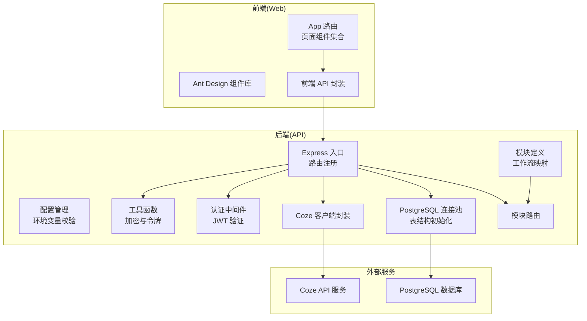
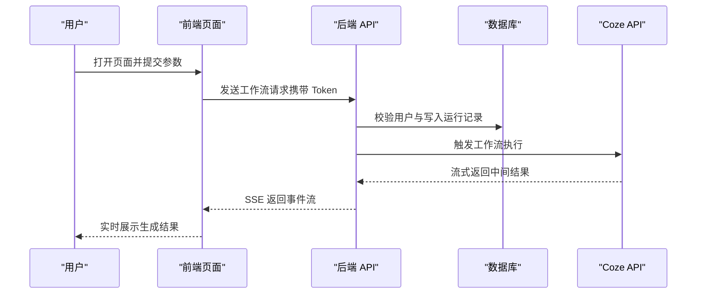
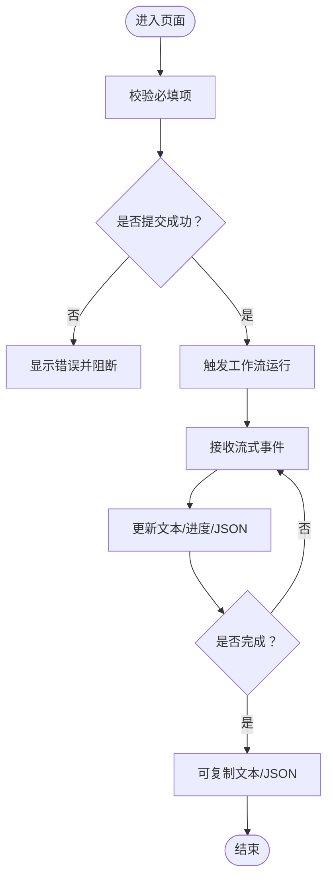
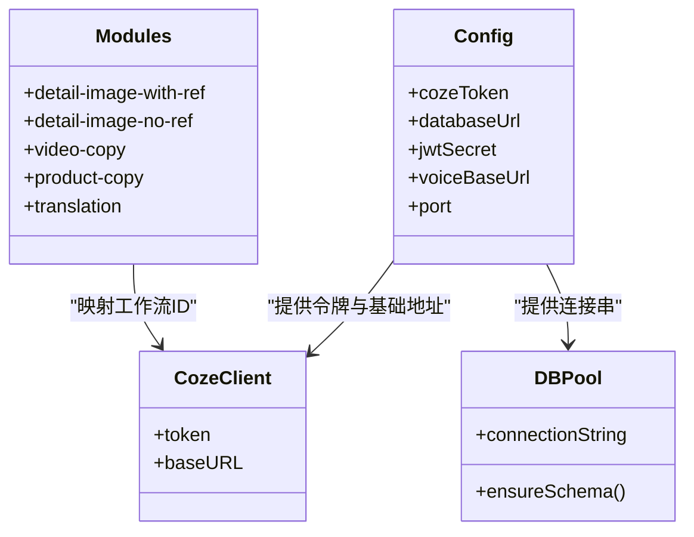
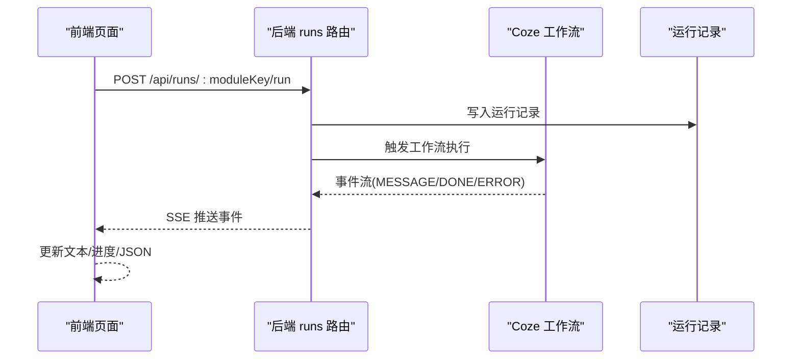
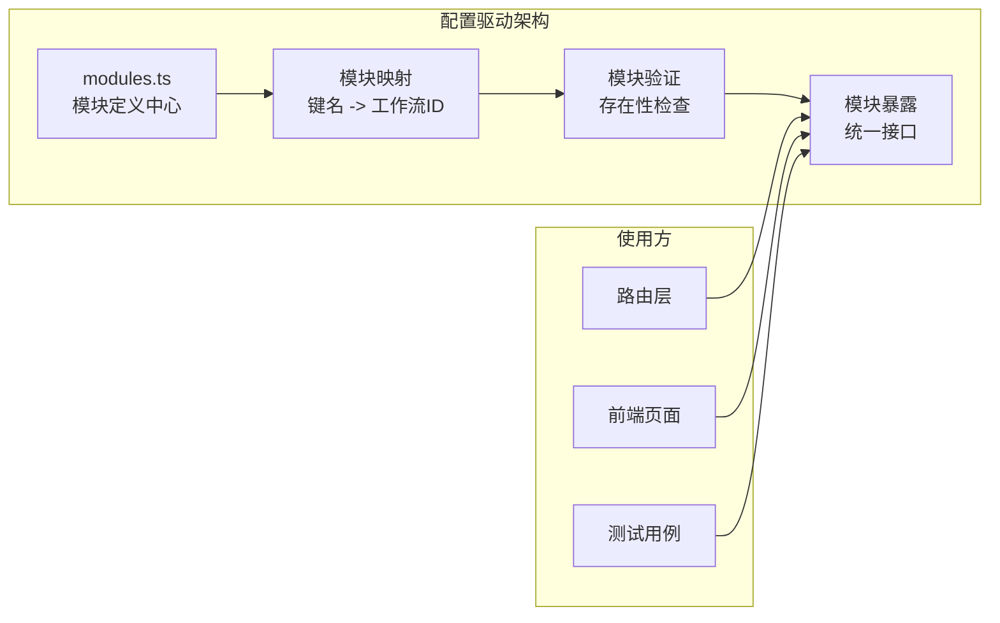
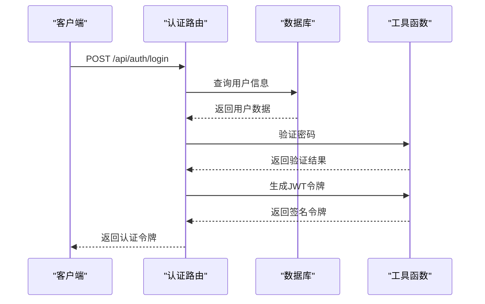
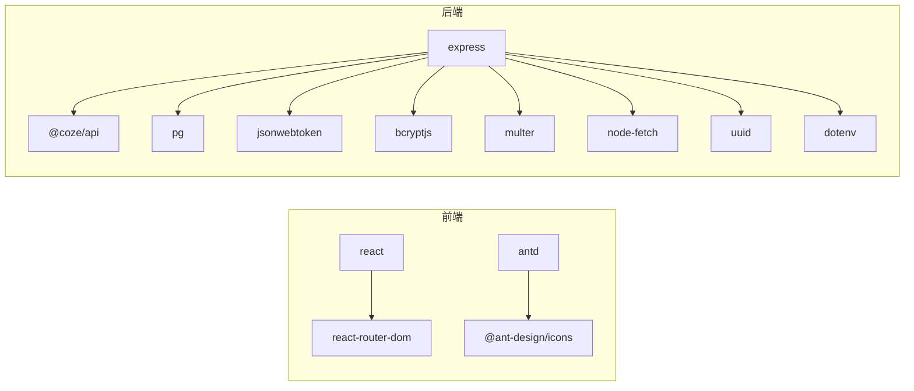

# 项目介绍

<cite>
**本文引用的文件**
- [api/src/index.ts](file://api/src/index.ts)
- [api/src/config.ts](file://api/src/config.ts)
- [api/src/coze.ts](file://api/src/coze.ts)
- [api/src/db.ts](file://api/src/db.ts)
- [api/src/modules.ts](file://api/src/modules.ts)
- [api/src/routes/modules.ts](file://api/src/routes/modules.ts)
- [api/src/routes/auth.ts](file://api/src/routes/auth.ts)
- [api/src/routes/runs.ts](file://api/src/routes/runs.ts)
- [api/src/middleware/auth.ts](file://api/src/middleware/auth.ts)
- [api/src/utils.ts](file://api/src/utils.ts)
- [api/package.json](file://api/package.json)
- [web/src/App.tsx](file://web/src/App.tsx)
- [web/src/pages/DashboardPage.tsx](file://web/src/pages/DashboardPage.tsx)
- [web/src/pages/ProductCopyPage.tsx](file://web/src/pages/ProductCopyPage.tsx)
- [web/src/pages/TranslationPage.tsx](file://web/src/pages/TranslationPage.tsx)
- [web/src/pages/VoiceGeneratorPage.tsx](file://web/src/pages/VoiceGeneratorPage.tsx)
- [web/src/lib/api.ts](file://web/src/lib/api.ts)
- [web/src/components/ResultPanel.tsx](file://web/src/components/ResultPanel.tsx)
- [web/package.json](file://web/package.json)
- [quick-start.bat](file://quick-start.bat)
</cite>

## 目录
1. [引言](#引言)
2. [项目结构](#项目结构)
3. [核心组件](#核心组件)
4. [架构总览](#架构总览)
5. [详细组件分析](#详细组件分析)
6. [配置管理与安全实践](#配置管理与安全实践)
7. [依赖关系分析](#依赖关系分析)
8. [性能考虑](#性能考虑)
9. [故障排查指南](#故障排查指南)
10. [结论](#结论)
11. [附录](#附录)

## 引言
Coze Workflow 是一个基于 Coze AI 平台的多模态工作流管理系统，旨在为用户提供从内容创作到多语言传播的全链路解决方案。项目通过统一的工作流编排与模块化设计，将图像生成、视频文案提取、产品文案生成、翻译服务与语音生成等能力整合在一个可扩展的平台中，帮助创作者与企业高效完成内容生产与分发。

本项目的核心愿景是降低多模态 AI 能力的使用门槛，让用户以"所见即所得"的方式完成复杂内容创作任务；同时通过本地化部署与集中式资源调度，提升内容生产的稳定性与可维护性。

## 项目结构
项目采用前后端分离架构，前端使用 React + Ant Design 构建交互界面，后端基于 Express 提供 REST 接口，并通过 Coze API 与数据库协同工作。Docker Compose 支持一键拉起数据库、后端 API 与前端 Web 应用。

**图表来源**
- [api/src/index.ts:1-33](file://api/src/index.ts#L1-L33)
- [api/src/config.ts:1-19](file://api/src/config.ts#L1-L19)
- [api/src/coze.ts:1-8](file://api/src/coze.ts#L1-L8)
- [api/src/db.ts:1-52](file://api/src/db.ts#L1-L52)
- [api/src/modules.ts:1-40](file://api/src/modules.ts#L1-L40)
- [api/src/routes/modules.ts:1-20](file://api/src/routes/modules.ts#L1-L20)
- [api/src/middleware/auth.ts:1-23](file://api/src/middleware/auth.ts#L1-L23)
- [api/src/utils.ts:1-21](file://api/src/utils.ts#L1-L21)
- [web/src/App.tsx:1-74](file://web/src/App.tsx#L1-L74)
- [web/src/lib/api.ts:1-160](file://web/src/lib/api.ts#L1-L160)

**章节来源**
- [api/src/index.ts:1-33](file://api/src/index.ts#L1-L33)
- [web/src/App.tsx:1-74](file://web/src/App.tsx#L1-L74)

## 核心组件
- 前端应用（React + Ant Design）
  - 提供仪表盘、各功能模块页面与结果面板，支持实时流式结果展示与复制操作。
- 后端 API（Express）
  - 提供认证、模块查询、文件上传、工作流运行与语音相关接口。
- 数据层（PostgreSQL）
  - 用户表与运行记录表，用于持久化用户状态与工作流执行历史。
- 集成层（Coze API）
  - 通过官方 SDK 访问 Coze 平台的工作流能力，实现多模态内容生成与处理。
- 部署与开发（Docker Compose + 快速启动脚本）
  - 支持本地一键启动数据库、后端与前端服务，便于开发与演示。

**章节来源**
- [web/src/pages/DashboardPage.tsx:1-108](file://web/src/pages/DashboardPage.tsx#L1-L108)
- [web/src/components/ResultPanel.tsx:1-46](file://web/src/components/ResultPanel.tsx#L1-L46)
- [api/src/db.ts:1-52](file://api/src/db.ts#L1-L52)
- [api/src/coze.ts:1-8](file://api/src/coze.ts#L1-L8)
- [quick-start.bat:1-14](file://quick-start.bat#L1-L14)

## 架构总览
系统采用"前端页面 + 后端 API + 数据库 + 第三方 AI 服务"的分层架构。前端通过统一的 API 封装调用后端接口，后端负责鉴权、工作流编排、与 Coze API 的交互以及数据持久化。

**图表来源**
- [web/src/lib/api.ts:58-115](file://web/src/lib/api.ts#L58-L115)
- [api/src/index.ts:17-27](file://api/src/index.ts#L17-L27)
- [api/src/db.ts:10-51](file://api/src/db.ts#L10-L51)
- [api/src/coze.ts:4-7](file://api/src/coze.ts#L4-L7)

## 详细组件分析

### 前端应用与页面组件
- 仪表盘页面
  - 展示可用功能模块卡片，支持跳转至各子页面，具备搜索与标签分类。
- 产品文案生成页面
  - 支持产品名称、卖点文案与模板选择，提供"开始生成""独立英译""生成语音（MP3+SRT）"三步式工作流。
- 翻译页面
  - 支持多语言选择与中文文案输入，提供实时流式翻译结果。
- 语音生成页面
  - 读取语音服务配置，内嵌 iframe 打开语音生成器，统一调度局域网语音服务。
- 结果面板组件
  - 统一展示流式文本、进度条、错误提示与复制按钮，适配不同页面的结果展示需求。

**图表来源**
- [web/src/pages/ProductCopyPage.tsx:31-89](file://web/src/pages/ProductCopyPage.tsx#L31-L89)
- [web/src/pages/TranslationPage.tsx:26-85](file://web/src/pages/TranslationPage.tsx#L26-L85)
- [web/src/lib/api.ts:58-115](file://web/src/lib/api.ts#L58-L115)
- [web/src/components/ResultPanel.tsx:14-43](file://web/src/components/ResultPanel.tsx#L14-L43)

**章节来源**
- [web/src/pages/DashboardPage.tsx:1-108](file://web/src/pages/DashboardPage.tsx#L1-L108)
- [web/src/pages/ProductCopyPage.tsx:1-249](file://web/src/pages/ProductCopyPage.tsx#L1-L249)
- [web/src/pages/TranslationPage.tsx:1-140](file://web/src/pages/TranslationPage.tsx#L1-L140)
- [web/src/pages/VoiceGeneratorPage.tsx:1-95](file://web/src/pages/VoiceGeneratorPage.tsx#L1-L95)
- [web/src/components/ResultPanel.tsx:1-46](file://web/src/components/ResultPanel.tsx#L1-L46)

### 后端 API 与路由
- Express 入口
  - 注册跨域、JSON 解析、健康检查与各模块路由。
- 模块路由
  - 提供模块清单与单个模块信息查询，配合前端仪表盘展示。
- 配置与鉴权
  - 读取环境变量并进行必要校验，确保关键密钥与服务地址存在。
- 数据库初始化
  - 自动创建用户表与运行记录表，保证运行历史可追溯。
- Coze 客户端
  - 初始化 Coze API 客户端，统一访问入口。

**图表来源**
- [api/src/config.ts:13-19](file://api/src/config.ts#L13-L19)
- [api/src/coze.ts:4-7](file://api/src/coze.ts#L4-L7)
- [api/src/db.ts:6-8](file://api/src/db.ts#L6-L8)
- [api/src/db.ts:10-51](file://api/src/db.ts#L10-L51)
- [api/src/modules.ts:1-40](file://api/src/modules.ts#L1-L40)

**章节来源**
- [api/src/index.ts:1-33](file://api/src/index.ts#L1-L33)
- [api/src/routes/modules.ts:1-20](file://api/src/routes/modules.ts#L1-L20)
- [api/src/config.ts:1-19](file://api/src/config.ts#L1-L19)
- [api/src/db.ts:1-52](file://api/src/db.ts#L1-L52)
- [api/src/coze.ts:1-8](file://api/src/coze.ts#L1-L8)
- [api/src/modules.ts:1-40](file://api/src/modules.ts#L1-L40)

### 工作流与模块映射
- 模块定义
  - 包含详情图（有/无参考图）、视频文案提取、产品文案生成、翻译等模块，并为每个模块绑定对应的 Coze 工作流 ID。
- 前端调用
  - 通过统一的 runWorkflowStream 方法发起工作流请求，接收事件流并更新 UI。
- 语音集成
  - 提供独立的语音翻译与 TTS 接口，支持按行批量生成并导出 SRT 字幕。

**图表来源**
- [web/src/lib/api.ts:58-115](file://web/src/lib/api.ts#L58-L115)
- [api/src/modules.ts:1-40](file://api/src/modules.ts#L1-L40)
- [api/src/db.ts:22-51](file://api/src/db.ts#L22-L51)

**章节来源**
- [api/src/modules.ts:1-40](file://api/src/modules.ts#L1-L40)
- [web/src/lib/api.ts:58-115](file://web/src/lib/api.ts#L58-L115)
- [web/src/pages/ProductCopyPage.tsx:120-149](file://web/src/pages/ProductCopyPage.tsx#L120-L149)

## 配置管理与安全实践

### 配置驱动的模块管理
项目采用配置驱动的方式管理所有工作流模块，通过 centralized modules.ts 文件统一定义和维护所有可用的 AI 功能模块。每个模块包含标准化的元数据结构，包括模块键名、显示名称和对应的 Coze 工作流 ID。

**图表来源**
- [api/src/modules.ts:1-40](file://api/src/modules.ts#L1-L40)
- [api/src/routes/modules.ts:1-20](file://api/src/routes/modules.ts#L1-L20)

### 安全认证与授权机制
系统实现了完整的身份认证和授权体系，采用 JWT（JSON Web Token）进行无状态认证，结合数据库中的用户信息实现细粒度的权限控制。

#### 认证流程

**图表来源**
- [api/src/routes/auth.ts:36-63](file://api/src/routes/auth.ts#L36-L63)
- [api/src/utils.ts:14-20](file://api/src/utils.ts#L14-L20)

#### 授权中间件
系统使用自定义的认证中间件 `authRequired` 对受保护的路由进行拦截，确保只有持有有效 JWT 令牌的用户才能访问敏感操作。

**章节来源**
- [api/src/modules.ts:1-40](file://api/src/modules.ts#L1-L40)
- [api/src/routes/auth.ts:1-115](file://api/src/routes/auth.ts#L1-L115)
- [api/src/middleware/auth.ts:1-23](file://api/src/middleware/auth.ts#L1-L23)
- [api/src/utils.ts:1-21](file://api/src/utils.ts#L1-L21)

### 环境配置与密钥管理
项目采用 dotenv 方案管理环境变量，通过严格的启动时校验确保所有必需的配置项都已正确设置。

#### 必需配置项
- COZE_API_TOKEN：Coze 平台 API 访问令牌
- DATABASE_URL：PostgreSQL 数据库连接字符串
- JWT_SECRET：JWT 令牌签名密钥
- VOICE_BASE_URL：语音服务基础 URL
- PORT：服务监听端口（默认 3000）

**章节来源**
- [api/src/config.ts:1-19](file://api/src/config.ts#L1-L19)
- [api/src/utils.ts:14-20](file://api/src/utils.ts#L14-L20)

## 依赖关系分析
- 前端依赖
  - React、React Router DOM、Ant Design、@ant-design/icons。
- 后端依赖
  - @coze/api、express、cors、bcryptjs、jsonwebtoken、pg、multer、node-fetch、uuid、dotenv。
- 部署依赖
  - Docker Compose 编排 PostgreSQL、API 与 Web 应用。

**图表来源**
- [web/package.json:11-17](file://web/package.json#L11-L17)
- [api/package.json:11-24](file://api/package.json#L11-L24)

**章节来源**
- [web/package.json:1-26](file://web/package.json#L1-L26)
- [api/package.json:1-37](file://api/package.json#L1-L37)

## 性能考虑
- 流式传输
  - 前端通过 SSE 接收事件流，逐步渲染结果，减少一次性大响应带来的延迟。
- 本地化资源调度
  - 语音生成统一走局域网服务，避免跨网络抖动，提升生成稳定性。
- 数据库连接池
  - 使用连接池管理数据库连接，降低频繁连接开销。
- 文件上传优化
  - 前端上传采用 FormData，结合后端 Multer，满足多模态文件处理需求。

**章节来源**
- [web/src/lib/api.ts:58-115](file://web/src/lib/api.ts#L58-L115)
- [api/src/db.ts:6-8](file://api/src/db.ts#L6-L8)
- [web/src/pages/VoiceGeneratorPage.tsx:1-95](file://web/src/pages/VoiceGeneratorPage.tsx#L1-L95)

## 故障排查指南
- 启动失败
  - 检查环境变量是否完整（COZE_API_TOKEN、DATABASE_URL、JWT_SECRET、VOICE_BASE_URL），确认 Docker Compose 服务均已就绪。
- 登录与鉴权
  - 若出现 401，前端会清除本地 Token 并重定向登录页；检查后端 JWT 秘钥与前端存储的 Token 是否匹配。
- 工作流执行异常
  - 查看运行记录表中的状态字段，结合前端错误提示与事件流中的错误事件定位问题。
- 语音服务不可用
  - 检查语音服务配置接口返回的 studioUrl 与 apiUrl，确认局域网可达性。

**章节来源**
- [api/src/config.ts:5-11](file://api/src/config.ts#L5-L11)
- [web/src/App.tsx:26-41](file://web/src/App.tsx#L26-L41)
- [web/src/lib/api.ts:13-36](file://web/src/lib/api.ts#L13-L36)
- [api/src/db.ts:22-51](file://api/src/db.ts#L22-L51)
- [web/src/pages/VoiceGeneratorPage.tsx:10-25](file://web/src/pages/VoiceGeneratorPage.tsx#L10-L25)

## 结论
Coze Workflow 通过模块化的功能设计与统一的工作流编排，将图像、视频、文案、翻译与语音等多模态能力整合为一套可扩展的内容创作平台。其优势在于：
- 一体化工作流：从前端页面到后端 API 再到第三方 AI 服务的闭环设计，降低使用成本。
- 可视化与可追溯：实时流式结果与运行记录，便于复盘与优化。
- 易于扩展：模块化定义与路由机制，便于新增功能与工作流。
- 本地化与稳定：集中式语音服务与数据库持久化，提升整体稳定性与可维护性。
- 安全可靠：完善的认证授权体系与配置驱动架构，确保系统的安全性与可维护性。

该平台适合内容创作者、电商运营与多语言内容团队，帮助他们以更低的成本与更高的效率完成内容生产与分发。

## 附录
- 快速启动
  - 使用提供的批处理脚本或 Docker Compose 一键启动后端、数据库与前端服务。
- 环境变量
  - COZE_API_TOKEN、DATABASE_URL、JWT_SECRET、VOICE_BASE_URL 为必需项，需在部署前正确配置。

**章节来源**
- [quick-start.bat:1-14](file://quick-start.bat#L1-L14)
- [api/src/config.ts:5-11](file://api/src/config.ts#L5-L11)