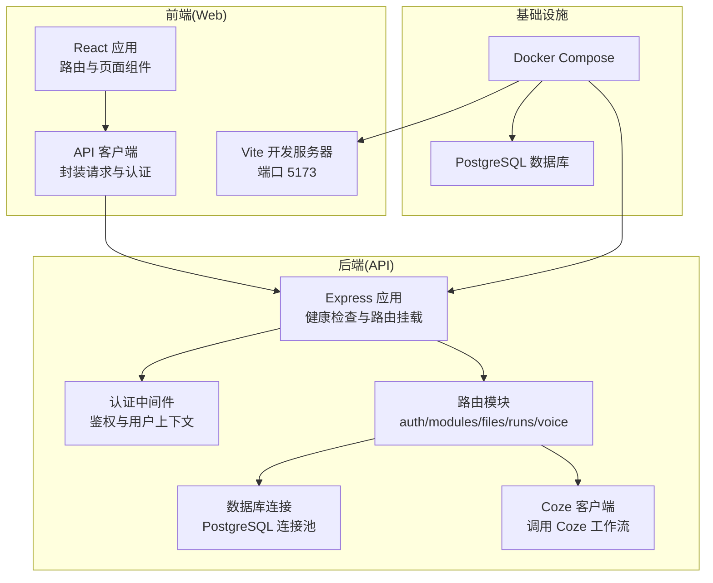
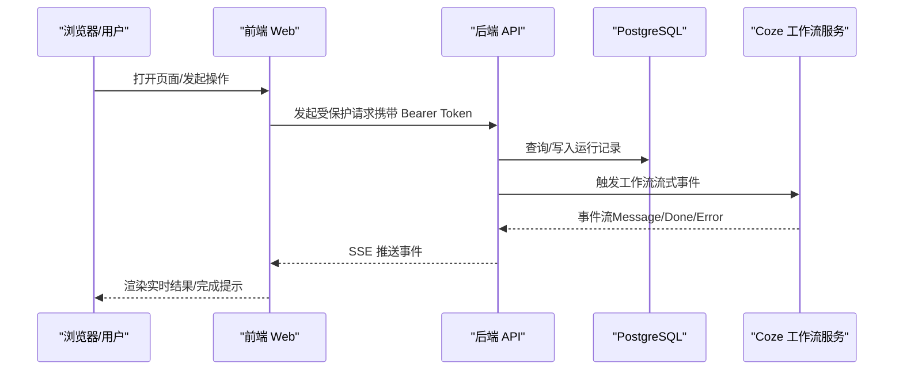
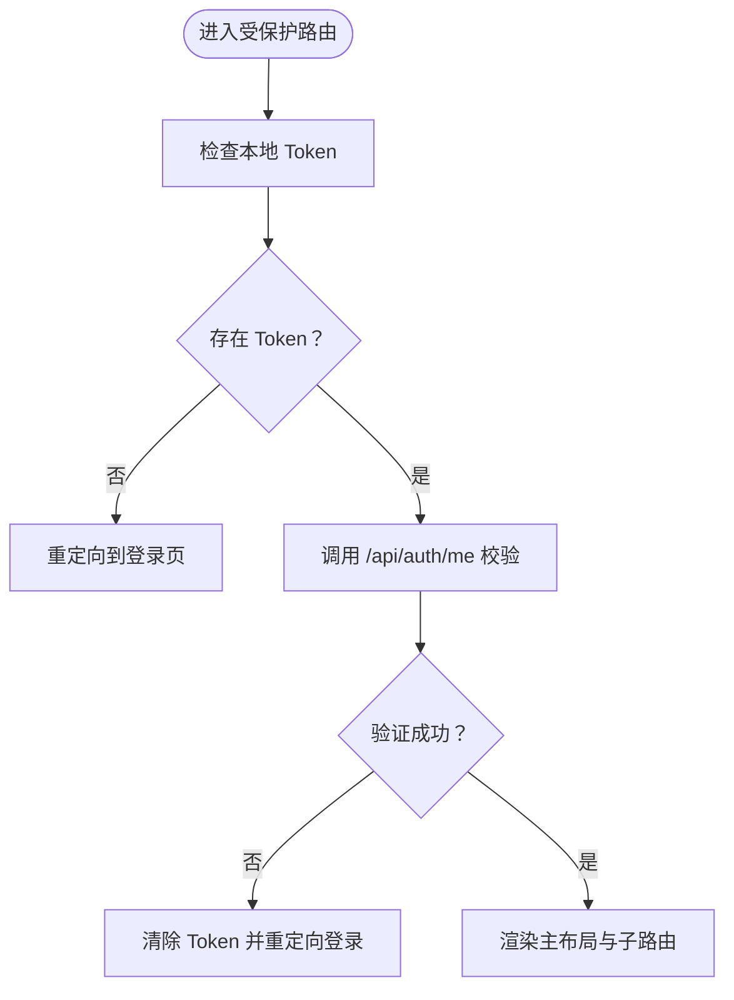
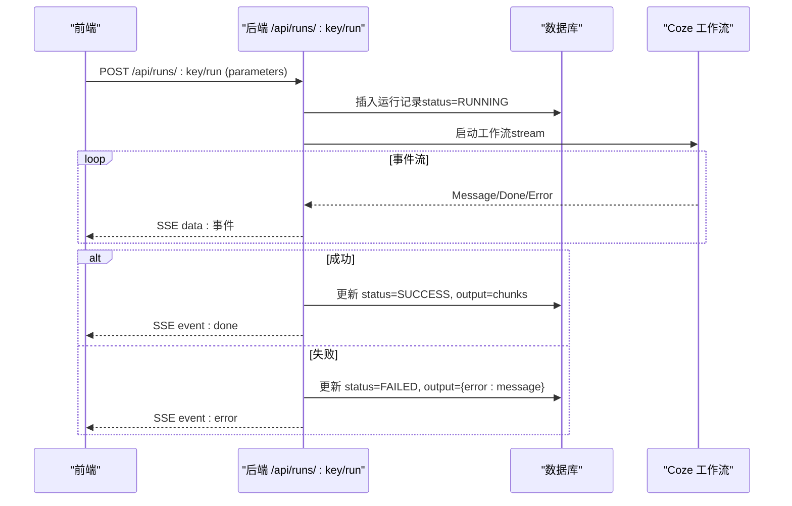
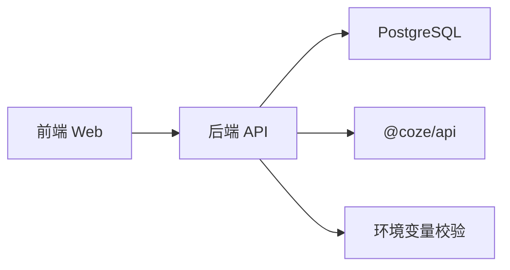

# 项目概述

<cite>
**本文引用的文件**
- [api/src/index.ts](file://api/src/index.ts)
- [api/src/config.ts](file://api/src/config.ts)
- [api/src/db.ts](file://api/src/db.ts)
- [api/src/coze.ts](file://api/src/coze.ts)
- [api/src/middleware/auth.ts](file://api/src/middleware/auth.ts)
- [api/src/routes/auth.ts](file://api/src/routes/auth.ts)
- [api/src/routes/modules.ts](file://api/src/routes/modules.ts)
- [api/src/routes/files.ts](file://api/src/routes/files.ts)
- [api/src/routes/runs.ts](file://api/src/routes/runs.ts)
- [api/src/routes/voice.ts](file://api/src/routes/voice.ts)
- [api/package.json](file://api/package.json)
- [web/src/App.tsx](file://web/src/App.tsx)
- [web/src/lib/api.ts](file://web/src/lib/api.ts)
- [web/src/pages/DashboardPage.tsx](file://web/src/pages/DashboardPage.tsx)
- [web/src/pages/VoiceGeneratorPage.tsx](file://web/src/pages/VoiceGeneratorPage.tsx)
- [web/vite.config.ts](file://web/vite.config.ts)
- [web/package.json](file://web/package.json)
- [docker-compose.yml](file://docker-compose.yml)
</cite>

## 目录
1. [引言](#引言)
2. [项目结构](#项目结构)
3. [核心组件](#核心组件)
4. [架构总览](#架构总览)
5. [详细组件分析](#详细组件分析)
6. [依赖分析](#依赖分析)
7. [性能考虑](#性能考虑)
8. [故障排除指南](#故障排除指南)
9. [结论](#结论)
10. [附录](#附录)

## 引言
Coze Workflow 是一个基于 Coze AI 平台的多模态工作流管理系统，旨在为用户提供从图片、视频到文案与语音的全链路 AI 内容创作能力。项目通过模块化的工作流设计，将复杂的人工智能任务拆解为可复用的模块，并以统一的运行与结果管理机制串联前后端，形成“模块 + 工作流 + 运行记录”的完整闭环。

本项目的核心价值在于：
- 降低 AI 内容创作门槛：通过标准化模块与可视化界面，让非技术用户也能高效完成高质量内容生产。
- 提升协作效率：统一的任务运行与结果存储，便于团队追踪与复用历史工作成果。
- 可扩展性与可维护性：清晰的模块定义与路由组织，便于后续新增工作流与功能模块。

在 AI 内容创作领域的定位是：提供“即插即用”的多模态工作流引擎，覆盖从素材输入、AI 处理到成品输出的全流程。

## 项目结构
项目采用前后端分离架构，前端使用 React + Vite + Ant Design，后端使用 Node.js + Express，数据库采用 PostgreSQL，并通过 Docker Compose 实现一键部署。

图表来源
- [docker-compose.yml:1-35](file://docker-compose.yml#L1-L35)
- [api/src/index.ts:11-29](file://api/src/index.ts#L11-L29)
- [api/src/db.ts:6-8](file://api/src/db.ts#L6-L8)
- [api/src/coze.ts:4-7](file://api/src/coze.ts#L4-L7)
- [web/vite.config.ts:6-8](file://web/vite.config.ts#L6-L8)

章节来源
- [docker-compose.yml:1-35](file://docker-compose.yml#L1-L35)
- [api/src/index.ts:11-29](file://api/src/index.ts#L11-L29)
- [web/vite.config.ts:6-8](file://web/vite.config.ts#L6-L8)

## 核心组件
- 前端应用（React）
  - 路由与布局：基于 React Router 的受保护路由与主/认证布局，支持登录态校验与自动跳转。
  - 页面组件：仪表盘、各功能模块页面（详情图生成、视频文案提取、产品文案生成、翻译、语音生成）、任务列表等。
  - API 客户端：统一封装 fetch 请求、Token 管理、SSE 流式响应处理、文件上传等。
- 后端服务（Node.js + Express）
  - 应用入口：挂载 CORS、JSON 解析、健康检查与各业务路由。
  - 认证中间件：基于 JWT 的用户鉴权与上下文注入。
  - 路由层：用户认证、模块查询、文件上传、任务运行（SSE 流）、语音相关接口。
  - 数据持久化：PostgreSQL 连接池与初始化表结构（用户、运行记录）。
  - 集成 Coze：通过官方 SDK 调用工作流，支持流式事件推送。
- 基础设施
  - Docker Compose：一键拉起数据库、API、Web 服务，暴露必要端口。
  - 环境变量：API Token、数据库连接、JWT 密钥、语音服务基础地址等。

章节来源
- [web/src/App.tsx:17-66](file://web/src/App.tsx#L17-L66)
- [web/src/pages/DashboardPage.tsx:19-103](file://web/src/pages/DashboardPage.tsx#L19-L103)
- [web/src/lib/api.ts:13-115](file://web/src/lib/api.ts#L13-L115)
- [api/src/index.ts:15-23](file://api/src/index.ts#L15-L23)
- [api/src/middleware/auth.ts](file://api/src/middleware/auth.ts)
- [api/src/routes/runs.ts:55-157](file://api/src/routes/runs.ts#L55-L157)
- [api/src/db.ts:10-34](file://api/src/db.ts#L10-L34)
- [api/src/coze.ts:4-7](file://api/src/coze.ts#L4-L7)
- [docker-compose.yml:13-32](file://docker-compose.yml#L13-L32)

## 架构总览
下图展示了从前端到后端、再到外部服务与数据库的整体交互流程：

图表来源
- [web/src/lib/api.ts:65-115](file://web/src/lib/api.ts#L65-L115)
- [api/src/routes/runs.ts:84-123](file://api/src/routes/runs.ts#L84-L123)
- [api/src/db.ts:10-34](file://api/src/db.ts#L10-L34)
- [api/src/coze.ts:4-7](file://api/src/coze.ts#L4-L7)

## 详细组件分析

### 前端组件与页面
- 应用路由与鉴权
  - 使用受保护路由包裹主布局，未登录自动跳转至登录页；设置未授权回调清理本地 Token 并跳转。
  - 首次进入时尝试校验当前登录态，失败则清空 Token 并跳转。
- 页面组件
  - 仪表盘：展示可用模块卡片，点击进入对应功能页。
  - 语音生成：加载语音服务配置并内嵌 iframe 打开局域网语音生成器。
- API 客户端
  - 统一设置 Content-Type 与 Authorization 头，处理 401 未授权并触发登出。
  - 封装文件上传、SSE 流式运行、语音配置与翻译/TTS 接口。

图表来源
- [web/src/App.tsx:17-39](file://web/src/App.tsx#L17-L39)

章节来源
- [web/src/App.tsx:17-66](file://web/src/App.tsx#L17-L66)
- [web/src/pages/DashboardPage.tsx:19-103](file://web/src/pages/DashboardPage.tsx#L19-L103)
- [web/src/pages/VoiceGeneratorPage.tsx:10-25](file://web/src/pages/VoiceGeneratorPage.tsx#L10-L25)
- [web/src/lib/api.ts:13-36](file://web/src/lib/api.ts#L13-L36)

### 后端路由与数据流
- 应用入口
  - 挂载 CORS 与 JSON 中间件，提供健康检查端点，按前缀挂载各路由模块。
- 认证中间件
  - 从请求头解析 JWT，注入用户上下文，用于后续路由鉴权。
- 模块路由
  - 提供模块清单与单个模块信息查询，配合前端仪表盘展示可用功能。
- 文件路由
  - 支持文件上传（含 Bearer 认证），供详情图等模块使用。
- 任务运行路由（核心）
  - 以 SSE 形式流式返回 Coze 工作流事件，同时将运行记录持久化到数据库。
  - 成功/失败状态更新与 Done 事件判断，保证运行结果可追溯。
- 语音路由
  - 提供语音服务配置读取，支撑前端语音生成页面。
- 数据库
  - 初始化 users 与 runs 表，runs 表保存每次运行的输入、输出、状态与时间戳。

图表来源
- [api/src/routes/runs.ts:55-157](file://api/src/routes/runs.ts#L55-L157)
- [api/src/db.ts:10-34](file://api/src/db.ts#L10-L34)
- [api/src/coze.ts:4-7](file://api/src/coze.ts#L4-L7)

章节来源
- [api/src/index.ts:19-23](file://api/src/index.ts#L19-L23)
- [api/src/middleware/auth.ts](file://api/src/middleware/auth.ts)
- [api/src/routes/modules.ts:6-17](file://api/src/routes/modules.ts#L6-L17)
- [api/src/routes/files.ts](file://api/src/routes/files.ts)
- [api/src/routes/runs.ts:55-157](file://api/src/routes/runs.ts#L55-L157)
- [api/src/routes/voice.ts](file://api/src/routes/voice.ts)
- [api/src/db.ts:10-34](file://api/src/db.ts#L10-L34)

### 技术栈概览
- 前端
  - React 18 + React Router DOM + Ant Design 5 + Vite
  - 本地开发服务器默认端口 5173
- 后端
  - Node.js + Express + TypeScript
  - @coze/api SDK、jsonwebtoken、bcryptjs、cors、multer、pg、uuid
- 数据库
  - PostgreSQL（通过 pg 连接池）
- 部署
  - Docker Compose：db、api、web 三服务编排

章节来源
- [web/package.json:11-17](file://web/package.json#L11-L17)
- [web/vite.config.ts:6-8](file://web/vite.config.ts#L6-L8)
- [api/package.json:11-22](file://api/package.json#L11-L22)
- [docker-compose.yml:13-32](file://docker-compose.yml#L13-L32)

## 依赖分析
- 前端对后端的依赖
  - 通过统一 API 客户端发起请求，依赖后端提供的认证、模块、文件、运行与语音接口。
- 后端对数据库的依赖
  - 使用连接池访问 PostgreSQL，确保并发安全与资源复用。
- 后端对第三方服务的依赖
  - 通过 Coze SDK 调用工作流，支持流式事件；依赖环境变量中的 API Token 与基础地址。
- 配置与环境
  - 后端启动前校验关键环境变量，确保运行所需凭据与连接信息完备。

图表来源
- [web/src/lib/api.ts:13-36](file://web/src/lib/api.ts#L13-L36)
- [api/src/db.ts:6-8](file://api/src/db.ts#L6-L8)
- [api/src/coze.ts:4-7](file://api/src/coze.ts#L4-L7)
- [api/src/config.ts:5-11](file://api/src/config.ts#L5-L11)

章节来源
- [web/src/lib/api.ts:13-36](file://web/src/lib/api.ts#L13-L36)
- [api/src/config.ts:5-11](file://api/src/config.ts#L5-L11)
- [api/src/db.ts:6-8](file://api/src/db.ts#L6-L8)
- [api/src/coze.ts:4-7](file://api/src/coze.ts#L4-L7)

## 性能考虑
- 前端
  - 使用 Vite 快速开发与构建，Ant Design 组件按需加载，减少首屏体积。
  - API 客户端统一处理认证与错误，避免重复逻辑。
- 后端
  - 使用连接池管理数据库连接，降低频繁建立/断开连接的开销。
  - 任务运行采用 SSE 流式推送，前端可逐步渲染，提升用户体验。
  - 对 JSON 请求体限制大小，防止异常流量导致内存压力。
- 部署
  - Docker Compose 将服务解耦，便于水平扩展与资源隔离。

## 故障排除指南
- 登录态失效
  - 现象：页面跳转到登录页或出现未授权提示。
  - 处理：前端会在收到 401 时清理本地 Token 并触发未授权回调；检查后端 JWT 密钥与 Token 是否正确。
- 任务运行失败
  - 现象：SSE 返回 error 事件或状态为 FAILED。
  - 处理：查看后端日志与数据库 runs 表的 output 字段，确认 Coze 工作流是否可用、参数是否正确。
- 数据库连接问题
  - 现象：应用启动时报连接错误。
  - 处理：检查 DATABASE_URL 环境变量与数据库容器状态，确认网络连通与凭据正确。
- 语音服务不可用
  - 现象：语音生成页面无法加载配置或 iframe 为空。
  - 处理：确认 VOICE_BASE_URL 环境变量与语音服务可达性，检查后端 /api/voice/config 返回。

章节来源
- [web/src/App.tsx:27-38](file://web/src/App.tsx#L27-L38)
- [web/src/lib/api.ts:25-28](file://web/src/lib/api.ts#L25-L28)
- [api/src/routes/runs.ts:124-156](file://api/src/routes/runs.ts#L124-L156)
- [api/src/config.ts:5-11](file://api/src/config.ts#L5-L11)

## 结论
Coze Workflow 通过清晰的前后端分层、模块化的功能设计与统一的运行记录体系，构建了一个易用、可扩展且可维护的多模态内容创作平台。它不仅降低了 AI 内容生产的门槛，也为团队提供了可追溯、可复用的工作流资产。未来可在以下方向持续演进：
- 扩展更多工作流模块与模板，覆盖更广泛的创作场景。
- 增强任务监控与告警机制，提升运行可观测性。
- 引入缓存与异步队列，进一步优化高并发下的响应性能。

## 附录
- 环境变量清单（后端）
  - COZE_API_TOKEN：调用 Coze 工作流所需的令牌
  - DATABASE_URL：PostgreSQL 连接字符串
  - JWT_SECRET：JWT 签名密钥
  - VOICE_BASE_URL：语音服务基础地址
  - PORT：后端监听端口（默认 3000）
- 默认端口
  - 前端开发服务器：5173
  - 后端 API：3000
  - 数据库：5432

章节来源
- [api/src/config.ts:5-19](file://api/src/config.ts#L5-L19)
- [docker-compose.yml:10-11](file://docker-compose.yml#L10-L11)
- [docker-compose.yml:23-24](file://docker-compose.yml#L23-L24)
- [web/vite.config.ts:7](file://web/vite.config.ts#L7)